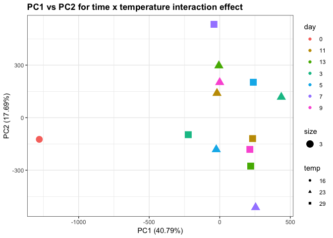

ASCA on average NSAF values of all proteins
================
Shelly Trigg
1/17/2019

load libraries

    ## Warning: package 'dplyr' was built under R version 3.4.4

    ## 
    ## Attaching package: 'dplyr'

    ## The following objects are masked from 'package:stats':
    ## 
    ##     filter, lag

    ## The following objects are masked from 'package:base':
    ## 
    ##     intersect, setdiff, setequal, union

    ## Warning: package 'tidyr' was built under R version 3.4.4

    ## Loading required package: MASS

    ## Warning: package 'MASS' was built under R version 3.4.4

    ## 
    ## Attaching package: 'MASS'

    ## The following object is masked from 'package:dplyr':
    ## 
    ##     select

    ## Loading required package: abind

    ## Loading required package: pls

    ## Warning: package 'pls' was built under R version 3.4.4

    ## 
    ## Attaching package: 'pls'

    ## The following object is masked from 'package:stats':
    ## 
    ##     loadings

    ## Warning: package 'ggplot2' was built under R version 3.4.4

load data

``` r
#NSAF data from filtered proteins
data <- read.csv("~/Documents/GitHub/OysterSeedProject/analysis/nmds_R/silo3and9_nozerovals_AVGs.csv", stringsAsFactors = FALSE)
```

**Perform ASCA**

``` r
#create matrix to pass to ASCA command, excluding the silo and time info
ASCA_X <- as.matrix(choyp_data[,-c(1:2)])
#create matrix to pass to ASCA command with only the silo and time info
ASCA_F <- as.matrix(choyp_data[,c(1:2)])
#perform ASCA
ASCA <- ASCA.Calculate(ASCA_X, ASCA_F, equation.elements = "1,2,12", scaling = FALSE)
```

    ## Variance explained per principal component (if >1%):
    ## Whole data set   PC1: 26.97%   PC2: 21.08%   PC3: 10.76%   PC4: 9.43%    PC5: 7.07%    PC6: 6.64%    PC7: 4.77%    PC8: 3.83%    PC9: 3.17%    PC10: 2.54%   
    ## Factor 1         PC1: 39.62%   PC2: 25.87%   PC3: 13.38%   PC4: 9.34%    PC5: 8.24%    PC6: 3.55%    PC7:  NA%     PC8:  NA%     PC9:  NA%     PC10:  NA%    
    ## Factor 2         PC1: 70.07%   PC2: 29.93%   PC3:  NA%     PC4:  NA%     PC5:  NA%     PC6:  NA%     PC7:  NA%     PC8:  NA%     PC9:  NA%     PC10:  NA%    
    ## Interaction 12   PC1: 40.79%   PC2: 17.69%   PC3: 13.61%   PC4: 11.72%   PC5: 9.88%    PC6: 6.30%    PC7:  NA%     PC8:  NA%     PC9:  NA%     PC10:  NA%    
    ## 
    ## Percentage each effect contributes to the total sum of squares:
    ## Overall means    91.22%
    ## Factor 1         5.60%
    ## Factor 2         2.04%
    ## Interaction 12   3.96%
    ## Residuals        0.00%
    ## 
    ## Percentage each effect contributes to the sum of squares of the centered data:
    ## Factor 1         63.77%
    ## Factor 2         23.23%
    ## Interaction 12   45.08%
    ## Residuals        0.00%

Here is a summary of the ASCA results (e.g. variance explained by different factors; factor 1= time (days), factor 2 = temperature, interaction = interaction of time and temperature)

``` r
#print the ASCA summary
ASCA.GetSummary(ASCA)
```

    ## Variance explained per principal component (if >1%):
    ## Whole data set   PC1: 26.97%   PC2: 21.08%   PC3: 10.76%   PC4: 9.43%    PC5: 7.07%    PC6: 6.64%    PC7: 4.77%    PC8: 3.83%    PC9: 3.17%    PC10: 2.54%   
    ## Factor 1         PC1: 39.62%   PC2: 25.87%   PC3: 13.38%   PC4: 9.34%    PC5: 8.24%    PC6: 3.55%    PC7:  NA%     PC8:  NA%     PC9:  NA%     PC10:  NA%    
    ## Factor 2         PC1: 70.07%   PC2: 29.93%   PC3:  NA%     PC4:  NA%     PC5:  NA%     PC6:  NA%     PC7:  NA%     PC8:  NA%     PC9:  NA%     PC10:  NA%    
    ## Interaction 12   PC1: 40.79%   PC2: 17.69%   PC3: 13.61%   PC4: 11.72%   PC5: 9.88%    PC6: 6.30%    PC7:  NA%     PC8:  NA%     PC9:  NA%     PC10:  NA%    
    ## 
    ## Percentage each effect contributes to the total sum of squares:
    ## Overall means    91.22%
    ## Factor 1         5.60%
    ## Factor 2         2.04%
    ## Interaction 12   3.96%
    ## Residuals        0.00%
    ## 
    ## Percentage each effect contributes to the sum of squares of the centered data:
    ## Factor 1         63.77%
    ## Factor 2         23.23%
    ## Interaction 12   45.08%
    ## Residuals        0.00%

    ## $summary.pca
    ##            PC1       PC2       PC3        PC4        PC5        PC6
    ## data 0.2697456 0.2108149 0.1076162 0.09428784 0.07073832 0.06639430
    ## 1    0.3962349 0.2586869 0.1338009 0.09343167 0.08235720 0.03548848
    ## 2    0.7007309 0.2992691        NA         NA         NA         NA
    ## 12   0.4079499 0.1768866 0.1361433 0.11717182 0.09883591 0.06301248
    ##            PC7        PC8        PC9       PC10
    ## data 0.0476876 0.03833476 0.03173637 0.02537494
    ## 1           NA         NA         NA         NA
    ## 2           NA         NA         NA         NA
    ## 12          NA         NA         NA         NA
    ## 
    ## $summary.ssq
    ##                     Overall means          1          2         12
    ## Contribution to ssq     0.9122141 0.05598042 0.02039528 0.03957785
    ##                        Residuals
    ## Contribution to ssq 2.301613e-34

### Plot PCAs from ASCA

**This first plot is the time (days) effect PCA**

``` r
#plot PCA for factor 1, which is time in this case
ASCA.PlotScoresPerLevel(ASCA, ee = "1", pcs = "1,2")
```


**This next plot is the temperature effect PCA**

``` r
#plot PCA for factor 2, which is temperature in this case
ASCA.PlotScoresPerLevel(ASCA, ee = "2", pcs = "1,2")
```


**This next plot is the time x temp interaction effect PCA**

``` r
#plot PCA for factor interaction, which is time x temp in this case
timextemp_PC12 <- data.frame(ASCA$`12`$svd$t[,c(1,2)])
timextemp_PC12 <- cbind(data.frame(ASCA$`12`$level.combinations$row.patterns), timextemp_PC12)
colnames(timextemp_PC12)<- c("day","temp","PC1","PC2")
timextemp_PC12$day <- as.character(timextemp_PC12$day)
timextemp_PC12$temp <- as.character(timextemp_PC12$temp)
ggplot(timextemp_PC12, aes(PC1, PC2)) + geom_point(aes(col = day, shape = temp, size = 3)) + theme_bw() + ggtitle("PC1 vs PC2 for time x temperature interaction effect") + theme(plot.title = element_text(face = "bold")) + xlab(paste("PC1"," (",formatC(ASCA$`12`$svd$var.explained[1] * 100,digits=2,format="f"),"%)", sep = "")) + ylab(paste("PC2"," (",formatC(ASCA$`12`$svd$var.explained[2] * 100,digits=2,format="f"),"%)", sep = ""))
```



### Analysis of proteins affected by temperature

Because the temperature effect PCA show the most separation between 23C and 29C in PC2, we will look at those loadings.

**PC2 loadings for temperature effect** 

To pull out proteins affected by temperature based on their influence in seperating treatment groups on PC2 of the temperature PCA, I picked an absolute value loadings threshold of 0.025. This means any protein that had a loadings value \> 0.025 or \< -0.025 was selected.

Number of proteins affected by temperature at loadings value \> 0.025 or \< -0.025

    ## [1] 138

**Heatmap of proteins affected by temperature based on temperature effect PC2 loadings value cutoff** 

### Analysis of proteins affected by time (development associated proteins)

**PC1 loadings for the time effect PCA** 

**PC2 loadings for the time effect PCA** 

number of proteins affected by time at loadings value \> 0.025 or \< -0.025

    ## [1] 230

**heatmap of proteins affected by time based on time effect PC1 and PC2 loadings value cutoffs** 

### Analysis of proteins affected by the interaction of time and temp

**PC1 loadings for the time x temperature interaction effect PCA** 

**PC2 loadings for the time x temperature interaction effect PCA** 

number of proteins affected by time x temperature interaction at loadings value \> 0.025 or \< -0.025

    ## [1] 219

**heatmap of proteins affected by the time x temperature interaction based on time x temperature effect PC1 and PC2 loadings value cutoffs** 
