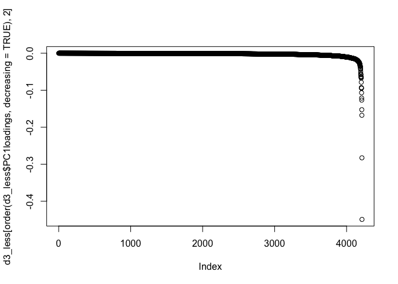

ASCA\_avgNSAFvals\_allProteins\_noDay0
================
Shelly Trigg
3/7/2019

load libraries

    ## 
    ## Attaching package: 'dplyr'

    ## The following objects are masked from 'package:stats':
    ## 
    ##     filter, lag

    ## The following objects are masked from 'package:base':
    ## 
    ##     intersect, setdiff, setequal, union

    ## Loading required package: MASS

    ## 
    ## Attaching package: 'MASS'

    ## The following object is masked from 'package:dplyr':
    ## 
    ##     select

    ## Loading required package: abind

    ## Loading required package: pls

    ## 
    ## Attaching package: 'pls'

    ## The following object is masked from 'package:stats':
    ## 
    ##     loadings

load data

``` r
#NSAF data from filtered proteins
data <- read.csv("~/Documents/GitHub/OysterSeedProject/analysis/nmds_R/silo3and9_nozerovals_AVGs.csv", stringsAsFactors = FALSE)
```

``` r
contam_data_t <- t(contam_data[,-c(1:2)])
colnames(contam_data_t) <- paste(contam_data$day,contam_data$temp, sep = "_")
heatmap3(as.matrix(contam_data_t), Colv = NA, cexRow = 0.5)
```


**Perform ASCA**

``` r
#create matrix to pass to ASCA command, excluding the silo and time info
ASCA_X <- as.matrix(choyp_data[,-c(1:2)])
#create matrix to pass to ASCA command with only the silo and time info
ASCA_F <- as.matrix(choyp_data[,c(1:2)])
#perform ASCA
ASCA <- ASCA.Calculate(ASCA_X, ASCA_F, equation.elements = "1,2,12", scaling = FALSE)
```

    ## Variance explained per principal component (if >1%):
    ## Whole data set   PC1: 28.09%   PC2: 19.96%   PC3: 11.39%   PC4: 9.52%    PC5: 8.43%    PC6: 6.10%    PC7: 4.67%    PC8: 3.89%    PC9: 3.45%    PC10: 2.51%   
    ## Factor 1         PC1: 44.61%   PC2: 26.81%   PC3: 12.72%   PC4: 11.07%   PC5: 4.79%    PC6:  NA%     PC7:  NA%     PC8:  NA%     PC9:  NA%     PC10:  NA%    
    ## Factor 2         PC1: 100.00%  PC2:  NA%     PC3:  NA%     PC4:  NA%     PC5:  NA%     PC6:  NA%     PC7:  NA%     PC8:  NA%     PC9:  NA%     PC10:  NA%    
    ## Interaction 12   PC1: 29.07%   PC2: 24.00%   PC3: 19.06%   PC4: 17.32%   PC5: 10.54%   PC6:  NA%     PC7:  NA%     PC8:  NA%     PC9:  NA%     PC10:  NA%    
    ## 
    ## Percentage each effect contributes to the total sum of squares:
    ## Overall means    92.07%
    ## Factor 1         4.51%
    ## Factor 2         0.68%
    ## Interaction 12   2.74%
    ## Residuals        0.00%
    ## 
    ## Percentage each effect contributes to the sum of squares of the centered data:
    ## Factor 1         56.85%
    ## Factor 2         8.56%
    ## Interaction 12   34.59%
    ## Residuals        0.00%

Here is a summary of the ASCA results (e.g. variance explained by different factors; factor 1= time (days), factor 2 = temperature, interaction = interaction of time and temperature)

``` r
#print the ASCA summary
ASCA.GetSummary(ASCA)
```

    ## Variance explained per principal component (if >1%):
    ## Whole data set   PC1: 28.09%   PC2: 19.96%   PC3: 11.39%   PC4: 9.52%    PC5: 8.43%    PC6: 6.10%    PC7: 4.67%    PC8: 3.89%    PC9: 3.45%    PC10: 2.51%   
    ## Factor 1         PC1: 44.61%   PC2: 26.81%   PC3: 12.72%   PC4: 11.07%   PC5: 4.79%    PC6:  NA%     PC7:  NA%     PC8:  NA%     PC9:  NA%     PC10:  NA%    
    ## Factor 2         PC1: 100.00%  PC2:  NA%     PC3:  NA%     PC4:  NA%     PC5:  NA%     PC6:  NA%     PC7:  NA%     PC8:  NA%     PC9:  NA%     PC10:  NA%    
    ## Interaction 12   PC1: 29.07%   PC2: 24.00%   PC3: 19.06%   PC4: 17.32%   PC5: 10.54%   PC6:  NA%     PC7:  NA%     PC8:  NA%     PC9:  NA%     PC10:  NA%    
    ## 
    ## Percentage each effect contributes to the total sum of squares:
    ## Overall means    92.07%
    ## Factor 1         4.51%
    ## Factor 2         0.68%
    ## Interaction 12   2.74%
    ## Residuals        0.00%
    ## 
    ## Percentage each effect contributes to the sum of squares of the centered data:
    ## Factor 1         56.85%
    ## Factor 2         8.56%
    ## Interaction 12   34.59%
    ## Residuals        0.00%

    ## $summary.pca
    ##            PC1       PC2       PC3        PC4        PC5        PC6
    ## data 0.2809005 0.1996002 0.1139049 0.09515855 0.08425580 0.06095173
    ## 1    0.4461099 0.2680878 0.1272418 0.11067296 0.04788754         NA
    ## 2    1.0000000        NA        NA         NA         NA         NA
    ## 12   0.2907039 0.2400320 0.1906424 0.17323925 0.10538248         NA
    ##             PC7        PC8        PC9       PC10
    ## data 0.04665395 0.03888077 0.03449373 0.02508709
    ## 1            NA         NA         NA         NA
    ## 2            NA         NA         NA         NA
    ## 12           NA         NA         NA         NA
    ## 
    ## $summary.ssq
    ##                     Overall means          1           2         12
    ## Contribution to ssq     0.9207362 0.04505819 0.006787731 0.02741786
    ##                        Residuals
    ## Contribution to ssq 2.769919e-34

### Plot PCAs from ASCA

**This first plot is the time (days) effect PCA**

``` r
#plot PCA for factor 1, which is time in this case
ASCA.PlotScoresPerLevel(ASCA, ee = "1", pcs = "1,2")
```


**This next plot is the temperature effect PCA**

``` r
#plot PCA for factor 2, which is temperature in this case
ASCA.PlotScoresPerLevel(ASCA, ee = "2", pcs = "1,2")
```


**This next plot is the time x temp interaction effect PCA**

``` r
#plot PCA for factor interaction, which is time x temp in this case
timextemp_PC12 <- data.frame(ASCA$`12`$svd$t[,c(1,2)])
timextemp_PC12 <- cbind(data.frame(ASCA$`12`$level.combinations$row.patterns), timextemp_PC12)
colnames(timextemp_PC12)<- c("day","temp","PC1","PC2")
timextemp_PC12$day <- as.character(timextemp_PC12$day)
timextemp_PC12$temp <- as.character(timextemp_PC12$temp)
ggplot(timextemp_PC12, aes(PC1, PC2)) + geom_point(aes(col = day, shape = temp, size = 3)) + theme_bw() + ggtitle("PC1 vs PC2 for time x temperature interaction effect") + theme(plot.title = element_text(face = "bold")) + xlab(paste("PC1"," (",formatC(ASCA$`12`$svd$var.explained[1] * 100,digits=2,format="f"),"%)", sep = "")) + ylab(paste("PC2"," (",formatC(ASCA$`12`$svd$var.explained[2] * 100,digits=2,format="f"),"%)", sep = ""))
```


### Analysis of proteins affected by temperature

Because the temperature effect PCA show the most separation between 23C and 29C in PC2, we will look at those loadings.

**PC2 loadings for temperature effect** 

To pull out proteins affected by temperature based on their influence in seperating treatment groups on PC2 of the temperature PCA, I picked an absolute value loadings threshold of 0.025. This means any protein that had a loadings value \> 0.025 or \< -0.025 was selected.

Number of proteins affected by temperature at loadings value \> 0.03 or \< -0.025

    ## [1] 120

**Heatmap of proteins affected by temperature based on temperature effect PC2 loadings value cutoff**

### Analysis of proteins affected by time (development associated proteins)

**PC1 loadings for the time effect PCA** 

**PC2 loadings for the time effect PCA** 

number of proteins affected by time at loadings value \> 0.025 or \< -0.025

    ## [1] 207

**heatmap of proteins affected by time based on time effect PC1 and PC2 loadings value cutoffs** 

### Analysis of proteins affected by the interaction of time and temp

**PC1 loadings for the time x temperature interaction effect PCA** 

**PC2 loadings for the time x temperature interaction effect PCA** 

number of proteins affected by time x temperature interaction at loadings value \> 0.025 or \< -0.025

    ## [1] 178

**heatmap of proteins affected by the time x temperature interaction based on time x temperature effect PC1 and PC2 loadings value cutoffs** 

``` r
combined1d2 <- merge(d1[which(abs(d1$PC1loadings) >= 0.025),],d2[which(abs(d2$PC2loadings) >= 0.025),], by = "protein", all = TRUE)
for(i in 1:nrow(combined1d2)){
  combined1d2$TimePC12[i] <- sum(abs(combined1d2$PC1loadings[i]), abs(combined1d2$PC2loadings[i]), na.rm = TRUE)
}

combined3d4 <- merge(d3[which(abs(d3$PC1loadings) >= 0.025),],d4[which(abs(d4$PC2loadings) >= 0.025),], by = "protein", all = TRUE)
for(i in 1:nrow(combined3d4)){
  combined3d4$TimexTempPC12[i] <- sum(abs(combined3d4$PC1loadings[i]), abs(combined3d4$PC2loadings[i]), na.rm = TRUE)
}

ASCA_all <- merge(cutd, combined1d2[,c("protein", "TimePC12")], by = "protein", all = TRUE)
ASCA_all <- merge(ASCA_all, combined3d4[,c("protein", "TimexTempPC12")], by = "protein", all = TRUE)    
colnames(ASCA_all)[2] <- "TempPC2"

write.csv(ASCA_all,"~/Documents/GitHub/OysterSeedProject/analysis/ASCA/ASCA_all_proteins_avgADJNSAF/ASCA_TimeTempTimexTemp_proteins_loadings.csv", row.names = FALSE, quote = FALSE)
```
