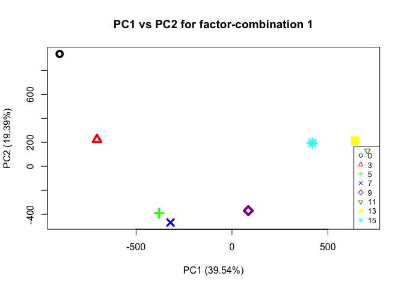
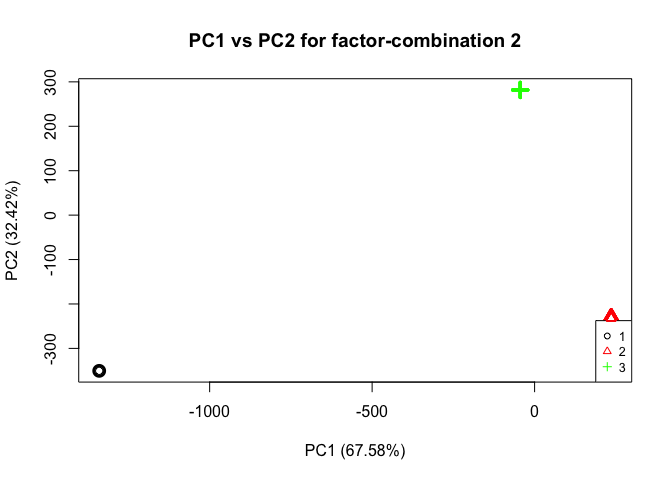
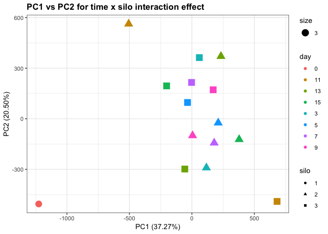
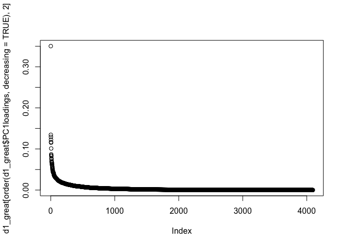
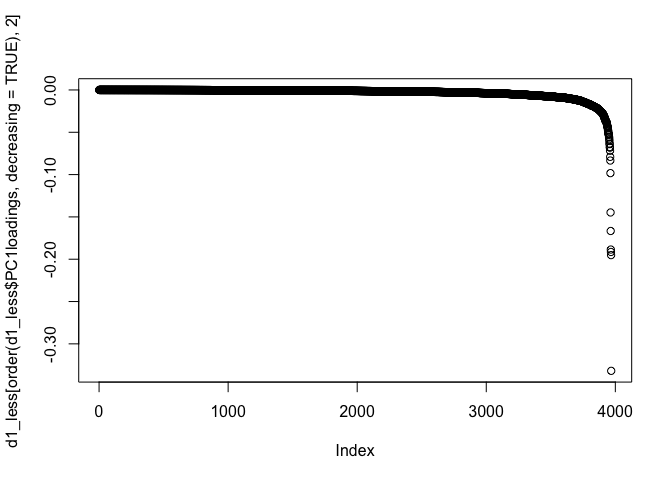
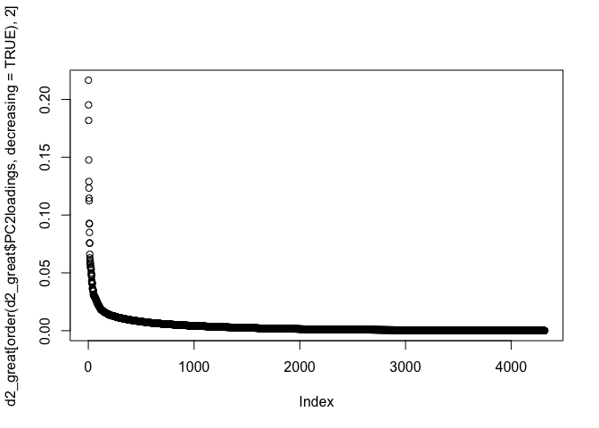
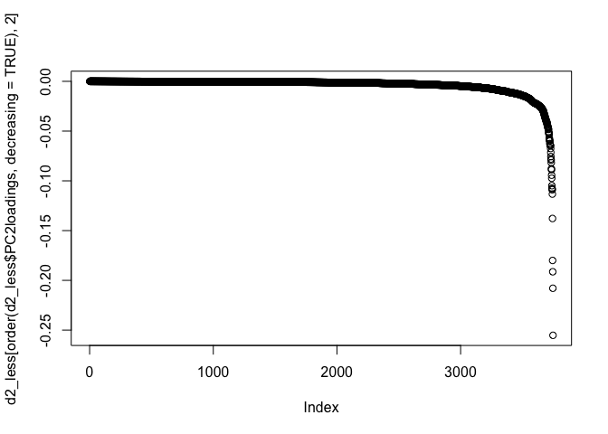
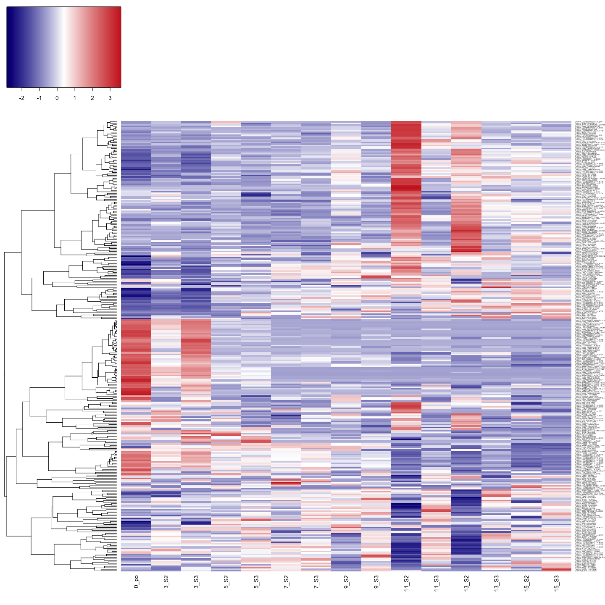
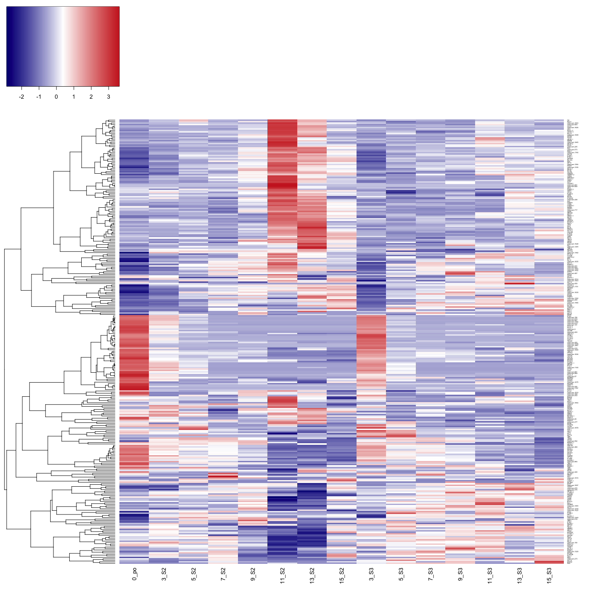

ASCA on average NSAF values of all proteins
================
Shelly Trigg
1/17/2019

load libraries

    ## Warning: package 'dplyr' was built under R version 3.4.4

    ## 
    ## Attaching package: 'dplyr'

    ## The following objects are masked from 'package:stats':
    ## 
    ##     filter, lag

    ## The following objects are masked from 'package:base':
    ## 
    ##     intersect, setdiff, setequal, union

    ## Warning: package 'tidyr' was built under R version 3.4.4

    ## Loading required package: MASS

    ## Warning: package 'MASS' was built under R version 3.4.4

    ## 
    ## Attaching package: 'MASS'

    ## The following object is masked from 'package:dplyr':
    ## 
    ##     select

    ## Loading required package: abind

    ## Loading required package: pls

    ## Warning: package 'pls' was built under R version 3.4.4

    ## 
    ## Attaching package: 'pls'

    ## The following object is masked from 'package:stats':
    ## 
    ##     loadings

    ## Warning: package 'ggplot2' was built under R version 3.4.4

load data

``` r
#NSAF data from filtered proteins
data <- read.csv("~/Documents/GitHub/OysterSeedProject/analysis/nmds_R/silo3and2_nozerovals_AVGs.csv", stringsAsFactors = FALSE)
```

**Perform ASCA**

``` r
#create matrix to pass to ASCA command, excluding the silo and time info
ASCA_X <- as.matrix(choyp_data[,-c(1:3)])
#create matrix to pass to ASCA command with only the silo and time info
ASCA_F <- choyp_data[,c(1,3)]
ASCA_F$silo <- as.numeric(as.factor(ASCA_F$silo))
ASCA_F <- as.matrix(ASCA_F)
#perform ASCA
ASCA <- ASCA.Calculate(ASCA_X, ASCA_F, equation.elements = "1,2,12", scaling = FALSE)
```

    ## Variance explained per principal component (if >1%):
    ## Whole data set   PC1: 32.51%   PC2: 14.97%   PC3: 14.22%   PC4: 7.84%    PC5: 6.33%    PC6: 5.39%    PC7: 4.63%    PC8: 3.27%    PC9: 2.42%    PC10: 2.24%   
    ## Factor 1         PC1: 39.54%   PC2: 19.39%   PC3: 15.55%   PC4: 10.56%   PC5: 6.56%    PC6: 5.14%    PC7: 3.25%    PC8:  NA%     PC9:  NA%     PC10:  NA%    
    ## Factor 2         PC1: 67.58%   PC2: 32.42%   PC3:  NA%     PC4:  NA%     PC5:  NA%     PC6:  NA%     PC7:  NA%     PC8:  NA%     PC9:  NA%     PC10:  NA%    
    ## Interaction 12   PC1: 37.27%   PC2: 20.50%   PC3: 16.85%   PC4: 9.95%    PC5: 6.07%    PC6: 5.59%    PC7: 3.77%    PC8:  NA%     PC9:  NA%     PC10:  NA%    
    ## 
    ## Percentage each effect contributes to the total sum of squares:
    ## Overall means    89.12%
    ## Factor 1         7.08%
    ## Factor 2         2.03%
    ## Interaction 12   4.34%
    ## Residuals        0.00%
    ## 
    ## Percentage each effect contributes to the sum of squares of the centered data:
    ## Factor 1         65.05%
    ## Factor 2         18.67%
    ## Interaction 12   39.87%
    ## Residuals        0.00%

Here is a summary of the ASCA results (e.g. variance explained by different factors; factor 1= time (days), factor 2 = silo, interaction = interaction of time and silo)

``` r
#print the ASCA summary
ASCA.GetSummary(ASCA)
```

    ## Variance explained per principal component (if >1%):
    ## Whole data set   PC1: 32.51%   PC2: 14.97%   PC3: 14.22%   PC4: 7.84%    PC5: 6.33%    PC6: 5.39%    PC7: 4.63%    PC8: 3.27%    PC9: 2.42%    PC10: 2.24%   
    ## Factor 1         PC1: 39.54%   PC2: 19.39%   PC3: 15.55%   PC4: 10.56%   PC5: 6.56%    PC6: 5.14%    PC7: 3.25%    PC8:  NA%     PC9:  NA%     PC10:  NA%    
    ## Factor 2         PC1: 67.58%   PC2: 32.42%   PC3:  NA%     PC4:  NA%     PC5:  NA%     PC6:  NA%     PC7:  NA%     PC8:  NA%     PC9:  NA%     PC10:  NA%    
    ## Interaction 12   PC1: 37.27%   PC2: 20.50%   PC3: 16.85%   PC4: 9.95%    PC5: 6.07%    PC6: 5.59%    PC7: 3.77%    PC8:  NA%     PC9:  NA%     PC10:  NA%    
    ## 
    ## Percentage each effect contributes to the total sum of squares:
    ## Overall means    89.12%
    ## Factor 1         7.08%
    ## Factor 2         2.03%
    ## Interaction 12   4.34%
    ## Residuals        0.00%
    ## 
    ## Percentage each effect contributes to the sum of squares of the centered data:
    ## Factor 1         65.05%
    ## Factor 2         18.67%
    ## Interaction 12   39.87%
    ## Residuals        0.00%

    ## $summary.pca
    ##            PC1       PC2       PC3        PC4        PC5        PC6
    ## data 0.3251327 0.1497170 0.1421765 0.07838041 0.06329712 0.05385965
    ## 1    0.3953630 0.1939301 0.1555463 0.10561208 0.06558358 0.05144410
    ## 2    0.6758095 0.3241905        NA         NA         NA         NA
    ## 12   0.3726795 0.2049964 0.1685098 0.09945443 0.06072942 0.05590857
    ##             PC7      PC8        PC9       PC10
    ## data 0.04629385 0.032657 0.02421161 0.02242566
    ## 1    0.03252096       NA         NA         NA
    ## 2            NA       NA         NA         NA
    ## 12   0.03772191       NA         NA         NA
    ## 
    ## $summary.ssq
    ##                     Overall means          1          2         12
    ## Contribution to ssq     0.8911816 0.07078815 0.02031804 0.04339034
    ##                        Residuals
    ## Contribution to ssq 3.068754e-34

### Plot PCAs from ASCA

**This first plot is the time (days) effect PCA**

``` r
#plot PCA for factor 1, which is time in this case
ASCA.PlotScoresPerLevel(ASCA, ee = "1", pcs = "1,2")
```



**This next plot is the silo effect PCA**

``` r
#plot PCA for factor 2, which is silo in this case
ASCA.PlotScoresPerLevel(ASCA, ee = "2", pcs = "1,2")
```



**This next plot is the time x silo interaction effect PCA**

``` r
#plot PCA for factor interaction, which is time x silo in this case
timexsilo_PC12 <- data.frame(ASCA$`12`$svd$t[,c(1,2)])
timexsilo_PC12 <- cbind(data.frame(ASCA$`12`$level.combinations$row.patterns), timexsilo_PC12)
colnames(timexsilo_PC12)<- c("day","silo","PC1","PC2")
timexsilo_PC12$day <- as.character(timexsilo_PC12$day)
timexsilo_PC12$silo <- as.character(timexsilo_PC12$silo)
ggplot(timexsilo_PC12, aes(PC1, PC2)) + geom_point(aes(col = day, shape = silo, size = 3)) + theme_bw() + ggtitle("PC1 vs PC2 for time x silo interaction effect") + theme(plot.title = element_text(face = "bold")) + xlab(paste("PC1"," (",formatC(ASCA$`12`$svd$var.explained[1] * 100,digits=2,format="f"),"%)", sep = "")) + ylab(paste("PC2"," (",formatC(ASCA$`12`$svd$var.explained[2] * 100,digits=2,format="f"),"%)", sep = ""))
```



### Analysis of proteins affected by silo

Because the silo effect PCA show the most separation between 23C and 29C in PC2, we will look at those loadings.

combine protein names with ASCA loadings for PC1 and PC2 for silo



**PC2 loadings for the time effect PCA** 

To pull out proteins affected by silo based on their influence in seperating treatment groups on the silo PCA, I picked an absolute value loadings threshold of 0.025. This means any protein that had a loadings value \> 0.025 or \< -0.025 was selected.

**Heatmap of proteins affected by silo, time points are side-by-side** 

Number of proteins affected by silo at loadings value \> 0.025 or \< -0.025

    ## [1] 302

**Heatmap of proteins affected by silo, ordered by silo and then by time** 
