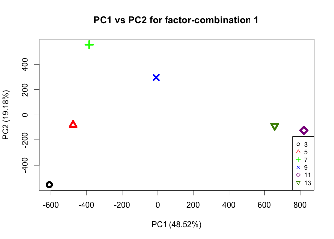
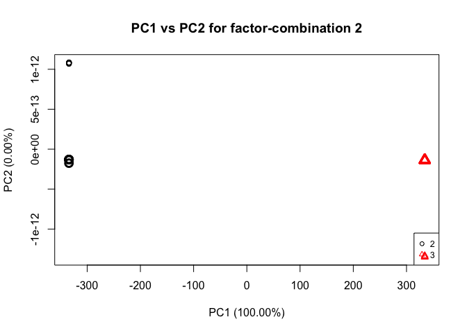
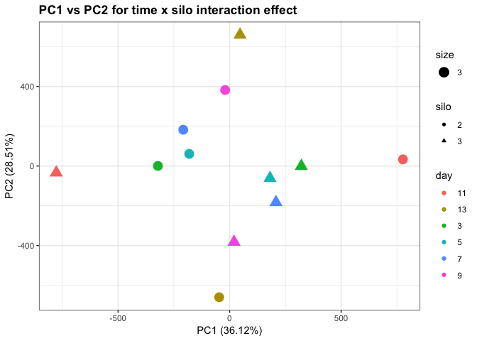
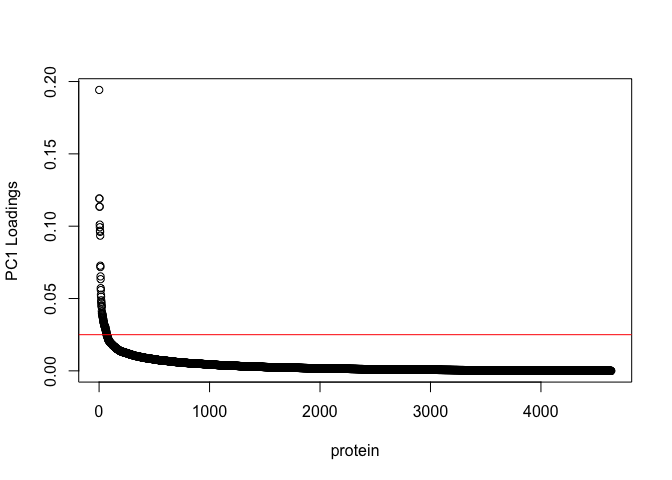
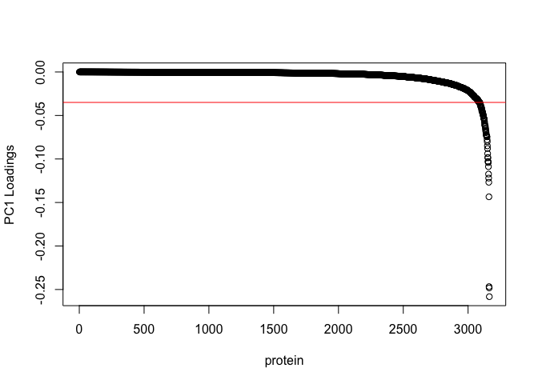

ASCA on average NSAF values of all proteins
================
Shelly Trigg
1/17/2019

load libraries

    ## 
    ## Attaching package: 'dplyr'

    ## The following objects are masked from 'package:stats':
    ## 
    ##     filter, lag

    ## The following objects are masked from 'package:base':
    ## 
    ##     intersect, setdiff, setequal, union

    ## Loading required package: MASS

    ## 
    ## Attaching package: 'MASS'

    ## The following object is masked from 'package:dplyr':
    ## 
    ##     select

    ## Loading required package: abind

    ## Loading required package: pls

    ## 
    ## Attaching package: 'pls'

    ## The following object is masked from 'package:stats':
    ## 
    ##     loadings

load data

``` r
#NSAF data from filtered proteins
data <- read.csv("~/Documents/GitHub/OysterSeedProject/analysis/nmds_R/silo3and2_nozerovals_AVGs.csv", stringsAsFactors = FALSE)
```

**Perform ASCA**

``` r
#create matrix to pass to ASCA command, excluding the silo and time info
ASCA_X <- as.matrix(choyp_data[,-c(1:3)])
#create matrix to pass to ASCA command with only the silo and time info
ASCA_F <- choyp_data[,c(1,3)]
ASCA_F$silo <- as.numeric(substr(ASCA_F$silo,2,2))
ASCA_F <- as.matrix(ASCA_F)
#perform ASCA
ASCA <- ASCA.Calculate(ASCA_X, ASCA_F, equation.elements = "1,2,12", scaling = FALSE)
```

    ## Variance explained per principal component (if >1%):
    ## Whole data set   PC1: 38.65%   PC2: 13.61%   PC3: 11.76%   PC4: 8.83%    PC5: 7.08%    PC6: 6.35%    PC7: 3.51%    PC8: 3.33%    PC9: 2.78%    PC10: 2.32%   
    ## Factor 1         PC1: 48.52%   PC2: 19.18%   PC3: 14.32%   PC4: 11.76%   PC5: 6.22%    PC6:  NA%     PC7:  NA%     PC8:  NA%     PC9:  NA%     PC10:  NA%    
    ## Factor 2         PC1: 100.00%  PC2:  NA%     PC3:  NA%     PC4:  NA%     PC5:  NA%     PC6:  NA%     PC7:  NA%     PC8:  NA%     PC9:  NA%     PC10:  NA%    
    ## Interaction 12   PC1: 36.12%   PC2: 28.51%   PC3: 17.68%   PC4: 9.69%    PC5: 8.00%    PC6:  NA%     PC7:  NA%     PC8:  NA%     PC9:  NA%     PC10:  NA%    
    ## 
    ## Percentage each effect contributes to the total sum of squares:
    ## Overall means    89.77%
    ## Factor 1         5.86%
    ## Factor 2         1.03%
    ## Interaction 12   3.34%
    ## Residuals        0.00%
    ## 
    ## Percentage each effect contributes to the sum of squares of the centered data:
    ## Factor 1         57.30%
    ## Factor 2         10.06%
    ## Interaction 12   32.64%
    ## Residuals        0.00%

Here is a summary of the ASCA results (e.g. variance explained by different factors; factor 1= time (days), factor 2 = silo, interaction = interaction of time and silo)

``` r
#print the ASCA summary
ASCA.GetSummary(ASCA)
```

    ## Variance explained per principal component (if >1%):
    ## Whole data set   PC1: 38.65%   PC2: 13.61%   PC3: 11.76%   PC4: 8.83%    PC5: 7.08%    PC6: 6.35%    PC7: 3.51%    PC8: 3.33%    PC9: 2.78%    PC10: 2.32%   
    ## Factor 1         PC1: 48.52%   PC2: 19.18%   PC3: 14.32%   PC4: 11.76%   PC5: 6.22%    PC6:  NA%     PC7:  NA%     PC8:  NA%     PC9:  NA%     PC10:  NA%    
    ## Factor 2         PC1: 100.00%  PC2:  NA%     PC3:  NA%     PC4:  NA%     PC5:  NA%     PC6:  NA%     PC7:  NA%     PC8:  NA%     PC9:  NA%     PC10:  NA%    
    ## Interaction 12   PC1: 36.12%   PC2: 28.51%   PC3: 17.68%   PC4: 9.69%    PC5: 8.00%    PC6:  NA%     PC7:  NA%     PC8:  NA%     PC9:  NA%     PC10:  NA%    
    ## 
    ## Percentage each effect contributes to the total sum of squares:
    ## Overall means    89.77%
    ## Factor 1         5.86%
    ## Factor 2         1.03%
    ## Interaction 12   3.34%
    ## Residuals        0.00%
    ## 
    ## Percentage each effect contributes to the sum of squares of the centered data:
    ## Factor 1         57.30%
    ## Factor 2         10.06%
    ## Interaction 12   32.64%
    ## Residuals        0.00%

    ## $summary.pca
    ##            PC1       PC2       PC3        PC4        PC5        PC6
    ## data 0.3865152 0.1360864 0.1176403 0.08827531 0.07083676 0.06352717
    ## 1    0.4852285 0.1917612 0.1432014 0.11760062 0.06220829         NA
    ## 2    1.0000000        NA        NA         NA         NA         NA
    ## 12   0.3612434 0.2850760 0.1768078 0.09685929 0.08001355         NA
    ##             PC7        PC8        PC9       PC10
    ## data 0.03512264 0.03328836 0.02775927 0.02320242
    ## 1            NA         NA         NA         NA
    ## 2            NA         NA         NA         NA
    ## 12           NA         NA         NA         NA
    ## 
    ## $summary.ssq
    ##                     Overall means          1          2         12
    ## Contribution to ssq     0.8977194 0.05860237 0.01029428 0.03338398
    ##                        Residuals
    ## Contribution to ssq 4.143651e-34

### Plot PCAs from ASCA

**This first plot is the time (days) effect PCA**

``` r
#plot PCA for factor 1, which is time in this case
ASCA.PlotScoresPerLevel(ASCA, ee = "1", pcs = "1,2")
```



**This next plot is the silo effect PCA**

``` r
#plot PCA for factor 2, which is silo in this case
ASCA.PlotScoresPerLevel(ASCA, ee = "2", pcs = "1,2")
```



**This next plot is the time x silo interaction effect PCA**

``` r
#plot PCA for factor interaction, which is time x silo in this case
timexsilo_PC12 <- data.frame(ASCA$`12`$svd$t[,c(1,2)])
timexsilo_PC12 <- cbind(data.frame(ASCA$`12`$level.combinations$row.patterns), timexsilo_PC12)
colnames(timexsilo_PC12)<- c("day","silo","PC1","PC2")
timexsilo_PC12$day <- as.character(timexsilo_PC12$day)
timexsilo_PC12$silo <- as.character(timexsilo_PC12$silo)
ggplot(timexsilo_PC12, aes(PC1, PC2)) + geom_point(aes(col = day, shape = silo, size = 3)) + theme_bw() + ggtitle("PC1 vs PC2 for time x silo interaction effect") + theme(plot.title = element_text(face = "bold")) + xlab(paste("PC1"," (",formatC(ASCA$`12`$svd$var.explained[1] * 100,digits=2,format="f"),"%)", sep = "")) + ylab(paste("PC2"," (",formatC(ASCA$`12`$svd$var.explained[2] * 100,digits=2,format="f"),"%)", sep = ""))
```



### Analysis of proteins affected by silo

Because the silo effect PCA show the most separation between 2 and 3 in PC1, we will look at those loadings.

combine protein names with ASCA loadings for PC1 for silo factor



make list of proteins with silo PC1 loadings values \>= 0.025

To pull out proteins affected by silo based on their influence in seperating treatment groups on the silo PCA, I picked any protein that had a loadings value \> 0.025 or \< -0.035 was selected.

**Heatmap of proteins affected by silo, time points are side-by-side** 

Number of proteins affected by silo at loadings value \> 0.025 or \< -0.035

    ## [1] 144
