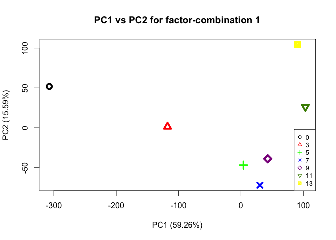

ASCA on average NSAF values of filtered proteins
================
Shelly Trigg
1/16/2019

load libraries

``` r
library(dplyr)
```

    ## Warning: package 'dplyr' was built under R version 3.4.4

    ## 
    ## Attaching package: 'dplyr'

    ## The following objects are masked from 'package:stats':
    ## 
    ##     filter, lag

    ## The following objects are masked from 'package:base':
    ## 
    ##     intersect, setdiff, setequal, union

``` r
library(tidyr)
```

    ## Warning: package 'tidyr' was built under R version 3.4.4

``` r
library(MetStaT)
```

    ## Loading required package: MASS

    ## Warning: package 'MASS' was built under R version 3.4.4

    ## 
    ## Attaching package: 'MASS'

    ## The following object is masked from 'package:dplyr':
    ## 
    ##     select

    ## Loading required package: abind

    ## Loading required package: pls

    ## Warning: package 'pls' was built under R version 3.4.4

    ## 
    ## Attaching package: 'pls'

    ## The following object is masked from 'package:stats':
    ## 
    ##     loadings

``` r
library(ggplot2)
```

    ## Warning: package 'ggplot2' was built under R version 3.4.4

``` r
library(heatmap3)
```

load data

``` r
#NSAF data from filtered proteins
data <- read.csv("~/Documents/GitHub/OysterSeedProject/analysis/nmds_R/silo3and9_nozerovals_noincnstprot.csv", stringsAsFactors = FALSE)
```

load data with annotations so protein IDs can be substituted This chunk makes a list of protein IDs and unique shortened Entry Names

``` r
#data with uniprot annotations
data_w_uniprot <- read.csv("~/Documents/GitHub/OysterSeedProject/raw_data/gigaton-uniport-table_GOterms-sperated.csv", stringsAsFactors = FALSE)
#subset only Protein IDs and Entry names
data_w_uniprot <- data_w_uniprot[,c("Protein.ID", "Entry.name")]
#replace pipe character with nothing; remember \\ to escape the | character
data_w_uniprot$Protein.ID <- gsub("\\|",".", data_w_uniprot$Protein.ID)
#replace all characters following '_' with nothing in the entry name column
data_w_uniprot$Entry.name.simple <- gsub("\\_.*","", data_w_uniprot$Entry.name)
#replace 'none' with 'unknown'
data_w_uniprot$Entry.name.simple <- gsub("None","Unknown", data_w_uniprot$Entry.name.simple)

#there are duplicated Entry names for unique protein IDs, so we need to make unique Entry names by adding .1, .2 etc.
#https://stackoverflow.com/questions/16646446/renaming-duplicate-strings-in-r

data_w_uniprot$Entry.name.new <- make.names(data_w_uniprot$Entry.name.simple, unique = TRUE)
```

subset the data for only CHOYP proteins; this removes contaminant proteins

``` r
#make a dataframe with just CHOYP proteins
choyp_data <- data[,c(1:2,grep("CHOYP", colnames(data)))]
#make a seperate data frame with contaminant proteins
contam_data <- data[,-grep("CHOYP", colnames(data))]
```

perform ASCA

``` r
#create matrix to pass to ASCA command, excluding the silo and time info
ASCA_X <- as.matrix(choyp_data[,-c(1:2)])
#create matrix to pass to ASCA command with only the silo and time info
ASCA_F <- as.matrix(choyp_data[,c(1:2)])
#perform ASCA
ASCA <- ASCA.Calculate(ASCA_X, ASCA_F, equation.elements = "1,2,12", scaling = FALSE)
```

    ## Variance explained per principal component (if >1%):
    ## Whole data set   PC1: 48.74%   PC2: 13.30%   PC3: 8.69%    PC4: 8.11%    PC5: 6.31%    PC6: 3.95%    PC7: 3.08%    PC8: 2.58%    PC9: 1.66%    PC10: 1.27%   
    ## Factor 1         PC1: 59.26%   PC2: 15.59%   PC3: 11.31%   PC4: 6.53%    PC5: 4.29%    PC6: 3.01%    PC7:  NA%     PC8:  NA%     PC9:  NA%     PC10:  NA%    
    ## Factor 2         PC1: 84.81%   PC2: 15.19%   PC3:  NA%     PC4:  NA%     PC5:  NA%     PC6:  NA%     PC7:  NA%     PC8:  NA%     PC9:  NA%     PC10:  NA%    
    ## Interaction 12   PC1: 63.45%   PC2: 12.71%   PC3: 11.00%   PC4: 6.17%    PC5: 3.88%    PC6: 2.79%    PC7:  NA%     PC8:  NA%     PC9:  NA%     PC10:  NA%    
    ## 
    ## Percentage each effect contributes to the total sum of squares:
    ## Overall means    98.04%
    ## Factor 1         1.29%
    ## Factor 2         0.65%
    ## Interaction 12   1.04%
    ## Residuals        0.00%
    ## 
    ## Percentage each effect contributes to the sum of squares of the centered data:
    ## Factor 1         65.62%
    ## Factor 2         33.22%
    ## Interaction 12   53.12%
    ## Residuals        0.00%

Here is a summary of the ASCA results (e.g. variance explained by different factors; factor 1= time (days), factor 2 = temperature, interaction = interaction of time and temperature)

``` r
#print the ASCA summary
ASCA.GetSummary(ASCA)
```

    ## Variance explained per principal component (if >1%):
    ## Whole data set   PC1: 48.74%   PC2: 13.30%   PC3: 8.69%    PC4: 8.11%    PC5: 6.31%    PC6: 3.95%    PC7: 3.08%    PC8: 2.58%    PC9: 1.66%    PC10: 1.27%   
    ## Factor 1         PC1: 59.26%   PC2: 15.59%   PC3: 11.31%   PC4: 6.53%    PC5: 4.29%    PC6: 3.01%    PC7:  NA%     PC8:  NA%     PC9:  NA%     PC10:  NA%    
    ## Factor 2         PC1: 84.81%   PC2: 15.19%   PC3:  NA%     PC4:  NA%     PC5:  NA%     PC6:  NA%     PC7:  NA%     PC8:  NA%     PC9:  NA%     PC10:  NA%    
    ## Interaction 12   PC1: 63.45%   PC2: 12.71%   PC3: 11.00%   PC4: 6.17%    PC5: 3.88%    PC6: 2.79%    PC7:  NA%     PC8:  NA%     PC9:  NA%     PC10:  NA%    
    ## 
    ## Percentage each effect contributes to the total sum of squares:
    ## Overall means    98.04%
    ## Factor 1         1.29%
    ## Factor 2         0.65%
    ## Interaction 12   1.04%
    ## Residuals        0.00%
    ## 
    ## Percentage each effect contributes to the sum of squares of the centered data:
    ## Factor 1         65.62%
    ## Factor 2         33.22%
    ## Interaction 12   53.12%
    ## Residuals        0.00%

    ## $summary.pca
    ##            PC1       PC2        PC3        PC4        PC5        PC6
    ## data 0.4874075 0.1329512 0.08690744 0.08107159 0.06313575 0.03946587
    ## 1    0.5925555 0.1558957 0.11312945 0.06533012 0.04294826 0.03014091
    ## 2    0.8481333 0.1518667         NA         NA         NA         NA
    ## 12   0.6344806 0.1270958 0.10999221 0.06167974 0.03884336 0.02790837
    ##             PC7        PC8        PC9       PC10
    ## data 0.03078727 0.02581203 0.01657766 0.01265652
    ## 1            NA         NA         NA         NA
    ## 2            NA         NA         NA         NA
    ## 12           NA         NA         NA         NA
    ## 
    ## $summary.ssq
    ##                     Overall means          1           2         12
    ## Contribution to ssq     0.9803873 0.01286986 0.006515683 0.01041795
    ##                        Residuals
    ## Contribution to ssq 5.157051e-35

### Plot PCAs from ASCA

This first plot is the PCA for time (days)

``` r
#plot PCA for factor 1, which is time in this case
ASCA.PlotScoresPerLevel(ASCA, ee = "1", pcs = "1,2")
```



This next plot is the PCA for temperature

``` r
#plot PCA for factor 2, which is temperature in this case
ASCA.PlotScoresPerLevel(ASCA, ee = "2", pcs = "1,2")
```


### Analysis of proteins affected by temperature

``` r
#extract protein names from ASCA data; these will be combined with loadings values; the order is maintained
protnames <- data.frame(colnames(ASCA$data))
#combine protein names with ASCA loadings for PC2 for temperature, since this component showed the greatest separation between temperatures
d <- cbind(protnames, ASCA$`2`$svd$v[,2])
#rename the columns
colnames(d) <- c("protein", "PC2loadings")
#make a dataframe of proteins with PC loadings greater than zero for the loadings plot
d_great <- d[which(d$PC2loadings > 0),]
#make a dataframe of proteins with PC loadings less than zero for the loadings plot
d_less <- d[which(d$PC2loadings < 0),]
#plot PC2 loadings
plot(d_great[order(d_great$PC2loadings, decreasing = TRUE),2], xlab = "protein", ylab = "PC2 Loadings")
```


``` r
plot(d_less[order(d_less$PC2loadings, decreasing = TRUE),2],xlab = "protein", ylab = "PC2 Loadings")
```


To pull out proteins affected by temperature based on their influence in seperating treatment groups on PC2 of the temperature PCA, I picked an absolute value loadings threshold of 0.025. This means any protein that had a loadings value \> 0.025 or \< -0.025 was selected.

``` r
#make list of proteins with temperature PC1 loadings values >= 0.04
cutd <- d[which(abs(d$PC2loadings) >= 0.025),]

#make a list of cutoff proteins with normalized abundance
cut_data <-data[,which(colnames(data) %in% cutd$protein)]
rownames(cut_data) <- paste(data$day, data$temp, sep="_")
```

Plot a heatmap of protein abundances (NSAF values) that are influenced by temperature having PC2 loadings values \> 0.025 or \< -0.025.

``` r
#make a heatmap to see if proteins cluster based on abundance over time
heatmap3(t.data.frame(cut_data),Colv = NA,cexRow = 0.4, cexCol = 0.7)
```

 This heatmap shows common time points adjacent to each other.

Make a new heatmap ordered by sequencial time points for each temperature.

``` r
#diff order
cut_data_ord <- data[,c(1:3,which(colnames(data) %in% cutd$protein))]
cut_data_ord <- cut_data_ord[order(cut_data_ord$temp,cut_data_ord$day),]
rownames(cut_data_ord) <- paste(cut_data_ord$day, cut_data_ord$temp, sep="_")
cut_data_ord <- cut_data_ord[,-c(1:3)]
heatmap3(t.data.frame(cut_data_ord),Colv = NA,cexRow = 0.4, cexCol = 0.7)
```


Make a new heatmap with simpler protein names

``` r
#replace CHOYP names with "entry names"
#transposed to eventually get row names as columns to match entry names to. 
#t.data.frame returns a matrix so I had convert back to data frame for all downstream rearranging because data frames are much easier to work with
cut_data_ord_t <- data.frame(t.data.frame(cut_data_ord))
#make row names which contain the protein IDs a column
cut_data_ord_t <- cbind(rownames(cut_data_ord_t), cut_data_ord_t)
#add the column name
colnames(cut_data_ord_t)[1] <- "Protein.ID"
#convert the Protein ID column to character
cut_data_ord_t[,1] <- as.character(cut_data_ord_t[,1])
#add the Entry names
cut_data_ord_t <- merge(data_w_uniprot[,c("Protein.ID","Entry.name.new")],cut_data_ord_t, by = "Protein.ID")
#make the entry names the row names
rownames(cut_data_ord_t) <- cut_data_ord_t[,"Entry.name.new"]
#remove the protein ID and entry name columns since the row names are added
cut_data_ord_t <- cut_data_ord_t[,-c(1:2)]
#this step removes the x from the column names while preserving the order of colnames
colnames(cut_data_ord_t) <- rownames(cut_data_ord)
#plot the heat map
heatmap3(as.matrix(cut_data_ord_t), Colv = NA, cexRow = 0.3, cexCol = 0.7)
```


