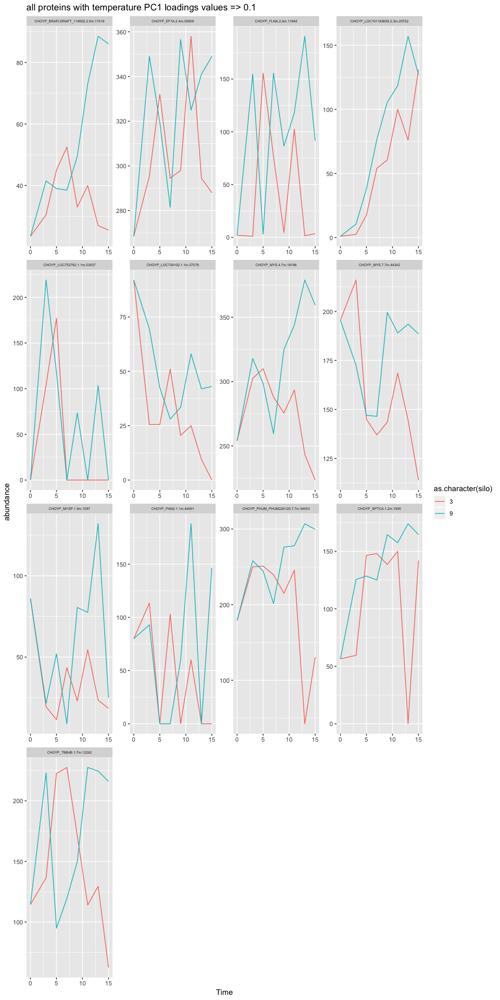

ASCA\_OysterSeedTemp
================
Shelly Trigg
11/5/2018

Load libraries

``` r
library(dplyr)
```

    ## Warning: package 'dplyr' was built under R version 3.4.4

    ## 
    ## Attaching package: 'dplyr'

    ## The following objects are masked from 'package:stats':
    ## 
    ##     filter, lag

    ## The following objects are masked from 'package:base':
    ## 
    ##     intersect, setdiff, setequal, union

``` r
library(tidyr)
```

    ## Warning: package 'tidyr' was built under R version 3.4.4

``` r
library(MetStaT)
```

    ## Loading required package: MASS

    ## Warning: package 'MASS' was built under R version 3.4.4

    ## 
    ## Attaching package: 'MASS'

    ## The following object is masked from 'package:dplyr':
    ## 
    ##     select

    ## Loading required package: abind

    ## Loading required package: pls

    ## Warning: package 'pls' was built under R version 3.4.4

    ## 
    ## Attaching package: 'pls'

    ## The following object is masked from 'package:stats':
    ## 
    ##     loadings

``` r
library(MetaboAnalystR)
library(ggplot2)
```

    ## Warning: package 'ggplot2' was built under R version 3.4.4

``` r
library(heatmap3)
```

read in Oyster Temp. protein data frame

``` r
data <- read.csv("~/Documents/GitHub/OysterSeedProject/analysis/kmeans/Silo3_and_9/silo3and9.csv")
#create silo column
data$silo <- substr(data$Protein,1,1)
#change class of protein column from factor to character
data$Protein <- as.character(unlist(data$Protein))
#remove the silo identifier from the protein names
data$Protein <- substr(data$Protein, 3, nchar(data$Protein))
#Change table orientation so that all abundances are listed in one column 
#and time points are listed down a column
#In this command, we only want to apply it to the timepoint columns that 
#have abundance values and keep the protein and silo columns unchanged
#so we use c(2:9) to select for timepoint columns with abundance values only
data <- tidyr::gather(data, "Time", "abundance", c(2:9))
#Change the table orientation again so that proteins are listed across the top
#This command will condense the proteins so that only unique proteins are listed
#across the top
data <- tidyr::spread(data, "Protein", "abundance")
#change silo column class to numeric
data$silo <- as.numeric(data$silo)
#change time column class to numeric; exclude the X with the substr command
data$Time <- as.numeric(substr(data$Time,2,nchar(data$Time)))

#format and export table for metaboanalyst
data$sample <- paste("S",data$silo,"T",data$Time, sep = "")
#move sample columns to first column
data <- data[,c(ncol(data),1:ncol(data)-1)]
data_choyp <- data[,c(1:3,grep("CHOYP", colnames(data)))]
data_std <- data[,-grep("CHOYP", colnames(data))]
write.csv(data_choyp, "~/Documents/GitHub/OysterSeedProject/analysis/ASCA/ASCA_shellytest/silo3_9_CHOYP_reformat4MetabA.csv", row.names = FALSE, quote = FALSE)
write.csv(data_std, "~/Documents/GitHub/OysterSeedProject/analysis/ASCA/ASCA_shellytest/silo3_9_STD_reformat4MetabA.csv", row.names = FALSE, quote = FALSE)
```

running metaboanalyst in R

``` r
#read in timeseries data
mSet<-InitDataObjects("conc", "ts", FALSE)
```

    ## [1] "R objects intialized ..."

``` r
mSet<-SetDesignType(mSet, "time")
mSet<-Read.TextData(mSet, "~/Documents/GitHub/OysterSeedProject/analysis/ASCA/ASCA_shellytest/silo3_9_CHOYP_reformat4MetabA.csv", "rowts", "disc")
```

    ## [1] "Samples are in rows and features in columns"                                  
    ## [2] "The uploaded file is in comma separated values (.csv) format."                
    ## [3] "The uploaded data file contains 16 (samples) by 7988 (compounds) data matrix."

``` r
mSet<-SanityCheckData(mSet)
#exclude any peptides with missing or zero values
mSet<-RemoveMissingPercent(mSet, percent=0.5)
mSet<-ImputeVar(mSet, method="exclude")
#filter by interquartile range to exclude proteins with near constant values throughout the experiment: 
#mSet<-FilterVariable(mSet, "iqr", "F", 25)

#do mean-centering
mSet<-Normalization(mSet, "NULL", "NULL", "MeanCenter", ratio=FALSE, ratioNum=20)
mSet<-PlotNormSummary(mSet, "norm_CHOYP_nozeros_", "png", 72, width=NA)
#make a data frame out of mean-centered peptides with zero-value peptides excluded
normData <- data.frame(mSet$dataSet$norm)
```

run ASCA with MetStat function

``` r
#create matrix to pass to ASCA command, excluding the silo and time info
ASCA_normData_X <- as.matrix(normData)
#create matrix to pass to ASCA command with only the silo and time info
ASCA_normData_F <- cbind(as.matrix(as.numeric(substr(rownames(normData),2,2))), as.matrix(as.numeric(substr(rownames(normData),4,length(rownames(normData))))))

#Run ASCA command
ASCA <- ASCA.Calculate(ASCA_normData_X, ASCA_normData_F, equation.elements = "1,2,12", scaling = FALSE)
```

    ## Variance explained per principal component (if >1%):
    ## Whole data set   PC1: 38.36%   PC2: 17.34%   PC3: 11.35%   PC4: 6.15%    PC5: 5.03%    PC6: 4.91%    PC7: 4.27%    PC8: 2.83%    PC9: 2.34%    PC10: 1.93%   
    ## Factor 1         PC1: 100.00%  PC2:  NA%     PC3:  NA%     PC4:  NA%     PC5:  NA%     PC6:  NA%     PC7:  NA%     PC8:  NA%     PC9:  NA%     PC10:  NA%    
    ## Factor 2         PC1: 52.58%   PC2: 16.94%   PC3: 9.55%    PC4: 7.77%    PC5: 5.75%    PC6: 4.64%    PC7: 2.76%    PC8:  NA%     PC9:  NA%     PC10:  NA%    
    ## Interaction 12   PC1: 43.95%   PC2: 17.08%   PC3: 12.81%   PC4: 10.60%   PC5: 8.09%    PC6: 5.73%    PC7: 1.73%    PC8:  NA%     PC9:  NA%     PC10:  NA%    
    ## 
    ## Percentage each effect contributes to the total sum of squares:
    ## Overall means    0.00%
    ## Factor 1         6.73%
    ## Factor 2         64.39%
    ## Interaction 12   28.88%
    ## Residuals        0.00%
    ## 
    ## Percentage each effect contributes to the sum of squares of the centered data:
    ## Factor 1         6.73%
    ## Factor 2         64.39%
    ## Interaction 12   28.88%
    ## Residuals        0.00%

plot loadings for PC1 and PC2 for temperature, time, and their interaction 

score plots for PC1 and PC2 for temperature, time, and their interaction 

    ## Warning in plot.xy(xy.coords(x, y), type = type, ...): pch value '254' is
    ## invalid in this locale


Summary of ASCA

    ## Variance explained per principal component (if >1%):
    ## Whole data set   PC1: 38.36%   PC2: 17.34%   PC3: 11.35%   PC4: 6.15%    PC5: 5.03%    PC6: 4.91%    PC7: 4.27%    PC8: 2.83%    PC9: 2.34%    PC10: 1.93%   
    ## Factor 1         PC1: 100.00%  PC2:  NA%     PC3:  NA%     PC4:  NA%     PC5:  NA%     PC6:  NA%     PC7:  NA%     PC8:  NA%     PC9:  NA%     PC10:  NA%    
    ## Factor 2         PC1: 52.58%   PC2: 16.94%   PC3: 9.55%    PC4: 7.77%    PC5: 5.75%    PC6: 4.64%    PC7: 2.76%    PC8:  NA%     PC9:  NA%     PC10:  NA%    
    ## Interaction 12   PC1: 43.95%   PC2: 17.08%   PC3: 12.81%   PC4: 10.60%   PC5: 8.09%    PC6: 5.73%    PC7: 1.73%    PC8:  NA%     PC9:  NA%     PC10:  NA%    
    ## 
    ## Percentage each effect contributes to the total sum of squares:
    ## Overall means    0.00%
    ## Factor 1         6.73%
    ## Factor 2         64.39%
    ## Interaction 12   28.88%
    ## Residuals        0.00%
    ## 
    ## Percentage each effect contributes to the sum of squares of the centered data:
    ## Factor 1         6.73%
    ## Factor 2         64.39%
    ## Interaction 12   28.88%
    ## Residuals        0.00%

    ## $summary.pca
    ##            PC1       PC2        PC3        PC4        PC5        PC6
    ## data 0.3835712 0.1733538 0.11349110 0.06153735 0.05034113 0.04909186
    ## 1    1.0000000        NA         NA         NA         NA         NA
    ## 2    0.5258047 0.1694229 0.09552861 0.07767502 0.05754621 0.04641135
    ## 12   0.4395177 0.1707994 0.12810826 0.10598042 0.08093744 0.05733208
    ##             PC7       PC8        PC9       PC10
    ## data 0.04272131 0.0282603 0.02342478 0.01929759
    ## 1            NA        NA         NA         NA
    ## 2    0.02761117        NA         NA         NA
    ## 12   0.01732470        NA         NA         NA
    ## 
    ## $summary.ssq
    ##                     Overall means          1         2        12 Residuals
    ## Contribution to ssq             0 0.06727141 0.6438832 0.2888454         0

Run permutation test (shuffle group labels of samples and see if results are the same)

    ##          1     2    12
    ## [1,] 0.147 0.015 0.997

this means that time has a significant effect on molecules, but temperature or time x temp interaction of the factors does not have a significant effect

plot PC1 loadings to find point of diminishing returns for cutoff print plot PC1 loadings values for proteins with loadings values \> 0 

cutoff loadings at absolute value \>= 0.04 make a heatmap to see if proteins cluster based on abundance patterns

``` r
#make list of proteins with temperature PC1 loadings values >= 0.04
cutd <- d[which(abs(d$PC1loadings) >= 0.04),]

#make a list of cutoff proteins with non-normalized abundance
#first remove pipe
cutDnonNorm <- data_choyp
colnames(cutDnonNorm) <- gsub("\\|","",colnames(cutDnonNorm))
cutDnonNorm <- cutDnonNorm[,c(2:3,which(colnames(cutDnonNorm) %in% cutd$protein))]

#make a list of cutoff proteins with normalized abundance
cutnormD <-normData[,which(colnames(normData) %in% cutd$protein)]
cutnormD$silo <- as.numeric(substr(rownames(cutnormD),2,2))
cutnormD$time <- as.matrix(as.numeric(substr(rownames(cutnormD),4,length(rownames(cutnormD)))))
#reorder columns
cutnormD <- cutnormD[,c(60,61,1:59)]
#order table by silo and time
ord_cutnormD <- cutnormD[order(cutnormD$silo,cutnormD$time),]
#make a heatmap to see if proteins cluster based on abundance over time
heatmap3(as.matrix(t(ord_cutnormD[-c(1,9),3:61])), Colv = NA, cexRow = 0.5)
```


Line plots of mean-centered abundance over time for proteins passing PC1 loadings cutoff 
