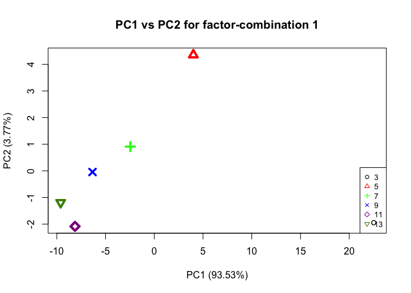
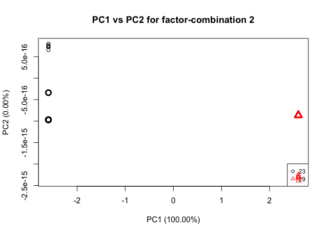

DaysxTime\_normalization
================
Shelly Trigg
5/23/2019

load libraries

``` r
library(tidyr)
library(ggplot2)
library(MetStaT)
```

    ## Loading required package: MASS

    ## Loading required package: abind

    ## Loading required package: pls

    ## 
    ## Attaching package: 'pls'

    ## The following object is masked from 'package:stats':
    ## 
    ##     loadings

``` r
library(heatmap3)
```

``` r
NSAF <- read.csv("~/Documents/GitHub/paper-OysterSeed-TimeXTemp/Data/silo3and9_nozerovals_NSAF_AVGs.csv", stringsAsFactors = FALSE)
```

Create tempXdays dataframe and merge it with NSAF data

``` r
tempXdays <- data.frame(NSAF$day * NSAF$temp)

NSAF <- cbind(tempXdays, NSAF)
colnames(NSAF)[1] <- "tempXdays"
```

normalize all NSAFs by tempXdays

``` r
NSAF_normTxD <- data.frame()

for(i in 1:nrow(NSAF)){
row <- NSAF[i,4:ncol(NSAF)]/(NSAF$tempXdays[i])
NSAF_normTxD <- rbind(NSAF_normTxD, row)
}
```

add temp and day info back

``` r
NSAF_normTxD <- cbind(NSAF[,2:3], NSAF_normTxD)
```

**Perform ASCA**

``` r
#create matrix to pass to ASCA command, excluding the silo and time info
ASCA_X <- as.matrix(NSAF_normTxD[,-c(1:2)])
#create matrix to pass to ASCA command with only the silo and time info
ASCA_F <- as.matrix(NSAF_normTxD[,c(1:2)])
#perform ASCA
ASCA <- ASCA.Calculate(ASCA_X, ASCA_F, equation.elements = "1,2,12", scaling = FALSE)
```

    ## Variance explained per principal component (if >1%):
    ## Whole data set   PC1: 83.30%   PC2: 8.06%    PC3: 2.82%    PC4: 1.51%    PC5: 1.25%    PC6: 1.06%    
    ## Factor 1         PC1: 93.53%   PC2: 3.77%    PC3: 1.31%    PC4:  NA%     PC5:  NA%     PC6:  NA%     
    ## Factor 2         PC1: 100.00%  PC2:  NA%     PC3:  NA%     PC4:  NA%     PC5:  NA%     PC6:  NA%     
    ## Interaction 12   PC1: 67.41%   PC2: 13.88%   PC3: 11.02%   PC4: 4.70%    PC5: 3.00%    PC6:  NA%     
    ## 
    ## Percentage each effect contributes to the total sum of squares:
    ## Overall means    70.19%
    ## Factor 1         25.30%
    ## Factor 2         1.32%
    ## Interaction 12   3.19%
    ## Residuals        0.00%
    ## 
    ## Percentage each effect contributes to the sum of squares of the centered data:
    ## Factor 1         84.88%
    ## Factor 2         4.41%
    ## Interaction 12   10.70%
    ## Residuals        0.00%

Here is a summary of the ASCA results (e.g. variance explained by different factors; factor 1= time (days), factor 2 = temperature, interaction = interaction of time and temperature)

``` r
#print the ASCA summary
ASCA.GetSummary(ASCA)
```

    ## Variance explained per principal component (if >1%):
    ## Whole data set   PC1: 83.30%   PC2: 8.06%    PC3: 2.82%    PC4: 1.51%    PC5: 1.25%    PC6: 1.06%    
    ## Factor 1         PC1: 93.53%   PC2: 3.77%    PC3: 1.31%    PC4:  NA%     PC5:  NA%     PC6:  NA%     
    ## Factor 2         PC1: 100.00%  PC2:  NA%     PC3:  NA%     PC4:  NA%     PC5:  NA%     PC6:  NA%     
    ## Interaction 12   PC1: 67.41%   PC2: 13.88%   PC3: 11.02%   PC4: 4.70%    PC5: 3.00%    PC6:  NA%     
    ## 
    ## Percentage each effect contributes to the total sum of squares:
    ## Overall means    70.19%
    ## Factor 1         25.30%
    ## Factor 2         1.32%
    ## Interaction 12   3.19%
    ## Residuals        0.00%
    ## 
    ## Percentage each effect contributes to the sum of squares of the centered data:
    ## Factor 1         84.88%
    ## Factor 2         4.41%
    ## Interaction 12   10.70%
    ## Residuals        0.00%

    ## $summary.pca
    ##            PC1        PC2        PC3        PC4        PC5        PC6
    ## data 0.8329519 0.08057280 0.02817309 0.01511295 0.01251043 0.01062901
    ## 1    0.9353286 0.03769716 0.01313907         NA         NA         NA
    ## 2    1.0000000         NA         NA         NA         NA         NA
    ## 12   0.6741007 0.13878427 0.11017533 0.04697671 0.02996298         NA
    ## 
    ## $summary.ssq
    ##                     Overall means         1          2         12
    ## Contribution to ssq     0.7019108 0.2530324 0.01315503 0.03190182
    ##                       Residuals
    ## Contribution to ssq 8.74194e-34

### Plot PCAs from ASCA

**This first plot is the time (days) effect PCA**

``` r
#plot PCA for factor 1, which is time in this case
ASCA.PlotScoresPerLevel(ASCA, ee = "1", pcs = "1,2")
```



**This next plot is the temperature effect PCA**

``` r
#plot PCA for factor 2, which is temperature in this case
ASCA.PlotScoresPerLevel(ASCA, ee = "2", pcs = "1,2")
```



**This next plot is the time x temp interaction effect PCA**

``` r
#plot PCA for factor interaction, which is time x temp in this case
timextemp_PC12 <- data.frame(ASCA$`12`$svd$t[,c(1,2)])
timextemp_PC12 <- cbind(data.frame(ASCA$`12`$level.combinations$row.patterns), timextemp_PC12)
colnames(timextemp_PC12)<- c("day","temp","PC1","PC2")
timextemp_PC12$day <- as.character(timextemp_PC12$day)
timextemp_PC12$temp <- as.character(timextemp_PC12$temp)
ggplot(timextemp_PC12, aes(PC1, PC2)) + geom_point(aes(col = day, shape = temp, size = 3)) + theme_bw() + ggtitle("PC1 vs PC2 for time x temperature interaction effect") + theme(plot.title = element_text(face = "bold")) + xlab(paste("PC1"," (",formatC(ASCA$`12`$svd$var.explained[1] * 100,digits=2,format="f"),"%)", sep = "")) + ylab(paste("PC2"," (",formatC(ASCA$`12`$svd$var.explained[2] * 100,digits=2,format="f"),"%)", sep = ""))
```


### Analysis of proteins affected by temperature

Because the temperature effect PCA show the most separation between 23C and 29C in PC2, we will look at those loadings.

**PC1 loadings for temperature effect** 

To pull out proteins affected by temperature based on their influence in seperating treatment groups on PC2 of the temperature PCA, I picked an absolute value loadings threshold of 0.025. This means any protein that had a loadings value \> 0.025 or \< -0.025 was selected.

heatmap3(t(cut\_data)) heatmap3(t(cut\_data), Colv = NA)

**PC1 loadings for temperature x time effect** 

To pull out proteins affected by temperature based on their influence in seperating treatment groups on PC2 of the temperature PCA, I picked an absolute value loadings threshold of 0.025. This means any protein that had a loadings value \> 0.025 or \< -0.025 was selected.

plot a heatmap of proteins with high PC1 loadings values in the ASCA time-temp interaction effect plot

``` r
heatmap3(t(cut_data12), Colv = NA, cexRow = 0.5)
```


pca

``` r
pca <- prcomp(NSAF_normTxD[,-c(1:2)])
pca_meta <- cbind(NSAF_normTxD[,c(1:2)],pca$x)
pca_meta$day <- factor(pca_meta$day)
pca_meta$temp <- factor(pca_meta$temp)

ggplot(pca_meta, aes(PC1, PC2)) + geom_point(aes(col = day, shape = temp)) + theme_bw() + ggtitle("PCA of ADJNSAF values scaled by day*time")
```


PCA with log scaled NSAFs

``` r
pca <- prcomp(log(NSAF_normTxD[,-c(1:2)],2))
pca_meta <- cbind(NSAF_normTxD[,c(1:2)],pca$x)
pca_meta$day <- factor(pca_meta$day)
pca_meta$temp <- factor(pca_meta$temp)

ggplot(pca_meta, aes(PC1, PC2)) + geom_point(aes(col = day, shape = temp)) + theme_bw() + ggtitle("PCA of log2 ADJNSAF values scaled by day*time")
```


Abudance over time of proteins with high PC1 loadings values in the ASCA time-temp interaction effect plot

``` r
cut_data12_STACKED <- cut_data12
cut_data12_STACKED$day <- gsub("_.*","",rownames(cut_data12))
cut_data12_STACKED$temp <- gsub(".*_","",rownames(cut_data12))

cut_data12_STACKED <- tidyr::gather(cut_data12_STACKED, "protein", "NSAF", 1:44)

ggplot(cut_data12_STACKED, aes(factor(as.integer(day)), NSAF, group = temp)) + geom_point(aes(color = temp)) + geom_line(aes(color = temp)) + facet_wrap(~protein, scale = "free") + ggtitle("Abudance over time of proteins with high PC1 loadings values in the ASCA time-temp interaction effect plot")
```


