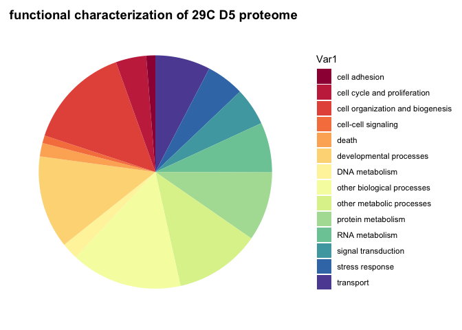
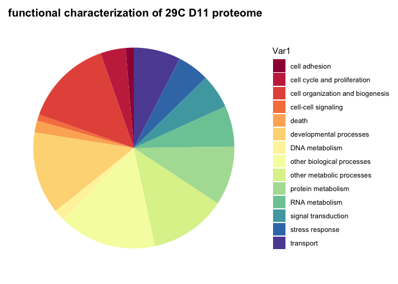
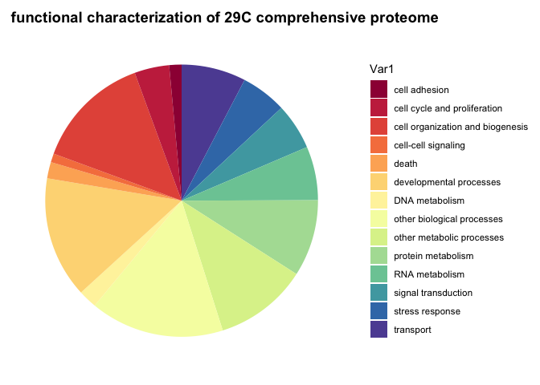
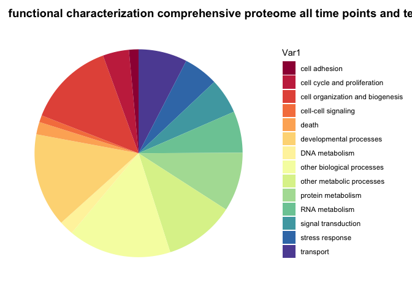

General\_proteome\_characterization
================
Shelly Trigg
4/3/2019

Load libraries

``` r
library(tidyr)
library(GSEABase)
```

    ## Loading required package: BiocGenerics

    ## Loading required package: parallel

    ## 
    ## Attaching package: 'BiocGenerics'

    ## The following objects are masked from 'package:parallel':
    ## 
    ##     clusterApply, clusterApplyLB, clusterCall, clusterEvalQ,
    ##     clusterExport, clusterMap, parApply, parCapply, parLapply,
    ##     parLapplyLB, parRapply, parSapply, parSapplyLB

    ## The following objects are masked from 'package:stats':
    ## 
    ##     IQR, mad, sd, var, xtabs

    ## The following objects are masked from 'package:base':
    ## 
    ##     anyDuplicated, append, as.data.frame, basename, cbind,
    ##     colMeans, colnames, colSums, dirname, do.call, duplicated,
    ##     eval, evalq, Filter, Find, get, grep, grepl, intersect,
    ##     is.unsorted, lapply, lengths, Map, mapply, match, mget, order,
    ##     paste, pmax, pmax.int, pmin, pmin.int, Position, rank, rbind,
    ##     Reduce, rowMeans, rownames, rowSums, sapply, setdiff, sort,
    ##     table, tapply, union, unique, unsplit, which, which.max,
    ##     which.min

    ## Loading required package: Biobase

    ## Welcome to Bioconductor
    ## 
    ##     Vignettes contain introductory material; view with
    ##     'browseVignettes()'. To cite Bioconductor, see
    ##     'citation("Biobase")', and for packages 'citation("pkgname")'.

    ## Loading required package: annotate

    ## Loading required package: AnnotationDbi

    ## Loading required package: stats4

    ## Loading required package: IRanges

    ## Loading required package: S4Vectors

    ## 
    ## Attaching package: 'S4Vectors'

    ## The following object is masked from 'package:tidyr':
    ## 
    ##     expand

    ## The following object is masked from 'package:base':
    ## 
    ##     expand.grid

    ## Loading required package: XML

    ## Loading required package: graph

    ## 
    ## Attaching package: 'graph'

    ## The following object is masked from 'package:XML':
    ## 
    ##     addNode

``` r
library(plyr)
```

    ## 
    ## Attaching package: 'plyr'

    ## The following object is masked from 'package:graph':
    ## 
    ##     join

    ## The following object is masked from 'package:IRanges':
    ## 
    ##     desc

    ## The following object is masked from 'package:S4Vectors':
    ## 
    ##     rename

``` r
library(RColorBrewer)
library(ggplot2)
```

read in data

``` r
NSAF <- read.csv("~/Documents/GitHub/OysterSeedProject/analysis/nmds_R/silo3and9_nozerovals_AVGs.csv", stringsAsFactors = FALSE)
sr_lab_goslim <- read.csv("~/Documents/GitHub/OysterSeedProject/raw_data/background/GOSlim_terms.csv", stringsAsFactors = FALSE)
colnames(sr_lab_goslim)[1] <- "GO"
#For reading in uniprot, gannet must be mounted on the computer
uniprot <- read.csv("/Volumes/web/metacarcinus/Cgigas/all_giga-uniprot-blastP-out.nopipe.annotations.tab", sep ="\t", header = FALSE, stringsAsFactors = FALSE)
#rename uniprot columns
colnames(uniprot) <- c("protein_ID","Entry", "Entry_name", "perc_ident_match", "align_len", "num_mismatch", "num_gaps","querStart", "querEnd", "subjStart", "subjEnd", "evalue", "bitscore","Entry.1","Entry_name.1", "Protein_names", "Gene_names", "Organism", "Protein_length","Pathway", "GO_bp", "GO","GO_IDs", "Protein_fams")
```

I had already changed the zeros to 0.1, so I will sub that back with zero for this analysis

``` r
#I had already changed the zeros to 0.1, so I will sub that back with zero for this analysis
NSAF[NSAF == 0.1] <- 0
```

separate 3 and 9

``` r
#separate 3 and 9

silo3 <- NSAF[grep("23", NSAF$temp),]
silo9 <- NSAF[grep("29", NSAF$temp),]
```

reformat to long list

``` r
silo3_t <- data.frame(t(silo3[,-c(1,2)]))
colnames(silo3_t) <- paste0("D",silo3$day)

silo9_t <- data.frame(t(silo9[,-c(1,2)]))
colnames(silo9_t) <- paste0("D",silo9$day)
```

remove proteins that were only in silo9

``` r
no_val_proteins <- rownames(silo3_t[which(apply(silo3_t, 1, var) == 0),])
silo3_t_nozero <- silo3_t[-c(which(rownames(silo3_t) %in% no_val_proteins)),]
#confirm it worked
nrow(silo3_t)
```

    ## [1] 7992

``` r
nrow(silo3_t_nozero)
```

    ## [1] 7204

``` r
nrow(silo3_t)-nrow(silo3_t_nozero)
```

    ## [1] 788

``` r
length(no_val_proteins)
```

    ## [1] 788

``` r
no_val_proteins <- rownames(silo9_t[which(apply(silo9_t, 1, var) == 0),])
silo9_t_nozero <- silo9_t[-c(which(rownames(silo9_t) %in% no_val_proteins)),]
#confirm it worked
nrow(silo9_t)
```

    ## [1] 7992

``` r
nrow(silo9_t_nozero)
```

    ## [1] 7041

``` r
nrow(silo9_t)-nrow(silo9_t_nozero)
```

    ## [1] 951

``` r
length(no_val_proteins)
```

    ## [1] 951

add protein column

``` r
silo3_t_nozero$protein_ID <- rownames(silo3_t_nozero)
silo3_t_nozero <- silo3_t_nozero[grep("CHOYP", silo3_t_nozero$protein_ID),]

silo9_t_nozero$protein_ID <- rownames(silo9_t_nozero)
silo9_t_nozero <- silo9_t_nozero[grep("CHOYP", silo9_t_nozero$protein_ID),]
```

merge with uniprot

``` r
#combine uniprot and NSAF data
silo3_t_nozero_unip<- merge(silo3_t_nozero, uniprot, by = "protein_ID", all.x = TRUE)

silo9_t_nozero_unip<- merge(silo9_t_nozero, uniprot, by = "protein_ID", all.x = TRUE)
```

exclude proteins that didn't map to uniprot DB

``` r
silo3_t_nozero_unip_mapped <- silo3_t_nozero_unip[-grep("unmapped", silo3_t_nozero_unip$Entry),]
nrow(silo3_t_nozero_unip_mapped)
```

    ## [1] 6963

``` r
silo3_t_nozero_unip_mapped <- silo3_t_nozero_unip_mapped[which(silo3_t_nozero_unip_mapped$evalue <= 10^-10),]
nrow(silo3_t_nozero_unip_mapped)
```

    ## [1] 3556

``` r
silo9_t_nozero_unip_mapped <- silo9_t_nozero_unip[-grep("unmapped", silo9_t_nozero_unip$Entry),]
nrow(silo9_t_nozero_unip_mapped)
```

    ## [1] 6809

``` r
silo9_t_nozero_unip_mapped <- silo9_t_nozero_unip_mapped[which(silo9_t_nozero_unip_mapped$evalue <= 10^-10),]
nrow(silo9_t_nozero_unip_mapped)
```

    ## [1] 3500

get go terms for each day for silo 3 (23C)

``` r
#create empty data frames to fill in with loop
silo3_all_srlab_terms_per_day <- data.frame()
silo3_all_srlab_BPterms_per_day <- data.frame()

#create list of days
days <- colnames(silo3_t_nozero_unip_mapped[,2:7])

#loop through days and pull out GO IDs associated with proteins from specific day
for(i in days){
  silo3_pro_GO <- silo3_t_nozero_unip_mapped[which(silo3_t_nozero_unip_mapped[,i] != 0),c("protein_ID","GO_IDs")] # create day specific list of proteins and their associated GO IDs 

  silo3_pro_GOid_term <- data.frame() #create another empty data frame
#loop through each line of data frame containing one column with "protein_ID" and one column with list of "GO_IDs" separated by ";"
  for (j in 1:nrow(silo3_pro_GO)){
    #create a row that lists all GO IDs associated with one protein listed across rows, where each different GO ID gets put in it's own column
    silo3_pro_GOid_term_row <- data.frame(t(data.frame(strsplit(as.character(silo3_pro_GO$GO_IDs[j]),'; ', fixed = TRUE))), stringsAsFactors = FALSE)
    #add each row created in the line above to the empty data frame
    #this will add NAs in columns where less terms exist; e.g. if a protein only has two terms and another has 10, there will be 8 NAs added to the row for the protein with 2 terms
    silo3_pro_GOid_term <- rbind.fill(silo3_pro_GOid_term,silo3_pro_GOid_term_row)
  }

  #add protein IDs back to GO IDs
  silo3_pro_GOid_term <- cbind(silo3_pro_GO[,"protein_ID"], silo3_pro_GOid_term)
  #this results in a table with protein ID listed in one column and each next column contains a GO ID that was listed with the protein in Uniprot DB.
  
  #reshape data so that all GO ID columns are gathered in one column called "GO" 
  STACKED_silo3_pro_GOid_term <- tidyr::gather(silo3_pro_GOid_term,"protein_ID","GO", 2:ncol(silo3_pro_GOid_term))
  #exlude middle column which just contains the string "protein_ID" in each row
  STACKED_silo3_pro_GOid_term <- STACKED_silo3_pro_GOid_term[,c(1,3)]
  #remove duplicate rows
  STACKED_silo3_pro_GOid_term <- unique(STACKED_silo3_pro_GOid_term)
  colnames(STACKED_silo3_pro_GOid_term)[1] <- "protein_ID"
  #remove any rows where GO column has NA value. 
  STACKED_silo3_pro_GOid_term <- STACKED_silo3_pro_GOid_term[which(!is.na(STACKED_silo3_pro_GOid_term$GO)),]
  #this resulting data frame has two columns "protein_ID" and "GO"
  
  ##get go slim terms for each day
  STACKED_silo3_pro_GOid_term_sr_labGOslim <- merge(STACKED_silo3_pro_GOid_term, sr_lab_goslim, by = "GO", all.x = TRUE)
  
  STACKED_silo3_pro_GOid_term_sr_labGOslim$GOSlim_bin <- ifelse(is.na(STACKED_silo3_pro_GOid_term_sr_labGOslim$GOSlim_bin),"unmapped",STACKED_silo3_pro_GOid_term_sr_labGOslim$GOSlim_bin)
  
  silo3_all_srlab_terms <- data.frame(table(STACKED_silo3_pro_GOid_term_sr_labGOslim$GOSlim_bin))
  silo3_all_srlab_terms$day <- i
  #View(silo3_all_srlab_terms)
  
  silo3_all_srlab_BPterms <- data.frame(table(STACKED_silo3_pro_GOid_term_sr_labGOslim[which(STACKED_silo3_pro_GOid_term_sr_labGOslim$aspect=="P"),"GOSlim_bin"]))
  silo3_all_srlab_BPterms$day <- i
    
  silo3_all_srlab_terms_per_day <- rbind(silo3_all_srlab_terms_per_day,silo3_all_srlab_terms)
  silo3_all_srlab_BPterms_per_day <- rbind(silo3_all_srlab_BPterms_per_day,silo3_all_srlab_BPterms)
}
```

get go terms for each day for silo 9 (29C)

``` r
silo9_all_srlab_terms_per_day <- data.frame()
silo9_all_srlab_BPterms_per_day <- data.frame()

days <- colnames(silo9_t_nozero_unip_mapped[,2:7])
for(i in days){
  silo9_pro_GO <- silo9_t_nozero_unip_mapped[which(silo9_t_nozero_unip_mapped[,i] != 0),c("protein_ID","GO_IDs")]
  
  silo9_pro_GOid_term <- data.frame()
  #loop through each line of data frame containing one column with "protein_ID" and one column with list of "GO_IDs" separated by ";"
  for (j in 1:nrow(silo9_pro_GO)){
    #create a row that lists all GO IDs associated with one protein listed across rows, where each different GO ID gets put in it's own column
    silo9_pro_GOid_term_row <- data.frame(t(data.frame(strsplit(as.character(silo9_pro_GO$GO_IDs[j]),'; ', fixed = TRUE))), stringsAsFactors = FALSE)
    #add each row created in the line above to the empty data frame
    #this will add NAs in columns where less terms exist; e.g. if a protein only has two terms and another has 10, there will be 8 NAs added to the row for the protein with 2 terms
    silo9_pro_GOid_term <- rbind.fill(silo9_pro_GOid_term,silo9_pro_GOid_term_row)
  }
  
  #add protein IDs back to GO IDs
  silo9_pro_GOid_term <- cbind(silo9_pro_GO[,"protein_ID"], silo9_pro_GOid_term)
  #this results in a table with protein ID listed in one column and each next column contains a GO ID that was listed with the protein in Uniprot DB.
  
  #reshape data so that all GO ID columns are gathered in one column called "GO" 
  STACKED_silo9_pro_GOid_term <- tidyr::gather(silo9_pro_GOid_term,"protein_ID","GO", 2:ncol(silo9_pro_GOid_term))
  #exlude middle column which just contains the string "protein_ID" in each row
  STACKED_silo9_pro_GOid_term <- STACKED_silo9_pro_GOid_term[,c(1,3)]
  #remove duplicate rows
  STACKED_silo9_pro_GOid_term <- unique(STACKED_silo9_pro_GOid_term)
  colnames(STACKED_silo9_pro_GOid_term)[1] <- "protein_ID"
  #remove any rows where GO column has NA value. 
  STACKED_silo9_pro_GOid_term <- STACKED_silo9_pro_GOid_term[which(!is.na(STACKED_silo9_pro_GOid_term$GO)),]
  #this resulting data frame has two columns "protein_ID" and "GO"
  
  ##get go slim terms for each day
  STACKED_silo9_pro_GOid_term_sr_labGOslim <- merge(STACKED_silo9_pro_GOid_term, sr_lab_goslim, by = "GO", all.x = TRUE)
  
  STACKED_silo9_pro_GOid_term_sr_labGOslim$GOSlim_bin <- ifelse(is.na(STACKED_silo9_pro_GOid_term_sr_labGOslim$GOSlim_bin),"unmapped",STACKED_silo9_pro_GOid_term_sr_labGOslim$GOSlim_bin)
  
  silo9_all_srlab_terms <- data.frame(table(STACKED_silo9_pro_GOid_term_sr_labGOslim$GOSlim_bin))
  silo9_all_srlab_terms$day <- i
  #View(silo9_all_srlab_terms)
  
  silo9_all_srlab_BPterms <- data.frame(table(STACKED_silo9_pro_GOid_term_sr_labGOslim[which(STACKED_silo9_pro_GOid_term_sr_labGOslim$aspect=="P"),"GOSlim_bin"]))
  silo9_all_srlab_BPterms$day <- i
  
  silo9_all_srlab_terms_per_day <- rbind(silo9_all_srlab_terms_per_day,silo9_all_srlab_terms)
  silo9_all_srlab_BPterms_per_day <- rbind(silo9_all_srlab_BPterms_per_day,silo9_all_srlab_BPterms)
}
```

make pie chart for each day of sr lab GO slim terms for all mapped proteins from silo 3(23C)

``` r
#for color palette expansion: https://www.r-bloggers.com/how-to-expand-color-palette-with-ggplot-and-rcolorbrewer/
#for pie chart: http://www.sthda.com/english/wiki/ggplot2-pie-chart-quick-start-guide-r-software-and-data-visualization


getPalette = colorRampPalette(brewer.pal(11, "Spectral"))
blank_theme <- theme_minimal()+
  theme(
    axis.title.x = element_blank(),
    axis.title.y = element_blank(),
    panel.border = element_blank(),
    panel.grid=element_blank(),
    axis.ticks = element_blank(),
    plot.title=element_text(size=14, face="bold")
  )

#loop through days and create plot for each day
for(i in days){
  p <- ggplot(silo3_all_srlab_BPterms_per_day[which(silo3_all_srlab_BPterms_per_day$day== i),], aes(x = "", y = Freq, fill = Var1)) + geom_bar(stat = "identity") + coord_polar("y", start = 0) + scale_fill_manual(values = getPalette(nrow(silo3_all_srlab_BPterms_per_day[which(silo3_all_srlab_BPterms_per_day$day== i),]))) + blank_theme + theme(axis.text.x = element_blank()) + ggtitle(paste0("functional characterization of 23C ",i," proteome"))
  print(p)
}
```


``` r
for(i in days){
  p <- ggplot(silo9_all_srlab_BPterms_per_day[which(silo9_all_srlab_BPterms_per_day$day== i),], aes(x = "", y = Freq, fill = Var1)) + geom_bar(stat = "identity") + coord_polar("y", start = 0) + scale_fill_manual(values = getPalette(nrow(silo9_all_srlab_BPterms_per_day[which(silo9_all_srlab_BPterms_per_day$day== i),]))) + blank_theme + theme(axis.text.x = element_blank()) + ggtitle(paste0("functional characterization of 29C ",i," proteome"))
  print(p)
}
```



compare GO slim frequencies between temperatures

``` r
compare_terms <- merge(silo3_all_srlab_BPterms_per_day, silo9_all_srlab_BPterms_per_day, by = c("Var1", "day"))
colnames(compare_terms) <- c("GOslim", "day", "23C", "29C")
print(compare_terms)
```

    ##                              GOslim day  23C  29C
    ## 1                     cell adhesion D11  172  161
    ## 2                     cell adhesion D13  154  183
    ## 3                     cell adhesion  D3  175  168
    ## 4                     cell adhesion  D5  170  164
    ## 5                     cell adhesion  D7  166  170
    ## 6                     cell adhesion  D9  167  167
    ## 7      cell cycle and proliferation D11  519  502
    ## 8      cell cycle and proliferation D13  450  547
    ## 9      cell cycle and proliferation  D3  575  558
    ## 10     cell cycle and proliferation  D5  537  550
    ## 11     cell cycle and proliferation  D7  531  494
    ## 12     cell cycle and proliferation  D9  565  534
    ## 13 cell organization and biogenesis D11 1792 1755
    ## 14 cell organization and biogenesis D13 1674 1978
    ## 15 cell organization and biogenesis  D3 1955 1901
    ## 16 cell organization and biogenesis  D5 1898 1882
    ## 17 cell organization and biogenesis  D7 1911 1780
    ## 18 cell organization and biogenesis  D9 1919 1822
    ## 19              cell-cell signaling D11  141  124
    ## 20              cell-cell signaling D13  117  150
    ## 21              cell-cell signaling  D3  152  144
    ## 22              cell-cell signaling  D5  148  138
    ## 23              cell-cell signaling  D7  145  127
    ## 24              cell-cell signaling  D9  151  137
    ## 25                            death D11  223  237
    ## 26                            death D13  225  257
    ## 27                            death  D3  264  252
    ## 28                            death  D5  263  242
    ## 29                            death  D7  257  221
    ## 30                            death  D9  257  271
    ## 31          developmental processes D11 1723 1643
    ## 32          developmental processes D13 1552 1917
    ## 33          developmental processes  D3 1886 1812
    ## 34          developmental processes  D5 1719 1674
    ## 35          developmental processes  D7 1846 1624
    ## 36          developmental processes  D9 1875 1774
    ## 37                   DNA metabolism D11  267  229
    ## 38                   DNA metabolism D13  266  292
    ## 39                   DNA metabolism  D3  313  305
    ## 40                   DNA metabolism  D5  270  302
    ## 41                   DNA metabolism  D7  268  270
    ## 42                   DNA metabolism  D9  309  299
    ## 43       other biological processes D11 1987 1940
    ## 44       other biological processes D13 1803 2121
    ## 45       other biological processes  D3 2179 2111
    ## 46       other biological processes  D5 2106 2010
    ## 47       other biological processes  D7 2044 1881
    ## 48       other biological processes  D9 2099 2009
    ## 49        other metabolic processes D11 1532 1524
    ## 50        other metabolic processes D13 1454 1619
    ## 51        other metabolic processes  D3 1657 1555
    ## 52        other metabolic processes  D5 1625 1549
    ## 53        other metabolic processes  D7 1578 1488
    ## 54        other metabolic processes  D9 1550 1578
    ## 55               protein metabolism D11 1195 1176
    ## 56               protein metabolism D13 1185 1293
    ## 57               protein metabolism  D3 1336 1304
    ## 58               protein metabolism  D5 1313 1249
    ## 59               protein metabolism  D7 1267 1166
    ## 60               protein metabolism  D9 1296 1199
    ## 61                   RNA metabolism D11  873  812
    ## 62                   RNA metabolism D13  819  899
    ## 63                   RNA metabolism  D3  932  949
    ## 64                   RNA metabolism  D5  922  901
    ## 65                   RNA metabolism  D7  911  817
    ## 66                   RNA metabolism  D9  927  871
    ## 67              signal transduction D11  663  681
    ## 68              signal transduction D13  595  707
    ## 69              signal transduction  D3  698  681
    ## 70              signal transduction  D5  687  679
    ## 71              signal transduction  D7  642  645
    ## 72              signal transduction  D9  660  693
    ## 73                  stress response D11  657  635
    ## 74                  stress response D13  628  713
    ## 75                  stress response  D3  736  700
    ## 76                  stress response  D5  677  686
    ## 77                  stress response  D7  645  616
    ## 78                  stress response  D9  680  695
    ## 79                        transport D11  946  932
    ## 80                        transport D13  896 1061
    ## 81                        transport  D3 1027  997
    ## 82                        transport  D5 1059  995
    ## 83                        transport  D7 1028  962
    ## 84                        transport  D9 1045  967

analysis of comprehensive proteomes (all days) for each temperature
-------------------------------------------------------------------

get GO terms for comprehensive proteome from 23C exposured seed

``` r
#Subset "protein_ID" column and "GO IDs" column containing list of GO_IDs separated by ";" from all_sig0.1_pro_logFC_pval 
silo3_pro_GO <- silo3_t_nozero_unip_mapped[,c("protein_ID","GO_IDs")]

silo3_pro_GOid_term <- data.frame()
#loop through each line of data frame containing one column with "protein_ID" and one column with list of "GO_IDs" separated by ";"
for (i in 1:nrow(silo3_pro_GO)){
  #create a row that lists all GO IDs associated with one protein listed across rows, where each different GO ID gets put in it's own column
  silo3_pro_GOid_term_row <- data.frame(t(data.frame(strsplit(as.character(silo3_pro_GO$GO_IDs[i]),'; ', fixed = TRUE))), stringsAsFactors = FALSE)
  #add each row created in the line above to the empty data frame
  #this will add NAs in columns where less terms exist; e.g. if a protein only has two terms and another has 10, there will be 8 NAs added to the row for the protein with 2 terms
  silo3_pro_GOid_term <- rbind.fill(silo3_pro_GOid_term,silo3_pro_GOid_term_row)
}

#add protein IDs back to GO IDs
silo3_pro_GOid_term <- cbind(silo3_pro_GO[,"protein_ID"], silo3_pro_GOid_term)
#this results in a table with protein ID listed in one column and each next column contains a GO ID that was listed with the protein in Uniprot DB.


#reshape data so that all GO ID columns are gathered in one column called "GO" 
STACKED_silo3_pro_GOid_term <- tidyr::gather(silo3_pro_GOid_term,"protein_ID","GO", 2:ncol(silo3_pro_GOid_term))
#exlude middle column which just contains the string "protein_ID" in each row
STACKED_silo3_pro_GOid_term <- STACKED_silo3_pro_GOid_term[,c(1,3)]
#remove duplicate rows
STACKED_silo3_pro_GOid_term <- unique(STACKED_silo3_pro_GOid_term)
colnames(STACKED_silo3_pro_GOid_term)[1] <- "protein_ID"
#remove any rows where GO column has NA value. 
STACKED_silo3_pro_GOid_term <- STACKED_silo3_pro_GOid_term[which(!is.na(STACKED_silo3_pro_GOid_term$GO)),]
#this resulting data frame has two columns "protein_ID" and "GO"
```

get GO slim terms for comprehensive proteome from 23C exposured seed

``` r
 ##get go slim terms for each day
STACKED_silo3_pro_GOid_term_sr_labGOslim <- merge(STACKED_silo3_pro_GOid_term, sr_lab_goslim, by = "GO", all.x = TRUE)
  
STACKED_silo3_pro_GOid_term_sr_labGOslim$GOSlim_bin <- ifelse(is.na(STACKED_silo3_pro_GOid_term_sr_labGOslim$GOSlim_bin),"unmapped",STACKED_silo3_pro_GOid_term_sr_labGOslim$GOSlim_bin)
  
silo3_all_srlab_terms <- data.frame(table(STACKED_silo3_pro_GOid_term_sr_labGOslim$GOSlim_bin))

silo3_all_srlab_BPterms <- data.frame(table(STACKED_silo3_pro_GOid_term_sr_labGOslim[which(STACKED_silo3_pro_GOid_term_sr_labGOslim$aspect=="P"),"GOSlim_bin"]))
```

get GO terms for comprehensive proteome from 29C exposured seed

``` r
#Subset "protein_ID" column and "GO IDs" column containing list of GO_IDs separated by ";" from all_sig0.1_pro_logFC_pval 
silo9_pro_GO <- silo9_t_nozero_unip_mapped[,c("protein_ID","GO_IDs")]

silo9_pro_GOid_term <- data.frame()
#loop through each line of data frame containing one column with "protein_ID" and one column with list of "GO_IDs" separated by ";"
for (i in 1:nrow(silo9_pro_GO)){
  #create a row that lists all GO IDs associated with one protein listed across rows, where each different GO ID gets put in it's own column
  silo9_pro_GOid_term_row <- data.frame(t(data.frame(strsplit(as.character(silo9_pro_GO$GO_IDs[i]),'; ', fixed = TRUE))), stringsAsFactors = FALSE)
  #add each row created in the line above to the empty data frame
  #this will add NAs in columns where less terms exist; e.g. if a protein only has two terms and another has 10, there will be 8 NAs added to the row for the protein with 2 terms
  silo9_pro_GOid_term <- rbind.fill(silo9_pro_GOid_term,silo9_pro_GOid_term_row)
}

#add protein IDs back to GO IDs
silo9_pro_GOid_term <- cbind(silo9_pro_GO[,"protein_ID"], silo9_pro_GOid_term)
#this results in a table with protein ID listed in one column and each next column contains a GO ID that was listed with the protein in Uniprot DB.


#reshape data so that all GO ID columns are gathered in one column called "GO" 
STACKED_silo9_pro_GOid_term <- tidyr::gather(silo9_pro_GOid_term,"protein_ID","GO", 2:ncol(silo9_pro_GOid_term))
#exlude middle column which just contains the string "protein_ID" in each row
STACKED_silo9_pro_GOid_term <- STACKED_silo9_pro_GOid_term[,c(1,3)]
#remove duplicate rows
STACKED_silo9_pro_GOid_term <- unique(STACKED_silo9_pro_GOid_term)
colnames(STACKED_silo9_pro_GOid_term)[1] <- "protein_ID"
#remove any rows where GO column has NA value. 
STACKED_silo9_pro_GOid_term <- STACKED_silo9_pro_GOid_term[which(!is.na(STACKED_silo9_pro_GOid_term$GO)),]
#this resulting data frame has two columns "protein_ID" and "GO"
```

get GO slim terms for comprehensive proteome from 29C exposured seed

``` r
 ##get go slim terms for each day
STACKED_silo9_pro_GOid_term_sr_labGOslim <- merge(STACKED_silo9_pro_GOid_term, sr_lab_goslim, by = "GO", all.x = TRUE)
  
STACKED_silo9_pro_GOid_term_sr_labGOslim$GOSlim_bin <- ifelse(is.na(STACKED_silo9_pro_GOid_term_sr_labGOslim$GOSlim_bin),"unmapped",STACKED_silo9_pro_GOid_term_sr_labGOslim$GOSlim_bin)
  
silo9_all_srlab_terms <- data.frame(table(STACKED_silo9_pro_GOid_term_sr_labGOslim$GOSlim_bin))

silo9_all_srlab_BPterms <- data.frame(table(STACKED_silo9_pro_GOid_term_sr_labGOslim[which(STACKED_silo9_pro_GOid_term_sr_labGOslim$aspect=="P"),"GOSlim_bin"]))
```

compare GO slim frequencies between temperatures

``` r
compare_terms <- merge(silo3_all_srlab_BPterms, silo9_all_srlab_BPterms, by = c("Var1"))
colnames(compare_terms) <- c("GOslim", "23C", "29C")
print(compare_terms)
```

    ##                              GOslim  23C  29C
    ## 1                     cell adhesion  260  264
    ## 2      cell cycle and proliferation  739  746
    ## 3  cell organization and biogenesis 2501 2495
    ## 4               cell-cell signaling  196  188
    ## 5                             death  347  351
    ## 6           developmental processes 2622 2607
    ## 7                    DNA metabolism  406  401
    ## 8        other biological processes 2924 2871
    ## 9         other metabolic processes 2038 2000
    ## 10               protein metabolism 1704 1648
    ## 11                   RNA metabolism 1205 1154
    ## 12              signal transduction  981  994
    ## 13                  stress response  984  980
    ## 14                        transport 1389 1382

pie charts of 23C and 29C comprehensive proteomes

``` r
ggplot(silo3_all_srlab_BPterms, aes(x = "", y = Freq, fill = Var1)) + geom_bar(stat = "identity") + coord_polar("y", start = 0) + scale_fill_manual(values = getPalette(nrow(silo3_all_srlab_BPterms))) + blank_theme + theme(axis.text.x = element_blank()) + ggtitle("functional characterization of 23C comprehensive proteome")
```


``` r
ggplot(silo9_all_srlab_BPterms, aes(x = "", y = Freq, fill = Var1)) + geom_bar(stat = "identity") + coord_polar("y", start = 0) + scale_fill_manual(values = getPalette(nrow(silo9_all_srlab_BPterms))) + blank_theme + theme(axis.text.x = element_blank()) + ggtitle("functional characterization of 29C comprehensive proteome")
```



NSAF
----

reformat to long list

``` r
NSAF_t <- data.frame(t(NSAF[,-c(1,2)]))
colnames(NSAF_t) <- paste0("D",NSAF$day,NSAF$temp)
```

add protein column

``` r
NSAF_t$protein_ID <- rownames(NSAF_t)
NSAF_t <- NSAF_t[grep("CHOYP", NSAF_t$protein_ID),]
```

merge with uniprot

``` r
#combine uniprot and NSAF data
NSAF_t_unip<- merge(NSAF_t, uniprot, by = "protein_ID", all.x = TRUE)
```

exclude proteins that didn't map to uniprot DB

``` r
NSAF_t_unip_mapped <- NSAF_t_unip[-grep("unmapped", NSAF_t_unip$Entry),]
nrow(NSAF_t_unip_mapped)
```

    ## [1] 7708

``` r
NSAF_t_unip_mapped <- NSAF_t_unip_mapped[which(NSAF_t_unip_mapped$evalue <= 10^-10),]
nrow(NSAF_t_unip_mapped)
```

    ## [1] 3915

get GO terms for comprehensive proteome from 23C exposured seed

``` r
#Subset "protein_ID" column and "GO IDs" column containing list of GO_IDs separated by ";"  
NSAF_pro_GO <- NSAF_t_unip_mapped[,c("protein_ID","GO_IDs")]
head(NSAF_pro_GO)
```

    ##                 protein_ID
    ## 3   CHOYP_1433E.1.2.m.3638
    ## 5  CHOYP_1433G.2.2.m.63451
    ## 7   CHOYP_2A5D.2.3.m.32240
    ## 8   CHOYP_2A5D.3.3.m.37716
    ## 9   CHOYP_2AAA.1.1.m.13306
    ## 10  CHOYP_2AAA.1.1.m.13307
    ##                                                                                                                                                                                                                                                                                                                                                        GO_IDs
    ## 3  GO:0000077; GO:0005634; GO:0005654; GO:0005694; GO:0005737; GO:0005813; GO:0005829; GO:0005886; GO:0007088; GO:0007093; GO:0007280; GO:0007294; GO:0007411; GO:0007444; GO:0008103; GO:0008134; GO:0008340; GO:0009314; GO:0009411; GO:0019904; GO:0035332; GO:0040008; GO:0042994; GO:0045172; GO:0045927; GO:0046579; GO:0046982; GO:0048190; GO:0050815
    ## 5  GO:0000381; GO:0002190; GO:0002192; GO:0003723; GO:0003729; GO:0003730; GO:0005634; GO:0005654; GO:0005730; GO:0005737; GO:0006397; GO:0008270; GO:0008380; GO:0010494; GO:0016607; GO:0017148; GO:0030154; GO:0032055; GO:0035198; GO:0035278; GO:0036002; GO:0043153; GO:0045947; GO:0046685; GO:0046822; GO:0051149; GO:0097157; GO:0097158; GO:0097167
    ## 7                                                                                                                                                                                      GO:0000159; GO:0004721; GO:0004722; GO:0005634; GO:0005654; GO:0005829; GO:0006470; GO:0007165; GO:0007399; GO:0010801; GO:0019888; GO:0031952; GO:0035307; GO:0072542
    ## 8                                                                                                                                                                                      GO:0000159; GO:0004721; GO:0004722; GO:0005634; GO:0005654; GO:0005829; GO:0006470; GO:0007165; GO:0007399; GO:0010801; GO:0019888; GO:0031952; GO:0035307; GO:0072542
    ## 9                                                                                                                                                                                                                                                  GO:0000159; GO:0000775; GO:0005737; GO:0006470; GO:0007059; GO:0016328; GO:0019888; GO:0030425; GO:0065003
    ## 10                                                                                                                                                                                                                                                 GO:0000159; GO:0000775; GO:0005737; GO:0006470; GO:0007059; GO:0016328; GO:0019888; GO:0030425; GO:0065003

``` r
NSAF_pro_GOid_term <- data.frame()
#loop through each line of data frame containing one column with "protein_ID" and one column with list of "GO_IDs" separated by ";"
for (i in 1:nrow(NSAF_pro_GO)){
  #create a row that lists all GO IDs associated with one protein listed across rows, where each different GO ID gets put in it's own column
  NSAF_pro_GOid_term_row <- data.frame(t(data.frame(strsplit(as.character(NSAF_pro_GO$GO_IDs[i]),'; ', fixed = TRUE))), stringsAsFactors = FALSE)
  #add each row created in the line above to the empty data frame
  #this will add NAs in columns where less terms exist; e.g. if a protein only has two terms and another has 10, there will be 8 NAs added to the row for the protein with 2 terms
  NSAF_pro_GOid_term <- rbind.fill(NSAF_pro_GOid_term,NSAF_pro_GOid_term_row)
}

#add protein IDs back to GO IDs
NSAF_pro_GOid_term <- cbind(NSAF_pro_GO[,"protein_ID"], NSAF_pro_GOid_term)
#this results in a table with protein ID listed in one column and each next column contains a GO ID that was listed with the protein in Uniprot DB.
head(NSAF_pro_GOid_term)
```

    ##   NSAF_pro_GO[, "protein_ID"]         X1         X2         X3         X4
    ## 1      CHOYP_1433E.1.2.m.3638 GO:0000077 GO:0005634 GO:0005654 GO:0005694
    ## 2     CHOYP_1433G.2.2.m.63451 GO:0000381 GO:0002190 GO:0002192 GO:0003723
    ## 3      CHOYP_2A5D.2.3.m.32240 GO:0000159 GO:0004721 GO:0004722 GO:0005634
    ## 4      CHOYP_2A5D.3.3.m.37716 GO:0000159 GO:0004721 GO:0004722 GO:0005634
    ## 5      CHOYP_2AAA.1.1.m.13306 GO:0000159 GO:0000775 GO:0005737 GO:0006470
    ## 6      CHOYP_2AAA.1.1.m.13307 GO:0000159 GO:0000775 GO:0005737 GO:0006470
    ##           X5         X6         X7         X8         X9        X10
    ## 1 GO:0005737 GO:0005813 GO:0005829 GO:0005886 GO:0007088 GO:0007093
    ## 2 GO:0003729 GO:0003730 GO:0005634 GO:0005654 GO:0005730 GO:0005737
    ## 3 GO:0005654 GO:0005829 GO:0006470 GO:0007165 GO:0007399 GO:0010801
    ## 4 GO:0005654 GO:0005829 GO:0006470 GO:0007165 GO:0007399 GO:0010801
    ## 5 GO:0007059 GO:0016328 GO:0019888 GO:0030425 GO:0065003       <NA>
    ## 6 GO:0007059 GO:0016328 GO:0019888 GO:0030425 GO:0065003       <NA>
    ##          X11        X12        X13        X14        X15        X16
    ## 1 GO:0007280 GO:0007294 GO:0007411 GO:0007444 GO:0008103 GO:0008134
    ## 2 GO:0006397 GO:0008270 GO:0008380 GO:0010494 GO:0016607 GO:0017148
    ## 3 GO:0019888 GO:0031952 GO:0035307 GO:0072542       <NA>       <NA>
    ## 4 GO:0019888 GO:0031952 GO:0035307 GO:0072542       <NA>       <NA>
    ## 5       <NA>       <NA>       <NA>       <NA>       <NA>       <NA>
    ## 6       <NA>       <NA>       <NA>       <NA>       <NA>       <NA>
    ##          X17        X18        X19        X20        X21        X22
    ## 1 GO:0008340 GO:0009314 GO:0009411 GO:0019904 GO:0035332 GO:0040008
    ## 2 GO:0030154 GO:0032055 GO:0035198 GO:0035278 GO:0036002 GO:0043153
    ## 3       <NA>       <NA>       <NA>       <NA>       <NA>       <NA>
    ## 4       <NA>       <NA>       <NA>       <NA>       <NA>       <NA>
    ## 5       <NA>       <NA>       <NA>       <NA>       <NA>       <NA>
    ## 6       <NA>       <NA>       <NA>       <NA>       <NA>       <NA>
    ##          X23        X24        X25        X26        X27        X28
    ## 1 GO:0042994 GO:0045172 GO:0045927 GO:0046579 GO:0046982 GO:0048190
    ## 2 GO:0045947 GO:0046685 GO:0046822 GO:0051149 GO:0097157 GO:0097158
    ## 3       <NA>       <NA>       <NA>       <NA>       <NA>       <NA>
    ## 4       <NA>       <NA>       <NA>       <NA>       <NA>       <NA>
    ## 5       <NA>       <NA>       <NA>       <NA>       <NA>       <NA>
    ## 6       <NA>       <NA>       <NA>       <NA>       <NA>       <NA>
    ##          X29  X30  X31  X32  X33  X34  X35  X36  X37  X38  X39  X40  X41
    ## 1 GO:0050815 <NA> <NA> <NA> <NA> <NA> <NA> <NA> <NA> <NA> <NA> <NA> <NA>
    ## 2 GO:0097167 <NA> <NA> <NA> <NA> <NA> <NA> <NA> <NA> <NA> <NA> <NA> <NA>
    ## 3       <NA> <NA> <NA> <NA> <NA> <NA> <NA> <NA> <NA> <NA> <NA> <NA> <NA>
    ## 4       <NA> <NA> <NA> <NA> <NA> <NA> <NA> <NA> <NA> <NA> <NA> <NA> <NA>
    ## 5       <NA> <NA> <NA> <NA> <NA> <NA> <NA> <NA> <NA> <NA> <NA> <NA> <NA>
    ## 6       <NA> <NA> <NA> <NA> <NA> <NA> <NA> <NA> <NA> <NA> <NA> <NA> <NA>
    ##    X42  X43  X44  X45  X46  X47  X48  X49  X50  X51  X52  X53  X54  X55
    ## 1 <NA> <NA> <NA> <NA> <NA> <NA> <NA> <NA> <NA> <NA> <NA> <NA> <NA> <NA>
    ## 2 <NA> <NA> <NA> <NA> <NA> <NA> <NA> <NA> <NA> <NA> <NA> <NA> <NA> <NA>
    ## 3 <NA> <NA> <NA> <NA> <NA> <NA> <NA> <NA> <NA> <NA> <NA> <NA> <NA> <NA>
    ## 4 <NA> <NA> <NA> <NA> <NA> <NA> <NA> <NA> <NA> <NA> <NA> <NA> <NA> <NA>
    ## 5 <NA> <NA> <NA> <NA> <NA> <NA> <NA> <NA> <NA> <NA> <NA> <NA> <NA> <NA>
    ## 6 <NA> <NA> <NA> <NA> <NA> <NA> <NA> <NA> <NA> <NA> <NA> <NA> <NA> <NA>
    ##    X56  X57  X58  X59  X60  X61  X62  X63  X64  X65  X66  X67  X68  X69
    ## 1 <NA> <NA> <NA> <NA> <NA> <NA> <NA> <NA> <NA> <NA> <NA> <NA> <NA> <NA>
    ## 2 <NA> <NA> <NA> <NA> <NA> <NA> <NA> <NA> <NA> <NA> <NA> <NA> <NA> <NA>
    ## 3 <NA> <NA> <NA> <NA> <NA> <NA> <NA> <NA> <NA> <NA> <NA> <NA> <NA> <NA>
    ## 4 <NA> <NA> <NA> <NA> <NA> <NA> <NA> <NA> <NA> <NA> <NA> <NA> <NA> <NA>
    ## 5 <NA> <NA> <NA> <NA> <NA> <NA> <NA> <NA> <NA> <NA> <NA> <NA> <NA> <NA>
    ## 6 <NA> <NA> <NA> <NA> <NA> <NA> <NA> <NA> <NA> <NA> <NA> <NA> <NA> <NA>
    ##    X70 t.data.frame.strsplit.as.character.NSAF_pro_GO.GO_IDs.i..........
    ## 1 <NA>                                                              <NA>
    ## 2 <NA>                                                              <NA>
    ## 3 <NA>                                                              <NA>
    ## 4 <NA>                                                              <NA>
    ## 5 <NA>                                                              <NA>
    ## 6 <NA>                                                              <NA>
    ##    X71  X72  X73  X74  X75  X76  X77  X78  X79  X80  X81  X82  X83  X84
    ## 1 <NA> <NA> <NA> <NA> <NA> <NA> <NA> <NA> <NA> <NA> <NA> <NA> <NA> <NA>
    ## 2 <NA> <NA> <NA> <NA> <NA> <NA> <NA> <NA> <NA> <NA> <NA> <NA> <NA> <NA>
    ## 3 <NA> <NA> <NA> <NA> <NA> <NA> <NA> <NA> <NA> <NA> <NA> <NA> <NA> <NA>
    ## 4 <NA> <NA> <NA> <NA> <NA> <NA> <NA> <NA> <NA> <NA> <NA> <NA> <NA> <NA>
    ## 5 <NA> <NA> <NA> <NA> <NA> <NA> <NA> <NA> <NA> <NA> <NA> <NA> <NA> <NA>
    ## 6 <NA> <NA> <NA> <NA> <NA> <NA> <NA> <NA> <NA> <NA> <NA> <NA> <NA> <NA>
    ##    X85  X86  X87  X88  X89  X90  X91  X92  X93  X94  X95  X96  X97  X98
    ## 1 <NA> <NA> <NA> <NA> <NA> <NA> <NA> <NA> <NA> <NA> <NA> <NA> <NA> <NA>
    ## 2 <NA> <NA> <NA> <NA> <NA> <NA> <NA> <NA> <NA> <NA> <NA> <NA> <NA> <NA>
    ## 3 <NA> <NA> <NA> <NA> <NA> <NA> <NA> <NA> <NA> <NA> <NA> <NA> <NA> <NA>
    ## 4 <NA> <NA> <NA> <NA> <NA> <NA> <NA> <NA> <NA> <NA> <NA> <NA> <NA> <NA>
    ## 5 <NA> <NA> <NA> <NA> <NA> <NA> <NA> <NA> <NA> <NA> <NA> <NA> <NA> <NA>
    ## 6 <NA> <NA> <NA> <NA> <NA> <NA> <NA> <NA> <NA> <NA> <NA> <NA> <NA> <NA>
    ##    X99 X100 X101 X102 X103 X104 X105 X106 X107 X108 X109 X110 X111 X112
    ## 1 <NA> <NA> <NA> <NA> <NA> <NA> <NA> <NA> <NA> <NA> <NA> <NA> <NA> <NA>
    ## 2 <NA> <NA> <NA> <NA> <NA> <NA> <NA> <NA> <NA> <NA> <NA> <NA> <NA> <NA>
    ## 3 <NA> <NA> <NA> <NA> <NA> <NA> <NA> <NA> <NA> <NA> <NA> <NA> <NA> <NA>
    ## 4 <NA> <NA> <NA> <NA> <NA> <NA> <NA> <NA> <NA> <NA> <NA> <NA> <NA> <NA>
    ## 5 <NA> <NA> <NA> <NA> <NA> <NA> <NA> <NA> <NA> <NA> <NA> <NA> <NA> <NA>
    ## 6 <NA> <NA> <NA> <NA> <NA> <NA> <NA> <NA> <NA> <NA> <NA> <NA> <NA> <NA>
    ##   X113 X114 X115 X116 X117 X118 X119 X120 X121 X122 X123 X124 X125 X126
    ## 1 <NA> <NA> <NA> <NA> <NA> <NA> <NA> <NA> <NA> <NA> <NA> <NA> <NA> <NA>
    ## 2 <NA> <NA> <NA> <NA> <NA> <NA> <NA> <NA> <NA> <NA> <NA> <NA> <NA> <NA>
    ## 3 <NA> <NA> <NA> <NA> <NA> <NA> <NA> <NA> <NA> <NA> <NA> <NA> <NA> <NA>
    ## 4 <NA> <NA> <NA> <NA> <NA> <NA> <NA> <NA> <NA> <NA> <NA> <NA> <NA> <NA>
    ## 5 <NA> <NA> <NA> <NA> <NA> <NA> <NA> <NA> <NA> <NA> <NA> <NA> <NA> <NA>
    ## 6 <NA> <NA> <NA> <NA> <NA> <NA> <NA> <NA> <NA> <NA> <NA> <NA> <NA> <NA>
    ##   X127 X128 X129 X130 X131 X132 X133 X134 X135 X136 X137 X138 X139 X140
    ## 1 <NA> <NA> <NA> <NA> <NA> <NA> <NA> <NA> <NA> <NA> <NA> <NA> <NA> <NA>
    ## 2 <NA> <NA> <NA> <NA> <NA> <NA> <NA> <NA> <NA> <NA> <NA> <NA> <NA> <NA>
    ## 3 <NA> <NA> <NA> <NA> <NA> <NA> <NA> <NA> <NA> <NA> <NA> <NA> <NA> <NA>
    ## 4 <NA> <NA> <NA> <NA> <NA> <NA> <NA> <NA> <NA> <NA> <NA> <NA> <NA> <NA>
    ## 5 <NA> <NA> <NA> <NA> <NA> <NA> <NA> <NA> <NA> <NA> <NA> <NA> <NA> <NA>
    ## 6 <NA> <NA> <NA> <NA> <NA> <NA> <NA> <NA> <NA> <NA> <NA> <NA> <NA> <NA>
    ##   X141 X142 X143 X144 X145 X146 X147 X148 X149 X150
    ## 1 <NA> <NA> <NA> <NA> <NA> <NA> <NA> <NA> <NA> <NA>
    ## 2 <NA> <NA> <NA> <NA> <NA> <NA> <NA> <NA> <NA> <NA>
    ## 3 <NA> <NA> <NA> <NA> <NA> <NA> <NA> <NA> <NA> <NA>
    ## 4 <NA> <NA> <NA> <NA> <NA> <NA> <NA> <NA> <NA> <NA>
    ## 5 <NA> <NA> <NA> <NA> <NA> <NA> <NA> <NA> <NA> <NA>
    ## 6 <NA> <NA> <NA> <NA> <NA> <NA> <NA> <NA> <NA> <NA>

``` r
#reshape data so that all GO ID columns are gathered in one column called "GO" 
STACKED_NSAF_pro_GOid_term <- tidyr::gather(NSAF_pro_GOid_term,"protein_ID","GO", 2:ncol(NSAF_pro_GOid_term))
#exlude middle column which just contains the string "protein_ID" in each row
STACKED_NSAF_pro_GOid_term <- STACKED_NSAF_pro_GOid_term[,c(1,3)]
#remove duplicate rows
STACKED_NSAF_pro_GOid_term <- unique(STACKED_NSAF_pro_GOid_term)
colnames(STACKED_NSAF_pro_GOid_term)[1] <- "protein_ID"
#remove any rows where GO column has NA value. 
STACKED_NSAF_pro_GOid_term <- STACKED_NSAF_pro_GOid_term[which(!is.na(STACKED_NSAF_pro_GOid_term$GO)),]
#this resulting data frame has two columns "protein_ID" and "GO"
head(STACKED_NSAF_pro_GOid_term)
```

    ##                protein_ID         GO
    ## 1  CHOYP_1433E.1.2.m.3638 GO:0000077
    ## 2 CHOYP_1433G.2.2.m.63451 GO:0000381
    ## 3  CHOYP_2A5D.2.3.m.32240 GO:0000159
    ## 4  CHOYP_2A5D.3.3.m.37716 GO:0000159
    ## 5  CHOYP_2AAA.1.1.m.13306 GO:0000159
    ## 6  CHOYP_2AAA.1.1.m.13307 GO:0000159

get GO slim terms for comprehensive proteome from 23C exposured seed

``` r
 ##get go slim terms for each day
STACKED_NSAF_pro_GOid_term_sr_labGOslim <- merge(STACKED_NSAF_pro_GOid_term, sr_lab_goslim, by = "GO", all.x = TRUE)
  
STACKED_NSAF_pro_GOid_term_sr_labGOslim$GOSlim_bin <- ifelse(is.na(STACKED_NSAF_pro_GOid_term_sr_labGOslim$GOSlim_bin),"unmapped",STACKED_NSAF_pro_GOid_term_sr_labGOslim$GOSlim_bin)
  
NSAF_all_srlab_terms <- data.frame(table(STACKED_NSAF_pro_GOid_term_sr_labGOslim$GOSlim_bin))

NSAF_all_srlab_BPterms <- data.frame(table(STACKED_NSAF_pro_GOid_term_sr_labGOslim[which(STACKED_NSAF_pro_GOid_term_sr_labGOslim$aspect=="P"),"GOSlim_bin"]))
```

pie charts of comprehensive proteome of all time points and temps

``` r
ggplot(NSAF_all_srlab_BPterms, aes(x = "", y = Freq, fill = Var1)) + geom_bar(stat = "identity") + coord_polar("y", start = 0) + scale_fill_manual(values = getPalette(nrow(NSAF_all_srlab_BPterms))) + blank_theme + theme(axis.text.x = element_blank()) + ggtitle("functional characterization comprehensive proteome all time points and temps")
```


