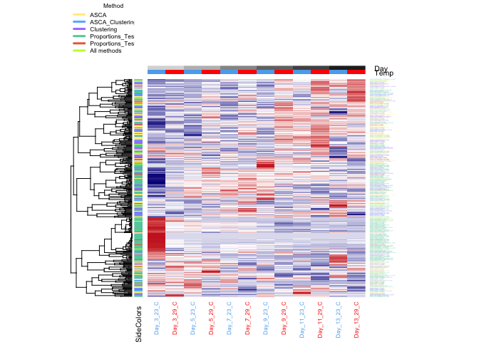
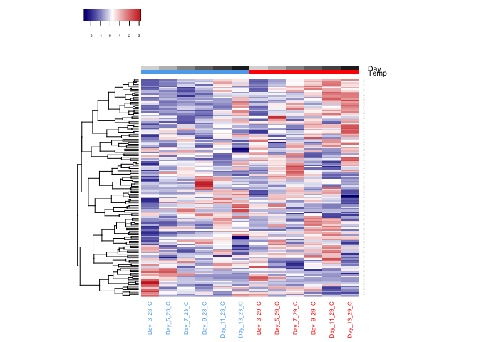
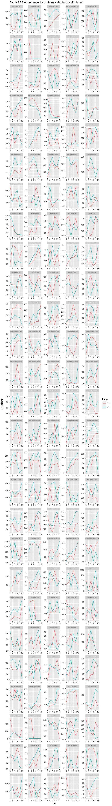
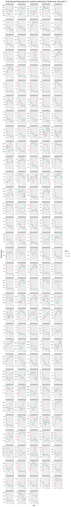

VerifyStatsProteinSelection\_noDay0
================
Shelly Trigg
4/5/2019

Verifying that stats methods lead to selection of proteins that are changing based on temperature
-------------------------------------------------------------------------------------------------

load libraries

    ## 
    ## Attaching package: 'reshape2'

    ## The following object is masked from 'package:tidyr':
    ## 
    ##     smiths

read in same day log FC and pval data

select only proteins with adj Chi sq. pvalue \<= 0.1

count how many unique proteins are in the list of proteins with adj Chi sq. pvalue \<= 0.1

``` r
nrow(unique(all_sig_pro))
```

    ## [1] 163

make a data frame of just unique proteins so we can select these from the foldchange/pvalue data

read in ASCA data

read in clustering data

make list of ChiSq, ASCA, and Clustering detected proteins

count the number of proteins detected across all methods (overlapping and non-overlapping)

``` r
nrow(all_sig0.1_ASCA_clust_pro)
```

    ## [1] 341

write out the NSAF values for selected proteins

read in list of proteins that mapped to uniprot db

exclude proteins that don't pass eval cut-off

count the number of proteins detected across all methods (overlapping and non-overlapping) that pass the Uniprot BLAST eval cutoff

``` r
nrow(all_sig0.1_ASCA_clust_pro_evalpass)
```

    ## [1] 161

write out the NSAF values for selected proteins that pass the Uniprot BLAST eval cutoff

make a proportional venn diagram to show overlapping proteins detected by statistical methods

    ## A Venn object on 3 sets named
    ## ASCA,Clustering,Prop_test 
    ## 000 100 010 110 001 101 011 111 
    ##   0  70  69  39 127   9   2  25


make a proportional venn diagram to show overlapping proteins passing Uniprot BLAST eval cutoff detected by statistical methods

    ## A Venn object on 3 sets named
    ## ASCA,Clustering,Prop_test 
    ## 000 100 010 110 001 101 011 111 
    ##   0  30  30  17  69   4   1  10


### Get an idea of how well our methods are selecting proteins with abundances changes related to temperature

**Plot NSAF values of proteins detected by ASCA and Clustering**

read in and format avg NSAF data

**CREATE HEATMAP OF ALL SELECTED PROTEINS**
ordered by day

    ## 
    ##                   ASCA         ASCAclustering             clustering 
    ##                     70                     39                     69 
    ##               PropTest           PropTestASCA PropTestASCAclustering 
    ##                    127                      9                     25 
    ##     PropTestclustering 
    ##                      2



ordered by temperature then day 

**CREATE HEATMAP OF ASCA SELECTED PROTEINS**
ordered by day 

ordered by temp then day 

Abundance plots for ASCA selected proteins 

**CREATE HEATMAP OF CLUSTERING SELECTED PROTEINS**
ordered by day 

ordered by temp then day 

Abundance plots for cluster selected proteins 

**CREATE HEATMAP OF PROP TEST SELECTED PROTEINS**
Since prop test was on TOTNUMSPEC, I will plot those instead of NSAFs

Read in and format TOTNUMSPEC data

ordered by day 

ordered by temp then day 

Abundance plots for proportions test selected proteins 
