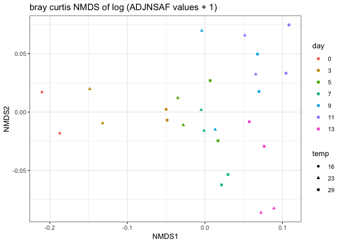

Clustering technical replicates
================
Shelly Trigg
1/11/2019

Load packages

``` r
library(vegan)
```

    ## Warning: package 'vegan' was built under R version 3.4.4

    ## Loading required package: permute

    ## Loading required package: lattice

    ## This is vegan 2.5-3

``` r
library(ggplot2)
```

    ## Warning: package 'ggplot2' was built under R version 3.4.4

``` r
library(dplyr)
```

    ## Warning: package 'dplyr' was built under R version 3.4.4

    ## 
    ## Attaching package: 'dplyr'

    ## The following objects are masked from 'package:stats':
    ## 
    ##     filter, lag

    ## The following objects are masked from 'package:base':
    ## 
    ##     intersect, setdiff, setequal, union

``` r
library(gtools)
```

    ## Warning: package 'gtools' was built under R version 3.4.4

    ## 
    ## Attaching package: 'gtools'

    ## The following object is masked from 'package:permute':
    ## 
    ##     permute

Load Abacus data, parse out ADJNSAF values, and simplify column names to just sample number

``` r
#upload data file
ABACUSdata <- read.csv("~/Documents/GitHub/OysterSeedProject/raw_data/ABACUS_output021417.tsv", sep = "\t", header=TRUE, stringsAsFactors = FALSE)
#select only columns containing ADJNSAF and Protein ID
ABACUSdata <- ABACUSdata[,c(1,grep("ADJNSAF", colnames(ABACUSdata)))]

## change column names in ABACUSdata to just sampleID
colnames(ABACUSdata) <- gsub(pattern = "X20161205_SAMPLE_", "", colnames(ABACUSdata))
colnames(ABACUSdata) <- gsub(pattern = "_ADJNSAF", "", colnames(ABACUSdata))
```

Load meta data file with temperature and day information

``` r
#upload meta data; this was a csv file I create from Rhonda's notebook entry: https://github.com/Ellior2/Ellior2.github.io/blob/master/_posts/2017-3-11-NMDS-analysis.md
meta_data <- read.csv("~/Documents/GitHub/OysterSeedProject/analysis/nmds_R/Rhonda_new_sample_names.csv", header = TRUE, stringsAsFactors = FALSE)
meta_data$silo <- substr(meta_data$Contents,5,5)
meta_data$day <- substr(meta_data$SampleName,5,6)
meta_data$SampleName <- gsub(pattern = "H","",meta_data$SampleName)
meta_data$SampleName <- gsub(pattern = "C","",meta_data$SampleName)
#create a temperature column
meta_data$temp <- "temp"
for(i in 1:nrow(meta_data)){
  if(meta_data$silo[i] == "2"){
    meta_data$temp[i] <- "23"
  }
  if(meta_data$silo[i] == "3"){
    meta_data$temp[i] <- "23"
  }
  if(meta_data$silo[i] == "9"){
    meta_data$temp[i] <- "29"
  }
  if(meta_data$silo[i] == "e"){
    meta_data$temp[i] <- "16"
  }
}
```

Reformat Abacus data for NMDS

``` r
#Transpose- switch rows and columns
tABACUSdata <- t.data.frame(ABACUSdata[,-1])
colnames(tABACUSdata) <- ABACUSdata[,1]
tABACUSdata <- cbind(data.frame(rownames(tABACUSdata)),tABACUSdata)
colnames(tABACUSdata)[1] <- "SampleID"

#add meta data to abacus data
tABACUSdata <- merge(meta_data[,c(1,2,7,8)],tABACUSdata, by = "SampleID")

#Remove Silo 2 and day 15
silo3and9 <- tABACUSdata[which(substr(tABACUSdata$SampleName,1,2) != "S2" & tABACUSdata$day != "15"),]
#make rownames from Sample ID column so that the NMDS knows what's what
rownames(silo3and9) <- silo3and9$SampleID
#order the data frame by day and temperature so coloring the points on the plot is easier
silo3and9 <- silo3and9[order(as.numeric(silo3and9$day),silo3and9$temp),]
```

Determine if any proteins have zero ADJNSAF vals for all samples; this would be because they were in Silo 2, but not in Silo 3 or 9

``` r
no_val_proteins <- silo3and9[,which(apply(silo3and9, 2, var) == 0)]
```

    ## Warning in FUN(newX[, i], ...): NAs introduced by coercion

    ## Warning in FUN(newX[, i], ...): NAs introduced by coercion

``` r
ncol(no_val_proteins)
```

    ## [1] 451

Remove proteins if they have a zero value in all samples

``` r
silo3and9_nozerovar <- silo3and9[,-c(1:4,which(colnames(silo3and9) %in% colnames(no_val_proteins)))]
#check to make sure it worked
ncol(silo3and9)-ncol(silo3and9_nozerovar)
```

    ## [1] 455

For proteins with a zero value in any sample, replace with very small value

``` r
silo3and9_nozerovar[silo3and9_nozerovar == 0.0000] <- 0.1000
```

try PCA

``` r
#first convert day and temp data to factors for plotting
silo3and9$day <- factor(silo3and9$day, levels = unique(silo3and9$day))
silo3and9$temp <- factor(silo3and9$temp, levels = unique(silo3and9$temp))

#run PCA
pca <- prcomp(silo3and9_nozerovar, center = T, scale = T)
pca_meta <- cbind(silo3and9$day, silo3and9$temp, data.frame(paste(silo3and9$day,silo3and9$temp, sep = "_")),pca$x)
colnames(pca_meta)[1:3] <- c("day","temp","SampleName")
ggplot(pca_meta, aes(PC1, PC2)) + geom_point(aes(col = day, shape = temp)) + theme_bw() + ggtitle("PCA of ADJNSAF values where zeros were replaced with 0.1")
```


try PCA on log transformed values

``` r
silo3and9_log <- log(silo3and9_nozerovar,2)
pca_log <- prcomp(silo3and9_log, center = F, scale = F)
pca_log_meta <- cbind(silo3and9$day, silo3and9$temp, data.frame(paste(silo3and9$day,silo3and9$temp, sep = "_")),pca_log$x)
colnames(pca_log_meta)[1:3] <- c("day","temp","SampleName")
ggplot(pca_log_meta, aes(PC1, PC2)) + geom_point(aes(col = day, shape = temp)) + theme_bw() + ggtitle("PCA of log ADJNSAF values with zeros replaced with 0.1")
```


Make MDS dissimilarity matrix

``` r
nmds.silo3and9 <- metaMDS(silo3and9_nozerovar, distance = 'euclidean', k = 2, trymax = 3000, autotransform = FALSE)
```

    ## Run 0 stress 0.1649526 
    ## Run 1 stress 0.1741347 
    ## Run 2 stress 0.186594 
    ## Run 3 stress 0.1649516 
    ## ... New best solution
    ## ... Procrustes: rmse 0.0003515769  max resid 0.001450181 
    ## ... Similar to previous best
    ## Run 4 stress 0.2693699 
    ## Run 5 stress 0.1631588 
    ## ... New best solution
    ## ... Procrustes: rmse 0.03627344  max resid 0.1309964 
    ## Run 6 stress 0.2387604 
    ## Run 7 stress 0.1832391 
    ## Run 8 stress 0.2105309 
    ## Run 9 stress 0.2593247 
    ## Run 10 stress 0.1627151 
    ## ... New best solution
    ## ... Procrustes: rmse 0.01441198  max resid 0.05956846 
    ## Run 11 stress 0.1763837 
    ## Run 12 stress 0.1874621 
    ## Run 13 stress 0.1631589 
    ## ... Procrustes: rmse 0.01448213  max resid 0.06021317 
    ## Run 14 stress 0.1807038 
    ## Run 15 stress 0.1741249 
    ## Run 16 stress 0.1649514 
    ## Run 17 stress 0.2013429 
    ## Run 18 stress 0.1627157 
    ## ... Procrustes: rmse 0.0003196832  max resid 0.00128576 
    ## ... Similar to previous best
    ## Run 19 stress 0.1649515 
    ## Run 20 stress 0.1649518 
    ## *** Solution reached

``` r
#make data frame of NMDS scores
nmds.silo3and9.scores <- cbind(silo3and9$day, silo3and9$temp,data.frame(scores(nmds.silo3and9)))
colnames(nmds.silo3and9.scores)[1:2] <- c("day","temp")
ggplot(nmds.silo3and9.scores, aes(NMDS1, NMDS2)) + geom_point(aes(col = day, shape = temp)) + theme_bw() + ggtitle("NMDS of ADJNSAF values with zeros replaced with 0.1")
```


Make MDS dissimilarity matrix with log tranformed ADJNSAF values

``` r
nmds.silo3and9_log <- metaMDS(silo3and9_log, distance = 'euclidean', k = 2, trymax = 3000, autotransform = FALSE)
```

    ## 'comm' has negative data: 'autotransform', 'noshare' and 'wascores' set to FALSE

    ## Run 0 stress 0.1123882 
    ## Run 1 stress 0.1282567 
    ## Run 2 stress 0.1229455 
    ## Run 3 stress 0.1124371 
    ## ... Procrustes: rmse 0.004849062  max resid 0.01680513 
    ## Run 4 stress 0.1230615 
    ## Run 5 stress 0.1230617 
    ## Run 6 stress 0.1155855 
    ## Run 7 stress 0.1124371 
    ## ... Procrustes: rmse 0.004840493  max resid 0.01677708 
    ## Run 8 stress 0.1285297 
    ## Run 9 stress 0.1335596 
    ## Run 10 stress 0.1124366 
    ## ... Procrustes: rmse 0.00480659  max resid 0.01678008 
    ## Run 11 stress 0.1279615 
    ## Run 12 stress 0.1230613 
    ## Run 13 stress 0.1123888 
    ## ... Procrustes: rmse 0.0004994801  max resid 0.001604861 
    ## ... Similar to previous best
    ## Run 14 stress 0.1263476 
    ## Run 15 stress 0.1124365 
    ## ... Procrustes: rmse 0.004745711  max resid 0.01668024 
    ## Run 16 stress 0.1285279 
    ## Run 17 stress 0.127836 
    ## Run 18 stress 0.1124378 
    ## ... Procrustes: rmse 0.004873351  max resid 0.0168166 
    ## Run 19 stress 0.1460328 
    ## Run 20 stress 0.131862 
    ## *** Solution reached

``` r
#make data frame of NMDS scores
nmds.silo3and9_log.scores <- cbind(silo3and9$day, silo3and9$temp,data.frame(scores(nmds.silo3and9_log)))
colnames(nmds.silo3and9_log.scores)[1:2] <- c("day","temp")
ggplot(nmds.silo3and9_log.scores, aes(NMDS1, NMDS2)) + geom_point(aes(col = day, shape = temp)) + theme_bw() + ggtitle("NMDS of log ADJNSAF values with zeros replaced with 0.1")
```


Make MDS dissimilarity matrix with log transformed (ADJNSAF values + 1) and bray curtis distance

``` r
nmds.silo3and9_log_bray <- metaMDS(log(silo3and9[,-c(1:4,which(colnames(silo3and9) %in% colnames(no_val_proteins)))]+1,2), distance = 'bray', k = 2, trymax = 3000, autotransform = FALSE)
```

    ## Run 0 stress 0.1245128 
    ## Run 1 stress 0.1357539 
    ## Run 2 stress 0.1397267 
    ## Run 3 stress 0.1304776 
    ## Run 4 stress 0.150567 
    ## Run 5 stress 0.1357538 
    ## Run 6 stress 0.1261319 
    ## Run 7 stress 0.1253263 
    ## Run 8 stress 0.1540754 
    ## Run 9 stress 0.1514475 
    ## Run 10 stress 0.1296366 
    ## Run 11 stress 0.1261315 
    ## Run 12 stress 0.1261314 
    ## Run 13 stress 0.1525995 
    ## Run 14 stress 0.1245128 
    ## ... Procrustes: rmse 4.332235e-05  max resid 0.0001472904 
    ## ... Similar to previous best
    ## Run 15 stress 0.1261314 
    ## Run 16 stress 0.135754 
    ## Run 17 stress 0.1394978 
    ## Run 18 stress 0.1261312 
    ## Run 19 stress 0.1261329 
    ## Run 20 stress 0.1310119 
    ## *** Solution reached

``` r
#make data frame of NMDS scores
nmds.silo3and9_log_bray.scores <- cbind(silo3and9$day, silo3and9$temp,data.frame(scores(nmds.silo3and9_log_bray)))
colnames(nmds.silo3and9_log_bray.scores)[1:2] <- c("day","temp")
ggplot(nmds.silo3and9_log_bray.scores, aes(NMDS1, NMDS2)) + geom_point(aes(col = day, shape = temp)) + theme_bw() + ggtitle("bray curtis NMDS of log (ADJNSAF values + 1)")
```



Average NSAF values

``` r
df_avg <- data.frame()
#loop through the data and calculate the mean between replicates for each protein
for (i in seq(1,nrow(silo3and9_nozerovar),2)){
  #this calculates the SD for each odd number row and the row following it
  df_avg_row <- apply(silo3and9_nozerovar[c(i,i+1),],2,mean)
  #this sequencially combines rows of data together after the SD is generated
  df_avg <- rbind(df_avg, df_avg_row)
}
#add column names to SD data
colnames(df_avg) <- colnames(silo3and9_nozerovar)
df_avg$Sample.ID <- rownames(silo3and9_nozerovar[-grep("A",rownames(silo3and9_nozerovar)),])
```

export filtered protein data set

Seems like technical replicates are pretty close according to either PCA, although a couple are questionable (e.g. 23C day 9, 23C day 11). NMDS plots don't seem as helpful as the PCA plots.
---------------------------------------------------------------------------------------------------------------------------------------------------------------------------------------------

The ADJNSAF values for trypsin across samples seem fairly consistent as expected since this was manually added in during protein prep. This suggests that sample scaling should not be necessary.

``` r
mean(silo3and9_nozerovar[,grep("TRYP",colnames(silo3and9_nozerovar))])
```

    ## [1] 24.39327

``` r
sd(silo3and9_nozerovar[,grep("TRYP",colnames(silo3and9_nozerovar))])
```

    ## [1] 3.803557

Looking at percent error in 23C day 9 replicates

``` r
S3D9 <- ABACUSdata[,c("PROTID","28","28A")]
S3D9$percerr <- abs(S3D9$`28` - S3D9$`28A`)/S3D9$`28` * 100
S3D9$SD <- apply(S3D9[,c("28","28A")],1,sd)
S3D9$Diff <- abs(S3D9$`28` - S3D9$`28A`)
```

There are a number of proteins that show up in one technical replicate, sometimes with ADJNSAF values \> 100, but then don't show up in the second technical replicate. This seems suspicious and perhaps these are unreliable proteins

``` r
head(S3D9[order(S3D9$SD, decreasing = TRUE),], n = 20)
```

    ##                                    PROTID       28      28A   percerr
    ## 4759       CHOYP_LOC100890099.1.1|m.11505 798.6587   0.0000 100.00000
    ## 3277             CHOYP_CALM.22.50|m.31010 485.1982   0.0000 100.00000
    ## 5076              CHOYP_TBB4B.1.7|m.12262 297.2170 598.8666 101.49137
    ## 3786               CHOYP_LDLR.6.7|m.57984 469.9926 220.1602  53.15667
    ## 4905              CHOYP_RLA1.5.12|m.15482   0.0000 245.9438       Inf
    ## 4593                CHOYP_MYSP.4.9|m.2302 734.9748 967.9571  31.69936
    ## 4305        CHOYP_LOC101072646.1.1|m.8800 390.5889 168.3118  56.90820
    ## 2978  CHOYP_BRAFLDRAFT_121562.1.1|m.37268 295.8526  80.0234  72.95160
    ## 4761              CHOYP_ACT.23.27|m.58454   0.0000 198.6892       Inf
    ## 2923              CHOYP_RS3A.4.15|m.15367 174.5522   0.0000 100.00000
    ## 81                    CHOYP_H3.1.2|m.3829 186.6147  20.3155  89.11367
    ## 5114              CHOYP_TPM.17.19|m.63919   0.0000 154.3981       Inf
    ## 1728               CHOYP_NPC2.6.7|m.31030 432.4313 295.4860  31.66868
    ## 4395          CHOYP_LOC587133.1.1|m.61281 401.9394 267.2274  33.51550
    ## 4893              CHOYP_RL8.10.10|m.65636   0.0000 134.1296       Inf
    ## 4585                CHOYP_MLE.1.9|m.15462 361.4183 234.5287  35.10879
    ## 3223 CHOYP_BRAFLDRAFT_208436.4.32|m.22689 125.2283   0.0000 100.00000
    ## 732        CHOYP_LOC100375551.1.2|m.27489 174.4442  50.3472  71.13851
    ## 2770              CHOYP_14332.2.2|m.61737 164.3987  41.3566  74.84372
    ## 5063                CHOYP_TBA1.2.9|m.9962   0.0000 118.2623       Inf
    ##             SD     Diff
    ## 4759 564.73698 798.6587
    ## 3277 343.08694 485.1982
    ## 5076 213.29848 301.6496
    ## 3786 176.65818 249.8324
    ## 4905 173.90853 245.9438
    ## 4593 164.74336 232.9823
    ## 4305 157.17364 222.2771
    ## 2978 152.61429 215.8292
    ## 4761 140.49448 198.6892
    ## 2923 123.42704 174.5522
    ## 81   117.59129 166.2992
    ## 5114 109.17594 154.3981
    ## 1728  96.83495 136.9453
    ## 4395  95.25577 134.7120
    ## 4893  94.84395 134.1296
    ## 4585  89.72450 126.8896
    ## 3223  88.54978 125.2283
    ## 732   87.74983 124.0970
    ## 2770  87.00390 123.0421
    ## 5063  83.62407 118.2623

If we look at one of these proteins across all technical replicates, are there other samples that show unreliable detection?

``` r
silo3and9[,c(1:4,grep("CHOYP_RLA1.5.12|m.15482", colnames(silo3and9)))]
```

    ##     SampleID SampleName day temp CHOYP_RLA1.5.12|m.15482
    ## 1          1      pool0   0   16                  0.0000
    ## 1A        1A      pool0   0   16                  0.0000
    ## 4          4       S3D3   3   23                  0.0000
    ## 4A        4A       S3D3   3   23                  0.0000
    ## 8          8       S9D3   3   29                  0.0000
    ## 8A        8A       S9D3   3   29                  0.0000
    ## 12        12       S3D5   5   23                197.1867
    ## 12A      12A       S3D5   5   23                212.0639
    ## 16        16       S9D5   5   29                180.6154
    ## 16A      16A       S9D5   5   29                  0.0000
    ## 20        20       S3D7   7   23                225.7157
    ## 20A      20A       S3D7   7   23                  0.0000
    ## 24        24       S9D7   7   29                238.9554
    ## 24A      24A       S9D7   7   29                272.1093
    ## 28        28       S3D9   9   23                  0.0000
    ## 28A      28A       S3D9   9   23                245.9438
    ## 32        32       S9D9   9   29                218.2319
    ## 32A      32A       S9D9   9   29                  0.0000
    ## 36        36      S3D11  11   23                  0.0000
    ## 36A      36A      S3D11  11   23                  0.0000
    ## 40        40      S9D11  11   29                  0.0000
    ## 40A      40A      S9D11  11   29                  0.0000
    ## 44        44      S3D13  13   23                  0.0000
    ## 44A      44A      S3D13  13   23                  0.0000
    ## 48        48      S9D13  13   29                  0.0000
    ## 48A      48A      S9D13  13   29                  0.0000

In addition to S3D9, this protein is also not reiably detected in technical replicates from S9D5, S3D7, and S9D9.

Next steps:
-----------

- Investigate how wide spread a problem this is an determine if certain proteins need to be removed from the dataset due to unreliable detection across technical replicates
============================================================================================================================================================================
