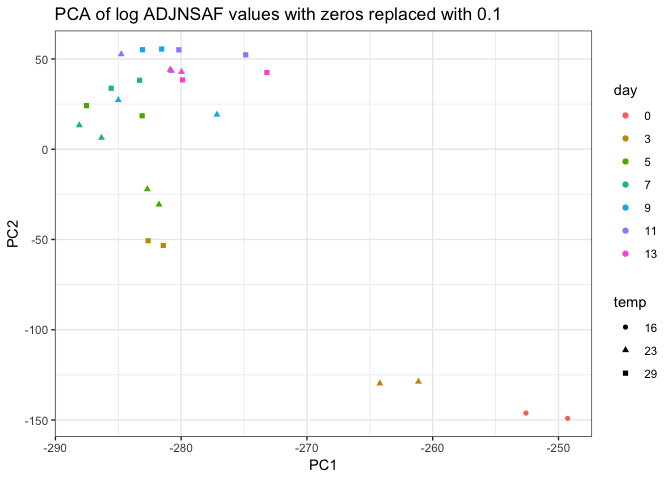

Clustering technical replicates
================
Shelly Trigg
1/11/2019

Load packages

``` r
library(vegan)
```

    ## Warning: package 'vegan' was built under R version 3.4.4

    ## Loading required package: permute

    ## Loading required package: lattice

    ## This is vegan 2.5-3

``` r
library(ggplot2)
```

    ## Warning: package 'ggplot2' was built under R version 3.4.4

``` r
library(dplyr)
```

    ## Warning: package 'dplyr' was built under R version 3.4.4

    ## 
    ## Attaching package: 'dplyr'

    ## The following objects are masked from 'package:stats':
    ## 
    ##     filter, lag

    ## The following objects are masked from 'package:base':
    ## 
    ##     intersect, setdiff, setequal, union

``` r
library(gtools)
```

    ## Warning: package 'gtools' was built under R version 3.4.4

    ## 
    ## Attaching package: 'gtools'

    ## The following object is masked from 'package:permute':
    ## 
    ##     permute

Load Abacus data, parse out ADJNSAF values, and simplify column names to just sample number

``` r
#upload data file
ABACUSdata <- read.csv("~/Documents/GitHub/OysterSeedProject/raw_data/ABACUS_output021417.tsv", sep = "\t", header=TRUE, stringsAsFactors = FALSE)
#select only columns containing ADJNSAF and Protein ID
ABACUSdata <- ABACUSdata[,c(1,grep("ADJNSAF", colnames(ABACUSdata)))]

## change column names in ABACUSdata to just sampleID
colnames(ABACUSdata) <- gsub(pattern = "X20161205_SAMPLE_", "", colnames(ABACUSdata))
colnames(ABACUSdata) <- gsub(pattern = "_ADJNSAF", "", colnames(ABACUSdata))
```

Load meta data file with temperature and day information

``` r
#upload meta data; this was a csv file I create from Rhonda's notebook entry: https://github.com/Ellior2/Ellior2.github.io/blob/master/_posts/2017-3-11-NMDS-analysis.md
meta_data <- read.csv("~/Documents/GitHub/OysterSeedProject/analysis/nmds_R/Rhonda_new_sample_names.csv", header = TRUE, stringsAsFactors = FALSE)
meta_data$silo <- substr(meta_data$Contents,5,5)
meta_data$day <- substr(meta_data$SampleName,5,6)
meta_data$SampleName <- gsub(pattern = "H","",meta_data$SampleName)
meta_data$SampleName <- gsub(pattern = "C","",meta_data$SampleName)
#create a temperature column
meta_data$temp <- "temp"
for(i in 1:nrow(meta_data)){
  if(meta_data$silo[i] == "2"){
    meta_data$temp[i] <- "23"
  }
  if(meta_data$silo[i] == "3"){
    meta_data$temp[i] <- "23"
  }
  if(meta_data$silo[i] == "9"){
    meta_data$temp[i] <- "29"
  }
  if(meta_data$silo[i] == "e"){
    meta_data$temp[i] <- "16"
  }
}
```

Reformat Abacus data for NMDS

``` r
#Transpose- switch rows and columns
tABACUSdata <- t.data.frame(ABACUSdata[,-1])
colnames(tABACUSdata) <- ABACUSdata[,1]
tABACUSdata <- cbind(data.frame(rownames(tABACUSdata)),tABACUSdata)
colnames(tABACUSdata)[1] <- "SampleID"

#add meta data to abacus data
tABACUSdata <- merge(meta_data[,c(1,2,7,8)],tABACUSdata, by = "SampleID")

#Remove Silo 2 and day 15
silo3and9 <- tABACUSdata[which(substr(tABACUSdata$SampleName,1,2) != "S2" & tABACUSdata$day != "15"),]
#make rownames from Sample ID column so that the NMDS knows what's what
rownames(silo3and9) <- silo3and9$SampleID
#order the data frame by day and temperature so coloring the points on the plot is easier
silo3and9 <- silo3and9[order(as.numeric(silo3and9$day),silo3and9$temp),]
```

Determine if any proteins have zero ADJNSAF vals for all samples; this would be because they were in Silo 2, but not in Silo 3 or 9

``` r
no_val_proteins <- silo3and9[,which(apply(silo3and9, 2, var) == 0)]
```

    ## Warning in FUN(newX[, i], ...): NAs introduced by coercion

    ## Warning in FUN(newX[, i], ...): NAs introduced by coercion

``` r
ncol(no_val_proteins)
```

    ## [1] 451

Remove proteins if they have a zero value in all samples

``` r
silo3and9_nozerovar <- silo3and9[,-c(1:4,which(colnames(silo3and9) %in% colnames(no_val_proteins)))]
#check to make sure it worked
ncol(silo3and9)-ncol(silo3and9_nozerovar)
```

    ## [1] 455

For proteins with a zero value in any sample, replace with very small value

``` r
silo3and9_nozerovar[silo3and9_nozerovar == 0.0000] <- 0.1000
```

try PCA

``` r
pca <- prcomp(silo3and9_nozerovar, center = T, scale = T)
pca_meta <- cbind(silo3and9$day, silo3and9$temp, data.frame(paste(silo3and9$day,silo3and9$temp, sep = "_")),pca$x)
colnames(pca_meta)[1:3] <- c("day","temp","SampleName")
ggplot(pca_meta, aes(PC1, PC2)) + geom_point(aes(col = day, shape = temp)) + theme_bw() + ggtitle("PCA of ADJNSAF values where zeros were replaced with 0.1")
```


try PCA on log transformed values

``` r
silo3and9_log <- log(silo3and9_nozerovar,2)
pca_log <- prcomp(silo3and9_log, center = F, scale = F)
pca_log_meta <- cbind(silo3and9$day, silo3and9$temp, data.frame(paste(silo3and9$day,silo3and9$temp, sep = "_")),pca_log$x)
colnames(pca_log_meta)[1:3] <- c("day","temp","SampleName")
ggplot(pca_log_meta, aes(PC1, PC2)) + geom_point(aes(col = day, shape = temp)) + theme_bw() + ggtitle("PCA of log ADJNSAF values with zeros replaced with 0.1")
```


Make MDS dissimilarity matrix

``` r
nmds.silo3and9 <- metaMDS(silo3and9_nozerovar, distance = 'euclidean', k = 2, trymax = 3000, autotransform = FALSE)
```

    ## Run 0 stress 0.1649526 
    ## Run 1 stress 0.1649518 
    ## ... New best solution
    ## ... Procrustes: rmse 0.000625819  max resid 0.002562868 
    ## ... Similar to previous best
    ## Run 2 stress 0.1649514 
    ## ... New best solution
    ## ... Procrustes: rmse 0.0001408251  max resid 0.0002835453 
    ## ... Similar to previous best
    ## Run 3 stress 0.2188406 
    ## Run 4 stress 0.1649516 
    ## ... Procrustes: rmse 0.0001933863  max resid 0.0008061458 
    ## ... Similar to previous best
    ## Run 5 stress 0.164953 
    ## ... Procrustes: rmse 0.0007608851  max resid 0.003148634 
    ## ... Similar to previous best
    ## Run 6 stress 0.1865942 
    ## Run 7 stress 0.1832191 
    ## Run 8 stress 0.1649514 
    ## ... Procrustes: rmse 2.97358e-05  max resid 0.0001206548 
    ## ... Similar to previous best
    ## Run 9 stress 0.205188 
    ## Run 10 stress 0.1919802 
    ## Run 11 stress 0.1832213 
    ## Run 12 stress 0.1627151 
    ## ... New best solution
    ## ... Procrustes: rmse 0.03380127  max resid 0.1322112 
    ## Run 13 stress 0.1832297 
    ## Run 14 stress 0.162715 
    ## ... New best solution
    ## ... Procrustes: rmse 0.0006216292  max resid 0.00254333 
    ## ... Similar to previous best
    ## Run 15 stress 0.1649514 
    ## Run 16 stress 0.1631586 
    ## ... Procrustes: rmse 0.01472268  max resid 0.06059427 
    ## Run 17 stress 0.1725526 
    ## Run 18 stress 0.1649514 
    ## Run 19 stress 0.1627157 
    ## ... Procrustes: rmse 0.0008452456  max resid 0.003441481 
    ## ... Similar to previous best
    ## Run 20 stress 0.1764495 
    ## *** Solution reached

``` r
#make data frame of NMDS scores
nmds.silo3and9.scores <- cbind(silo3and9$day, silo3and9$temp,data.frame(scores(nmds.silo3and9)))
colnames(nmds.silo3and9.scores)[1:2] <- c("day","temp")
ggplot(nmds.silo3and9.scores, aes(NMDS1, NMDS2)) + geom_point(aes(col = day, shape = temp)) + theme_bw() + ggtitle("NMDS of ADJNSAF values with zeros replaced with 0.1")
```



Make MDS dissimilarity matrix with log tranformed ADJNSAF values

``` r
nmds.silo3and9_log <- metaMDS(silo3and9_log, distance = 'euclidean', k = 2, trymax = 3000, autotransform = FALSE)
```

    ## 'comm' has negative data: 'autotransform', 'noshare' and 'wascores' set to FALSE

    ## Run 0 stress 0.1123882 
    ## Run 1 stress 0.1263213 
    ## Run 2 stress 0.1259193 
    ## Run 3 stress 0.112388 
    ## ... New best solution
    ## ... Procrustes: rmse 0.0001428118  max resid 0.0004176328 
    ## ... Similar to previous best
    ## Run 4 stress 0.1230616 
    ## Run 5 stress 0.1318571 
    ## Run 6 stress 0.1336499 
    ## Run 7 stress 0.1261216 
    ## Run 8 stress 0.1259513 
    ## Run 9 stress 0.1123887 
    ## ... Procrustes: rmse 0.000344625  max resid 0.001149689 
    ## ... Similar to previous best
    ## Run 10 stress 0.1123881 
    ## ... Procrustes: rmse 6.865946e-05  max resid 0.0002007828 
    ## ... Similar to previous best
    ## Run 11 stress 0.1229465 
    ## Run 12 stress 0.1156752 
    ## Run 13 stress 0.1229461 
    ## Run 14 stress 0.1124379 
    ## ... Procrustes: rmse 0.004866547  max resid 0.01680471 
    ## Run 15 stress 0.1271877 
    ## Run 16 stress 0.1155856 
    ## Run 17 stress 0.1318618 
    ## Run 18 stress 0.1271872 
    ## Run 19 stress 0.1396538 
    ## Run 20 stress 0.13356 
    ## *** Solution reached

``` r
#make data frame of NMDS scores
nmds.silo3and9_log.scores <- cbind(silo3and9$day, silo3and9$temp,data.frame(scores(nmds.silo3and9_log)))
colnames(nmds.silo3and9_log.scores)[1:2] <- c("day","temp")
ggplot(nmds.silo3and9_log.scores, aes(NMDS1, NMDS2)) + geom_point(aes(col = day, shape = temp)) + theme_bw() + ggtitle("NMDS of log ADJNSAF values with zeros replaced with 0.1")
```


Make MDS dissimilarity matrix with log transformed ADJNSAF values and bray curtis distance

``` r
nmds.silo3and9_log_bray <- metaMDS(silo3and9_log, distance = 'bray', k = 2, trymax = 3000, autotransform = FALSE)
```

    ## 'comm' has negative data: 'autotransform', 'noshare' and 'wascores' set to FALSE

    ## Warning in distfun(comm, method = distance, ...): results may be
    ## meaningless because data have negative entries in method "bray"

    ## Run 0 stress 0.2389081 
    ## Run 1 stress 0.2385332 
    ## ... New best solution
    ## ... Procrustes: rmse 0.1467573  max resid 0.3212746 
    ## Run 2 stress 0.2387971 
    ## ... Procrustes: rmse 0.1333525  max resid 0.3799475 
    ## Run 3 stress 0.2393156 
    ## Run 4 stress 0.2385678 
    ## ... Procrustes: rmse 0.1457633  max resid 0.4332445 
    ## Run 5 stress 0.2327935 
    ## ... New best solution
    ## ... Procrustes: rmse 0.1394975  max resid 0.3227422 
    ## Run 6 stress 0.2379373 
    ## Run 7 stress 0.2382077 
    ## Run 8 stress 0.2378688 
    ## Run 9 stress 0.234234 
    ## Run 10 stress 0.2347499 
    ## Run 11 stress 0.2368999 
    ## Run 12 stress 0.2394969 
    ## Run 13 stress 0.2392908 
    ## Run 14 stress 0.2383484 
    ## Run 15 stress 0.2437724 
    ## Run 16 stress 0.237386 
    ## Run 17 stress 0.2319339 
    ## ... New best solution
    ## ... Procrustes: rmse 0.1104242  max resid 0.477517 
    ## Run 18 stress 0.2322888 
    ## ... Procrustes: rmse 0.120642  max resid 0.4625821 
    ## Run 19 stress 0.2410362 
    ## Run 20 stress 0.2399144 
    ## Run 21 stress 0.2344346 
    ## Run 22 stress 0.2353362 
    ## Run 23 stress 0.2375156 
    ## Run 24 stress 0.2423516 
    ## Run 25 stress 0.2407863 
    ## Run 26 stress 0.2399377 
    ## Run 27 stress 0.2356976 
    ## Run 28 stress 0.2330648 
    ## Run 29 stress 0.2405173 
    ## Run 30 stress 0.2385415 
    ## Run 31 stress 0.2372155 
    ## Run 32 stress 0.2374673 
    ## Run 33 stress 0.2464921 
    ## Run 34 stress 0.2369825 
    ## Run 35 stress 0.238555 
    ## Run 36 stress 0.2339064 
    ## Run 37 stress 0.2377317 
    ## Run 38 stress 0.2322889 
    ## ... Procrustes: rmse 0.1272966  max resid 0.3351941 
    ## Run 39 stress 0.2329764 
    ## Run 40 stress 0.2377728 
    ## Run 41 stress 0.2392311 
    ## Run 42 stress 0.2364888 
    ## Run 43 stress 0.2369531 
    ## Run 44 stress 0.2332839 
    ## Run 45 stress 0.237461 
    ## Run 46 stress 0.2376676 
    ## Run 47 stress 0.238309 
    ## Run 48 stress 0.237146 
    ## Run 49 stress 0.2361375 
    ## Run 50 stress 0.2350937 
    ## Run 51 stress 0.2397204 
    ## Run 52 stress 0.2379331 
    ## Run 53 stress 0.237043 
    ## Run 54 stress 0.2367805 
    ## Run 55 stress 0.2339435 
    ## Run 56 stress 0.2374915 
    ## Run 57 stress 0.2385375 
    ## Run 58 stress 0.238426 
    ## Run 59 stress 0.2328957 
    ## Run 60 stress 0.2359317 
    ## Run 61 stress 0.2396457 
    ## Run 62 stress 0.2349618 
    ## Run 63 stress 0.2351661 
    ## Run 64 stress 0.238469 
    ## Run 65 stress 0.2401163 
    ## Run 66 stress 0.2323784 
    ## ... Procrustes: rmse 0.05851277  max resid 0.2438327 
    ## Run 67 stress 0.2381455 
    ## Run 68 stress 0.2400159 
    ## Run 69 stress 0.2359283 
    ## Run 70 stress 0.2327786 
    ## Run 71 stress 0.2377227 
    ## Run 72 stress 0.2376947 
    ## Run 73 stress 0.2383467 
    ## Run 74 stress 0.2379815 
    ## Run 75 stress 0.2356749 
    ## Run 76 stress 0.2393198 
    ## Run 77 stress 0.2346414 
    ## Run 78 stress 0.2371662 
    ## Run 79 stress 0.2361914 
    ## Run 80 stress 0.2357911 
    ## Run 81 stress 0.2409161 
    ## Run 82 stress 0.2367028 
    ## Run 83 stress 0.2366208 
    ## Run 84 stress 0.2366971 
    ## Run 85 stress 0.2409248 
    ## Run 86 stress 0.237691 
    ## Run 87 stress 0.2404606 
    ## Run 88 stress 0.2337536 
    ## Run 89 stress 0.2352053 
    ## Run 90 stress 0.232573 
    ## Run 91 stress 0.2367496 
    ## Run 92 stress 0.2357743 
    ## Run 93 stress 0.2380892 
    ## Run 94 stress 0.2355677 
    ## Run 95 stress 0.2354317 
    ## Run 96 stress 0.2378207 
    ## Run 97 stress 0.237907 
    ## Run 98 stress 0.2363425 
    ## Run 99 stress 0.2328967 
    ## Run 100 stress 0.2328136 
    ## Run 101 stress 0.2336016 
    ## Run 102 stress 0.232378 
    ## ... Procrustes: rmse 0.05841872  max resid 0.2438271 
    ## Run 103 stress 0.238138 
    ## Run 104 stress 0.232573 
    ## Run 105 stress 0.2395695 
    ## Run 106 stress 0.2355445 
    ## Run 107 stress 0.2359746 
    ## Run 108 stress 0.2370361 
    ## Run 109 stress 0.2368453 
    ## Run 110 stress 0.2343262 
    ## Run 111 stress 0.2362613 
    ## Run 112 stress 0.2419543 
    ## Run 113 stress 0.2378707 
    ## Run 114 stress 0.3701428 
    ## Run 115 stress 0.2378152 
    ## Run 116 stress 0.2365208 
    ## Run 117 stress 0.2308233 
    ## ... New best solution
    ## ... Procrustes: rmse 0.04500582  max resid 0.1188216 
    ## Run 118 stress 0.2377171 
    ## Run 119 stress 0.2351729 
    ## Run 120 stress 0.2389975 
    ## Run 121 stress 0.2378015 
    ## Run 122 stress 0.2364035 
    ## Run 123 stress 0.2419689 
    ## Run 124 stress 0.2381344 
    ## Run 125 stress 0.2344049 
    ## Run 126 stress 0.2323971 
    ## Run 127 stress 0.2395768 
    ## Run 128 stress 0.2386937 
    ## Run 129 stress 0.2427507 
    ## Run 130 stress 0.2397108 
    ## Run 131 stress 0.2396781 
    ## Run 132 stress 0.2376669 
    ## Run 133 stress 0.2394775 
    ## Run 134 stress 0.241586 
    ## Run 135 stress 0.2348222 
    ## Run 136 stress 0.2384448 
    ## Run 137 stress 0.2418524 
    ## Run 138 stress 0.2418998 
    ## Run 139 stress 0.2369057 
    ## Run 140 stress 0.2385873 
    ## Run 141 stress 0.2397262 
    ## Run 142 stress 0.2316003 
    ## Run 143 stress 0.2390423 
    ## Run 144 stress 0.2373593 
    ## Run 145 stress 0.240029 
    ## Run 146 stress 0.2381267 
    ## Run 147 stress 0.2316006 
    ## Run 148 stress 0.2367384 
    ## Run 149 stress 0.241681 
    ## Run 150 stress 0.2347395 
    ## Run 151 stress 0.2376344 
    ## Run 152 stress 0.2380375 
    ## Run 153 stress 0.2339381 
    ## Run 154 stress 0.2385425 
    ## Run 155 stress 0.2346418 
    ## Run 156 stress 0.2377285 
    ## Run 157 stress 0.2388318 
    ## Run 158 stress 0.2370749 
    ## Run 159 stress 0.2332389 
    ## Run 160 stress 0.2405391 
    ## Run 161 stress 0.2343262 
    ## Run 162 stress 0.2397158 
    ## Run 163 stress 0.2374676 
    ## Run 164 stress 0.2380442 
    ## Run 165 stress 0.2371903 
    ## Run 166 stress 0.2333979 
    ## Run 167 stress 0.2338448 
    ## Run 168 stress 0.2425106 
    ## Run 169 stress 0.3741576 
    ## Run 170 stress 0.2337847 
    ## Run 171 stress 0.2376453 
    ## Run 172 stress 0.2361837 
    ## Run 173 stress 0.2332815 
    ## Run 174 stress 0.2415609 
    ## Run 175 stress 0.2391559 
    ## Run 176 stress 0.2411578 
    ## Run 177 stress 0.2386256 
    ## Run 178 stress 0.2364235 
    ## Run 179 stress 0.2388494 
    ## Run 180 stress 0.2376449 
    ## Run 181 stress 0.2302107 
    ## ... New best solution
    ## ... Procrustes: rmse 0.02174088  max resid 0.08555446 
    ## Run 182 stress 0.2390599 
    ## Run 183 stress 0.2320627 
    ## Run 184 stress 0.2389523 
    ## Run 185 stress 0.2387546 
    ## Run 186 stress 0.2378319 
    ## Run 187 stress 0.2336732 
    ## Run 188 stress 0.2364194 
    ## Run 189 stress 0.2331398 
    ## Run 190 stress 0.2343005 
    ## Run 191 stress 0.2363689 
    ## Run 192 stress 0.2374473 
    ## Run 193 stress 0.2419398 
    ## Run 194 stress 0.232573 
    ## Run 195 stress 0.2404396 
    ## Run 196 stress 0.2333447 
    ## Run 197 stress 0.2377375 
    ## Run 198 stress 0.2344564 
    ## Run 199 stress 0.2364696 
    ## Run 200 stress 0.2395276 
    ## Run 201 stress 0.2344833 
    ## Run 202 stress 0.2370514 
    ## Run 203 stress 0.2338149 
    ## Run 204 stress 0.238025 
    ## Run 205 stress 0.236418 
    ## Run 206 stress 0.2385804 
    ## Run 207 stress 0.2407168 
    ## Run 208 stress 0.2372306 
    ## Run 209 stress 0.2380497 
    ## Run 210 stress 0.2393976 
    ## Run 211 stress 0.2359462 
    ## Run 212 stress 0.2365037 
    ## Run 213 stress 0.2336009 
    ## Run 214 stress 0.2321316 
    ## Run 215 stress 0.2377228 
    ## Run 216 stress 0.2314256 
    ## Run 217 stress 0.2335991 
    ## Run 218 stress 0.233705 
    ## Run 219 stress 0.2363239 
    ## Run 220 stress 0.2371554 
    ## Run 221 stress 0.2369292 
    ## Run 222 stress 0.2330554 
    ## Run 223 stress 0.2412669 
    ## Run 224 stress 0.2363313 
    ## Run 225 stress 0.2340712 
    ## Run 226 stress 0.2373664 
    ## Run 227 stress 0.2400129 
    ## Run 228 stress 0.2392234 
    ## Run 229 stress 0.2334151 
    ## Run 230 stress 0.2339722 
    ## Run 231 stress 0.2332172 
    ## Run 232 stress 0.2388565 
    ## Run 233 stress 0.2368241 
    ## Run 234 stress 0.240536 
    ## Run 235 stress 0.2429451 
    ## Run 236 stress 0.2333057 
    ## Run 237 stress 0.2405142 
    ## Run 238 stress 0.2365898 
    ## Run 239 stress 0.2326836 
    ## Run 240 stress 0.2392356 
    ## Run 241 stress 0.237342 
    ## Run 242 stress 0.233627 
    ## Run 243 stress 0.2385707 
    ## Run 244 stress 0.2321978 
    ## Run 245 stress 0.2392565 
    ## Run 246 stress 0.2390259 
    ## Run 247 stress 0.2317461 
    ## Run 248 stress 0.236988 
    ## Run 249 stress 0.2357261 
    ## Run 250 stress 0.2401416 
    ## Run 251 stress 0.3657966 
    ## Run 252 stress 0.2415886 
    ## Run 253 stress 0.2335921 
    ## Run 254 stress 0.2388995 
    ## Run 255 stress 0.2358313 
    ## Run 256 stress 0.2341167 
    ## Run 257 stress 0.2417646 
    ## Run 258 stress 0.2391992 
    ## Run 259 stress 0.2367258 
    ## Run 260 stress 0.237636 
    ## Run 261 stress 0.2367714 
    ## Run 262 stress 0.2337219 
    ## Run 263 stress 0.2375834 
    ## Run 264 stress 0.2384918 
    ## Run 265 stress 0.2435318 
    ## Run 266 stress 0.2356993 
    ## Run 267 stress 0.2380182 
    ## Run 268 stress 0.2372102 
    ## Run 269 stress 0.2360535 
    ## Run 270 stress 0.2386097 
    ## Run 271 stress 0.2389799 
    ## Run 272 stress 0.2393457 
    ## Run 273 stress 0.2374014 
    ## Run 274 stress 0.2343659 
    ## Run 275 stress 0.2341189 
    ## Run 276 stress 0.2368114 
    ## Run 277 stress 0.2390321 
    ## Run 278 stress 0.2385814 
    ## Run 279 stress 0.2418062 
    ## Run 280 stress 0.2325757 
    ## Run 281 stress 0.2357873 
    ## Run 282 stress 0.2340521 
    ## Run 283 stress 0.2310492 
    ## Run 284 stress 0.2325731 
    ## Run 285 stress 0.2409297 
    ## Run 286 stress 0.2360709 
    ## Run 287 stress 0.2347059 
    ## Run 288 stress 0.2408031 
    ## Run 289 stress 0.2334844 
    ## Run 290 stress 0.2338416 
    ## Run 291 stress 0.2377593 
    ## Run 292 stress 0.2374534 
    ## Run 293 stress 0.2310107 
    ## Run 294 stress 0.2385773 
    ## Run 295 stress 0.2337715 
    ## Run 296 stress 0.2369333 
    ## Run 297 stress 0.2397018 
    ## Run 298 stress 0.2390158 
    ## Run 299 stress 0.238788 
    ## Run 300 stress 0.2373101 
    ## Run 301 stress 0.2306555 
    ## ... Procrustes: rmse 0.04067631  max resid 0.1500241 
    ## Run 302 stress 0.2376559 
    ## Run 303 stress 0.235998 
    ## Run 304 stress 0.2352144 
    ## Run 305 stress 0.2384883 
    ## Run 306 stress 0.2361123 
    ## Run 307 stress 0.24126 
    ## Run 308 stress 0.2357387 
    ## Run 309 stress 0.2317831 
    ## Run 310 stress 0.2368181 
    ## Run 311 stress 0.2343777 
    ## Run 312 stress 0.2356144 
    ## Run 313 stress 0.2430166 
    ## Run 314 stress 0.2349293 
    ## Run 315 stress 0.2342355 
    ## Run 316 stress 0.2371322 
    ## Run 317 stress 0.2400205 
    ## Run 318 stress 0.2398027 
    ## Run 319 stress 0.2382552 
    ## Run 320 stress 0.2381057 
    ## Run 321 stress 0.2377172 
    ## Run 322 stress 0.2403284 
    ## Run 323 stress 0.2407095 
    ## Run 324 stress 0.2388125 
    ## Run 325 stress 0.2372158 
    ## Run 326 stress 0.2422899 
    ## Run 327 stress 0.2435852 
    ## Run 328 stress 0.2341818 
    ## Run 329 stress 0.2341811 
    ## Run 330 stress 0.2335177 
    ## Run 331 stress 0.2364658 
    ## Run 332 stress 0.2356977 
    ## Run 333 stress 0.2383514 
    ## Run 334 stress 0.2381994 
    ## Run 335 stress 0.2409177 
    ## Run 336 stress 0.2363943 
    ## Run 337 stress 0.2351906 
    ## Run 338 stress 0.2385501 
    ## Run 339 stress 0.2368498 
    ## Run 340 stress 0.2360541 
    ## Run 341 stress 0.2381895 
    ## Run 342 stress 0.237654 
    ## Run 343 stress 0.2383779 
    ## Run 344 stress 0.2365916 
    ## Run 345 stress 0.2379654 
    ## Run 346 stress 0.23745 
    ## Run 347 stress 0.236125 
    ## Run 348 stress 0.2360264 
    ## Run 349 stress 0.2399454 
    ## Run 350 stress 0.2396364 
    ## Run 351 stress 0.2343625 
    ## Run 352 stress 0.2336764 
    ## Run 353 stress 0.2416229 
    ## Run 354 stress 0.2344727 
    ## Run 355 stress 0.2362541 
    ## Run 356 stress 0.2439536 
    ## Run 357 stress 0.2364202 
    ## Run 358 stress 0.2403714 
    ## Run 359 stress 0.2431841 
    ## Run 360 stress 0.2432036 
    ## Run 361 stress 0.2372405 
    ## Run 362 stress 0.237129 
    ## Run 363 stress 0.2445154 
    ## Run 364 stress 0.2419972 
    ## Run 365 stress 0.2409634 
    ## Run 366 stress 0.2379378 
    ## Run 367 stress 0.2370646 
    ## Run 368 stress 0.232187 
    ## Run 369 stress 0.2375995 
    ## Run 370 stress 0.2390413 
    ## Run 371 stress 0.236441 
    ## Run 372 stress 0.2390822 
    ## Run 373 stress 0.2333855 
    ## Run 374 stress 0.2359466 
    ## Run 375 stress 0.236124 
    ## Run 376 stress 0.2406753 
    ## Run 377 stress 0.2344535 
    ## Run 378 stress 0.2403404 
    ## Run 379 stress 0.2372985 
    ## Run 380 stress 0.239015 
    ## Run 381 stress 0.2359125 
    ## Run 382 stress 0.2365298 
    ## Run 383 stress 0.2376082 
    ## Run 384 stress 0.2374036 
    ## Run 385 stress 0.2379004 
    ## Run 386 stress 0.2420441 
    ## Run 387 stress 0.2355263 
    ## Run 388 stress 0.2378561 
    ## Run 389 stress 0.2377085 
    ## Run 390 stress 0.2380463 
    ## Run 391 stress 0.2352416 
    ## Run 392 stress 0.2398296 
    ## Run 393 stress 0.2319109 
    ## Run 394 stress 0.2327186 
    ## Run 395 stress 0.2362942 
    ## Run 396 stress 0.2381286 
    ## Run 397 stress 0.2335678 
    ## Run 398 stress 0.2371875 
    ## Run 399 stress 0.2330648 
    ## Run 400 stress 0.2386595 
    ## Run 401 stress 0.2371667 
    ## Run 402 stress 0.2409404 
    ## Run 403 stress 0.2310107 
    ## Run 404 stress 0.2356179 
    ## Run 405 stress 0.2344528 
    ## Run 406 stress 0.2379815 
    ## Run 407 stress 0.2425409 
    ## Run 408 stress 0.2374177 
    ## Run 409 stress 0.232036 
    ## Run 410 stress 0.2382384 
    ## Run 411 stress 0.2320098 
    ## Run 412 stress 0.2374637 
    ## Run 413 stress 0.2413418 
    ## Run 414 stress 0.2383337 
    ## Run 415 stress 0.2381866 
    ## Run 416 stress 0.2350187 
    ## Run 417 stress 0.2356052 
    ## Run 418 stress 0.2356664 
    ## Run 419 stress 0.2374177 
    ## Run 420 stress 0.236188 
    ## Run 421 stress 0.2347396 
    ## Run 422 stress 0.2329632 
    ## Run 423 stress 0.2372785 
    ## Run 424 stress 0.2435034 
    ## Run 425 stress 0.2368968 
    ## Run 426 stress 0.2374323 
    ## Run 427 stress 0.23822 
    ## Run 428 stress 0.2335377 
    ## Run 429 stress 0.232573 
    ## Run 430 stress 0.2445373 
    ## Run 431 stress 0.2317219 
    ## Run 432 stress 0.234223 
    ## Run 433 stress 0.2330653 
    ## Run 434 stress 0.2372867 
    ## Run 435 stress 0.2376513 
    ## Run 436 stress 0.2375587 
    ## Run 437 stress 0.2339678 
    ## Run 438 stress 0.2322522 
    ## Run 439 stress 0.2310495 
    ## Run 440 stress 0.2394399 
    ## Run 441 stress 0.2379336 
    ## Run 442 stress 0.2353625 
    ## Run 443 stress 0.2383617 
    ## Run 444 stress 0.2361939 
    ## Run 445 stress 0.2395214 
    ## Run 446 stress 0.2378003 
    ## Run 447 stress 0.2390948 
    ## Run 448 stress 0.2364189 
    ## Run 449 stress 0.2378701 
    ## Run 450 stress 0.2381668 
    ## Run 451 stress 0.2377398 
    ## Run 452 stress 0.2344483 
    ## Run 453 stress 0.2331131 
    ## Run 454 stress 0.233696 
    ## Run 455 stress 0.2443056 
    ## Run 456 stress 0.2367772 
    ## Run 457 stress 0.2421097 
    ## Run 458 stress 0.2424578 
    ## Run 459 stress 0.2378613 
    ## Run 460 stress 0.233338 
    ## Run 461 stress 0.2372162 
    ## Run 462 stress 0.2391667 
    ## Run 463 stress 0.2337032 
    ## Run 464 stress 0.2375895 
    ## Run 465 stress 0.233169 
    ## Run 466 stress 0.2364046 
    ## Run 467 stress 0.2347985 
    ## Run 468 stress 0.2348549 
    ## Run 469 stress 0.2387588 
    ## Run 470 stress 0.2348591 
    ## Run 471 stress 0.2368542 
    ## Run 472 stress 0.2421208 
    ## Run 473 stress 0.2407185 
    ## Run 474 stress 0.2372495 
    ## Run 475 stress 0.2367794 
    ## Run 476 stress 0.2392983 
    ## Run 477 stress 0.2369655 
    ## Run 478 stress 0.242309 
    ## Run 479 stress 0.236374 
    ## Run 480 stress 0.2384983 
    ## Run 481 stress 0.2366155 
    ## Run 482 stress 0.23779 
    ## Run 483 stress 0.2386868 
    ## Run 484 stress 0.2377244 
    ## Run 485 stress 0.2343766 
    ## Run 486 stress 0.2379165 
    ## Run 487 stress 0.2380891 
    ## Run 488 stress 0.2346936 
    ## Run 489 stress 0.243214 
    ## Run 490 stress 0.2378843 
    ## Run 491 stress 0.2426151 
    ## Run 492 stress 0.241026 
    ## Run 493 stress 0.2359133 
    ## Run 494 stress 0.2389282 
    ## Run 495 stress 0.2390199 
    ## Run 496 stress 0.2381864 
    ## Run 497 stress 0.2373094 
    ## Run 498 stress 0.2366825 
    ## Run 499 stress 0.2369115 
    ## Run 500 stress 0.23633 
    ## Run 501 stress 0.2355297 
    ## Run 502 stress 0.2339348 
    ## Run 503 stress 0.2376509 
    ## Run 504 stress 0.2399091 
    ## Run 505 stress 0.2341167 
    ## Run 506 stress 0.2383954 
    ## Run 507 stress 0.2330522 
    ## Run 508 stress 0.2365298 
    ## Run 509 stress 0.2415567 
    ## Run 510 stress 0.2374463 
    ## Run 511 stress 0.2358306 
    ## Run 512 stress 0.2358972 
    ## Run 513 stress 0.237674 
    ## Run 514 stress 0.2369826 
    ## Run 515 stress 0.2336313 
    ## Run 516 stress 0.2347601 
    ## Run 517 stress 0.2388469 
    ## Run 518 stress 0.2352144 
    ## Run 519 stress 0.2385853 
    ## Run 520 stress 0.2374298 
    ## Run 521 stress 0.2308982 
    ## Run 522 stress 0.2393962 
    ## Run 523 stress 0.238442 
    ## Run 524 stress 0.2322116 
    ## Run 525 stress 0.2375647 
    ## Run 526 stress 0.2377887 
    ## Run 527 stress 0.234642 
    ## Run 528 stress 0.2332156 
    ## Run 529 stress 0.2393077 
    ## Run 530 stress 0.2368284 
    ## Run 531 stress 0.2409286 
    ## Run 532 stress 0.2374344 
    ## Run 533 stress 0.2378949 
    ## Run 534 stress 0.23602 
    ## Run 535 stress 0.2475387 
    ## Run 536 stress 0.2372488 
    ## Run 537 stress 0.2322202 
    ## Run 538 stress 0.2335581 
    ## Run 539 stress 0.2358024 
    ## Run 540 stress 0.2385325 
    ## Run 541 stress 0.2366884 
    ## Run 542 stress 0.2359165 
    ## Run 543 stress 0.2391845 
    ## Run 544 stress 0.2392305 
    ## Run 545 stress 0.2376703 
    ## Run 546 stress 0.2332414 
    ## Run 547 stress 0.2356063 
    ## Run 548 stress 0.2371536 
    ## Run 549 stress 0.2387082 
    ## Run 550 stress 0.238353 
    ## Run 551 stress 0.2364802 
    ## Run 552 stress 0.2382142 
    ## Run 553 stress 0.2331156 
    ## Run 554 stress 0.235799 
    ## Run 555 stress 0.2388875 
    ## Run 556 stress 0.2389681 
    ## Run 557 stress 0.2331668 
    ## Run 558 stress 0.2343262 
    ## Run 559 stress 0.2360988 
    ## Run 560 stress 0.2385719 
    ## Run 561 stress 0.2360732 
    ## Run 562 stress 0.2387394 
    ## Run 563 stress 0.2390386 
    ## Run 564 stress 0.2330777 
    ## Run 565 stress 0.237248 
    ## Run 566 stress 0.2360445 
    ## Run 567 stress 0.2337509 
    ## Run 568 stress 0.2391213 
    ## Run 569 stress 0.2350398 
    ## Run 570 stress 0.2333509 
    ## Run 571 stress 0.2371198 
    ## Run 572 stress 0.2380583 
    ## Run 573 stress 0.233881 
    ## Run 574 stress 0.2345843 
    ## Run 575 stress 0.2416574 
    ## Run 576 stress 0.237644 
    ## Run 577 stress 0.2485422 
    ## Run 578 stress 0.2362832 
    ## Run 579 stress 0.2340132 
    ## Run 580 stress 0.2330573 
    ## Run 581 stress 0.2362739 
    ## Run 582 stress 0.2387824 
    ## Run 583 stress 0.2329761 
    ## Run 584 stress 0.2380352 
    ## Run 585 stress 0.2350874 
    ## Run 586 stress 0.2403118 
    ## Run 587 stress 0.2394745 
    ## Run 588 stress 0.2365736 
    ## Run 589 stress 0.2334434 
    ## Run 590 stress 0.2355654 
    ## Run 591 stress 0.2399747 
    ## Run 592 stress 0.2371023 
    ## Run 593 stress 0.2387328 
    ## Run 594 stress 0.235973 
    ## Run 595 stress 0.2379676 
    ## Run 596 stress 0.2413472 
    ## Run 597 stress 0.2329338 
    ## Run 598 stress 0.2368484 
    ## Run 599 stress 0.2337542 
    ## Run 600 stress 0.2370636 
    ## Run 601 stress 0.23703 
    ## Run 602 stress 0.2399642 
    ## Run 603 stress 0.2379339 
    ## Run 604 stress 0.2388534 
    ## Run 605 stress 0.2376886 
    ## Run 606 stress 0.2374017 
    ## Run 607 stress 0.233518 
    ## Run 608 stress 0.2367059 
    ## Run 609 stress 0.2355072 
    ## Run 610 stress 0.237559 
    ## Run 611 stress 0.2329678 
    ## Run 612 stress 0.2361175 
    ## Run 613 stress 0.2351731 
    ## Run 614 stress 0.2328226 
    ## Run 615 stress 0.238537 
    ## Run 616 stress 0.2336638 
    ## Run 617 stress 0.2379482 
    ## Run 618 stress 0.2373194 
    ## Run 619 stress 0.2390221 
    ## Run 620 stress 0.2336168 
    ## Run 621 stress 0.2323743 
    ## Run 622 stress 0.2392648 
    ## Run 623 stress 0.2350831 
    ## Run 624 stress 0.2365923 
    ## Run 625 stress 0.239837 
    ## Run 626 stress 0.2464473 
    ## Run 627 stress 0.2391583 
    ## Run 628 stress 0.2376528 
    ## Run 629 stress 0.2376898 
    ## Run 630 stress 0.2400499 
    ## Run 631 stress 0.2376082 
    ## Run 632 stress 0.2358651 
    ## Run 633 stress 0.2429335 
    ## Run 634 stress 0.2377743 
    ## Run 635 stress 0.234054 
    ## Run 636 stress 0.2398627 
    ## Run 637 stress 0.2335834 
    ## Run 638 stress 0.2365994 
    ## Run 639 stress 0.2392641 
    ## Run 640 stress 0.2401168 
    ## Run 641 stress 0.2393408 
    ## Run 642 stress 0.2383049 
    ## Run 643 stress 0.2393584 
    ## Run 644 stress 0.2393175 
    ## Run 645 stress 0.2336568 
    ## Run 646 stress 0.2513089 
    ## Run 647 stress 0.2375069 
    ## Run 648 stress 0.238936 
    ## Run 649 stress 0.2335595 
    ## Run 650 stress 0.240459 
    ## Run 651 stress 0.236636 
    ## Run 652 stress 0.2340926 
    ## Run 653 stress 0.2380805 
    ## Run 654 stress 0.2394017 
    ## Run 655 stress 0.2375931 
    ## Run 656 stress 0.2381531 
    ## Run 657 stress 0.236655 
    ## Run 658 stress 0.2400532 
    ## Run 659 stress 0.2374537 
    ## Run 660 stress 0.236785 
    ## Run 661 stress 0.2392918 
    ## Run 662 stress 0.2370516 
    ## Run 663 stress 0.2380184 
    ## Run 664 stress 0.2372539 
    ## Run 665 stress 0.2366504 
    ## Run 666 stress 0.2352144 
    ## Run 667 stress 0.2388506 
    ## Run 668 stress 0.237476 
    ## Run 669 stress 0.2373659 
    ## Run 670 stress 0.2400207 
    ## Run 671 stress 0.2339434 
    ## Run 672 stress 0.2367394 
    ## Run 673 stress 0.2413867 
    ## Run 674 stress 0.2380426 
    ## Run 675 stress 0.2350545 
    ## Run 676 stress 0.2383913 
    ## Run 677 stress 0.236387 
    ## Run 678 stress 0.2413269 
    ## Run 679 stress 0.242117 
    ## Run 680 stress 0.2417682 
    ## Run 681 stress 0.2310981 
    ## Run 682 stress 0.2338512 
    ## Run 683 stress 0.2377658 
    ## Run 684 stress 0.2348167 
    ## Run 685 stress 0.2382707 
    ## Run 686 stress 0.2372322 
    ## Run 687 stress 0.2386403 
    ## Run 688 stress 0.2380546 
    ## Run 689 stress 0.2377897 
    ## Run 690 stress 0.2411431 
    ## Run 691 stress 0.2343018 
    ## Run 692 stress 0.2420155 
    ## Run 693 stress 0.2341081 
    ## Run 694 stress 0.2355679 
    ## Run 695 stress 0.2358847 
    ## Run 696 stress 0.2333635 
    ## Run 697 stress 0.2372232 
    ## Run 698 stress 0.2365478 
    ## Run 699 stress 0.2327296 
    ## Run 700 stress 0.2378341 
    ## Run 701 stress 0.2371326 
    ## Run 702 stress 0.2387714 
    ## Run 703 stress 0.2368785 
    ## Run 704 stress 0.2372128 
    ## Run 705 stress 0.2320722 
    ## Run 706 stress 0.2338507 
    ## Run 707 stress 0.2350928 
    ## Run 708 stress 0.23956 
    ## Run 709 stress 0.2384636 
    ## Run 710 stress 0.2319697 
    ## Run 711 stress 0.2344671 
    ## Run 712 stress 0.233587 
    ## Run 713 stress 0.2386399 
    ## Run 714 stress 0.2357858 
    ## Run 715 stress 0.2362328 
    ## Run 716 stress 0.2378626 
    ## Run 717 stress 0.2371981 
    ## Run 718 stress 0.2384695 
    ## Run 719 stress 0.2361221 
    ## Run 720 stress 0.2357676 
    ## Run 721 stress 0.2385308 
    ## Run 722 stress 0.2337479 
    ## Run 723 stress 0.2368938 
    ## Run 724 stress 0.242872 
    ## Run 725 stress 0.2325746 
    ## Run 726 stress 0.2366374 
    ## Run 727 stress 0.2330274 
    ## Run 728 stress 0.2375935 
    ## Run 729 stress 0.236026 
    ## Run 730 stress 0.2377153 
    ## Run 731 stress 0.2356574 
    ## Run 732 stress 0.2374677 
    ## Run 733 stress 0.237321 
    ## Run 734 stress 0.2363569 
    ## Run 735 stress 0.2336081 
    ## Run 736 stress 0.2375539 
    ## Run 737 stress 0.2367349 
    ## Run 738 stress 0.2343659 
    ## Run 739 stress 0.2478992 
    ## Run 740 stress 0.2373463 
    ## Run 741 stress 0.2307093 
    ## ... Procrustes: rmse 0.0376833  max resid 0.1524772 
    ## Run 742 stress 0.2369313 
    ## Run 743 stress 0.240595 
    ## Run 744 stress 0.2341974 
    ## Run 745 stress 0.2393128 
    ## Run 746 stress 0.2345185 
    ## Run 747 stress 0.2393358 
    ## Run 748 stress 0.2366384 
    ## Run 749 stress 0.2364386 
    ## Run 750 stress 0.2350449 
    ## Run 751 stress 0.2368873 
    ## Run 752 stress 0.2374743 
    ## Run 753 stress 0.2368489 
    ## Run 754 stress 0.2367824 
    ## Run 755 stress 0.2370425 
    ## Run 756 stress 0.2401776 
    ## Run 757 stress 0.23423 
    ## Run 758 stress 0.2443816 
    ## Run 759 stress 0.2379581 
    ## Run 760 stress 0.2371984 
    ## Run 761 stress 0.2317076 
    ## Run 762 stress 0.2392956 
    ## Run 763 stress 0.2391141 
    ## Run 764 stress 0.2467867 
    ## Run 765 stress 0.2383521 
    ## Run 766 stress 0.2378163 
    ## Run 767 stress 0.2380446 
    ## Run 768 stress 0.2329332 
    ## Run 769 stress 0.2377396 
    ## Run 770 stress 0.2365642 
    ## Run 771 stress 0.2375743 
    ## Run 772 stress 0.2355288 
    ## Run 773 stress 0.2415892 
    ## Run 774 stress 0.2340375 
    ## Run 775 stress 0.2338742 
    ## Run 776 stress 0.2398563 
    ## Run 777 stress 0.2368207 
    ## Run 778 stress 0.2403923 
    ## Run 779 stress 0.2395092 
    ## Run 780 stress 0.2374222 
    ## Run 781 stress 0.2322113 
    ## Run 782 stress 0.2424165 
    ## Run 783 stress 0.23982 
    ## Run 784 stress 0.2385376 
    ## Run 785 stress 0.2321736 
    ## Run 786 stress 0.2335571 
    ## Run 787 stress 0.2337551 
    ## Run 788 stress 0.2343681 
    ## Run 789 stress 0.2364193 
    ## Run 790 stress 0.2323941 
    ## Run 791 stress 0.2356392 
    ## Run 792 stress 0.2302106 
    ## ... New best solution
    ## ... Procrustes: rmse 0.0001914706  max resid 0.0004097433 
    ## ... Similar to previous best
    ## *** Solution reached

``` r
#make data frame of NMDS scores
nmds.silo3and9_log_bray.scores <- cbind(silo3and9$day, silo3and9$temp,data.frame(scores(nmds.silo3and9_log_bray)))
colnames(nmds.silo3and9_log_bray.scores)[1:2] <- c("day","temp")
ggplot(nmds.silo3and9_log_bray.scores, aes(NMDS1, NMDS2)) + geom_point(aes(col = day, shape = temp)) + theme_bw() + ggtitle("bray curtis NMDS of log ADJNSAF values with zeros replaced with 0.1")
```

 **Trying to make the NMDS plot like Emma did with Bray distance and with log tranformed values doesn't work in this case.**

Seems like technical replicates are pretty close according to either PCA, although a couple are questionable (e.g. 23C day 9, 23C day 11). NMDS plots don't seem as helpful as the PCA plots.
---------------------------------------------------------------------------------------------------------------------------------------------------------------------------------------------

The ADJNSAF values for trypsin across samples seem fairly consistent as expected since this was manually added in during protein prep. This suggests that sample scaling should not be necessary.

``` r
mean(silo3and9_nozerovar[,grep("TRYP",colnames(silo3and9_nozerovar))])
```

    ## [1] 24.39327

``` r
sd(silo3and9_nozerovar[,grep("TRYP",colnames(silo3and9_nozerovar))])
```

    ## [1] 3.803557

Looking at percent error in 23C day 9 replicates

``` r
S3D9 <- ABACUSdata[,c("PROTID","28","28A")]
S3D9$percerr <- abs(S3D9$`28` - S3D9$`28A`)/S3D9$`28` * 100
S3D9$SD <- apply(S3D9[,c("28","28A")],1,sd)
S3D9$Diff <- abs(S3D9$`28` - S3D9$`28A`)
```

There are a number of proteins that show up in one technical replicate, sometimes with ADJNSAF values \> 100, but then don't show up in the second technical replicate. This seems suspicious and perhaps these are unreliable proteins

``` r
head(S3D9[order(S3D9$SD, decreasing = TRUE),], n = 20)
```

    ##                                    PROTID       28      28A   percerr
    ## 4759       CHOYP_LOC100890099.1.1|m.11505 798.6587   0.0000 100.00000
    ## 3277             CHOYP_CALM.22.50|m.31010 485.1982   0.0000 100.00000
    ## 5076              CHOYP_TBB4B.1.7|m.12262 297.2170 598.8666 101.49137
    ## 3786               CHOYP_LDLR.6.7|m.57984 469.9926 220.1602  53.15667
    ## 4905              CHOYP_RLA1.5.12|m.15482   0.0000 245.9438       Inf
    ## 4593                CHOYP_MYSP.4.9|m.2302 734.9748 967.9571  31.69936
    ## 4305        CHOYP_LOC101072646.1.1|m.8800 390.5889 168.3118  56.90820
    ## 2978  CHOYP_BRAFLDRAFT_121562.1.1|m.37268 295.8526  80.0234  72.95160
    ## 4761              CHOYP_ACT.23.27|m.58454   0.0000 198.6892       Inf
    ## 2923              CHOYP_RS3A.4.15|m.15367 174.5522   0.0000 100.00000
    ## 81                    CHOYP_H3.1.2|m.3829 186.6147  20.3155  89.11367
    ## 5114              CHOYP_TPM.17.19|m.63919   0.0000 154.3981       Inf
    ## 1728               CHOYP_NPC2.6.7|m.31030 432.4313 295.4860  31.66868
    ## 4395          CHOYP_LOC587133.1.1|m.61281 401.9394 267.2274  33.51550
    ## 4893              CHOYP_RL8.10.10|m.65636   0.0000 134.1296       Inf
    ## 4585                CHOYP_MLE.1.9|m.15462 361.4183 234.5287  35.10879
    ## 3223 CHOYP_BRAFLDRAFT_208436.4.32|m.22689 125.2283   0.0000 100.00000
    ## 732        CHOYP_LOC100375551.1.2|m.27489 174.4442  50.3472  71.13851
    ## 2770              CHOYP_14332.2.2|m.61737 164.3987  41.3566  74.84372
    ## 5063                CHOYP_TBA1.2.9|m.9962   0.0000 118.2623       Inf
    ##             SD     Diff
    ## 4759 564.73698 798.6587
    ## 3277 343.08694 485.1982
    ## 5076 213.29848 301.6496
    ## 3786 176.65818 249.8324
    ## 4905 173.90853 245.9438
    ## 4593 164.74336 232.9823
    ## 4305 157.17364 222.2771
    ## 2978 152.61429 215.8292
    ## 4761 140.49448 198.6892
    ## 2923 123.42704 174.5522
    ## 81   117.59129 166.2992
    ## 5114 109.17594 154.3981
    ## 1728  96.83495 136.9453
    ## 4395  95.25577 134.7120
    ## 4893  94.84395 134.1296
    ## 4585  89.72450 126.8896
    ## 3223  88.54978 125.2283
    ## 732   87.74983 124.0970
    ## 2770  87.00390 123.0421
    ## 5063  83.62407 118.2623

If we look at one of these proteins across all technical replicates, are there other samples that show unreliable detection?

``` r
silo3and9[,c(1:4,grep("CHOYP_RLA1.5.12|m.15482", colnames(silo3and9)))]
```

    ##     SampleID SampleName day temp CHOYP_RLA1.5.12|m.15482
    ## 1          1      pool0   0   16                  0.0000
    ## 1A        1A      pool0   0   16                  0.0000
    ## 4          4       S3D3   3   23                  0.0000
    ## 4A        4A       S3D3   3   23                  0.0000
    ## 8          8       S9D3   3   29                  0.0000
    ## 8A        8A       S9D3   3   29                  0.0000
    ## 12        12       S3D5   5   23                197.1867
    ## 12A      12A       S3D5   5   23                212.0639
    ## 16        16       S9D5   5   29                180.6154
    ## 16A      16A       S9D5   5   29                  0.0000
    ## 20        20       S3D7   7   23                225.7157
    ## 20A      20A       S3D7   7   23                  0.0000
    ## 24        24       S9D7   7   29                238.9554
    ## 24A      24A       S9D7   7   29                272.1093
    ## 28        28       S3D9   9   23                  0.0000
    ## 28A      28A       S3D9   9   23                245.9438
    ## 32        32       S9D9   9   29                218.2319
    ## 32A      32A       S9D9   9   29                  0.0000
    ## 36        36      S3D11  11   23                  0.0000
    ## 36A      36A      S3D11  11   23                  0.0000
    ## 40        40      S9D11  11   29                  0.0000
    ## 40A      40A      S9D11  11   29                  0.0000
    ## 44        44      S3D13  13   23                  0.0000
    ## 44A      44A      S3D13  13   23                  0.0000
    ## 48        48      S9D13  13   29                  0.0000
    ## 48A      48A      S9D13  13   29                  0.0000

In addition to S3D9, this protein is also not reiably detected in technical replicates from S9D5, S3D7, and S9D9.

Next steps:
-----------

- Investigate how wide spread a problem this is an determine if certain proteins need to be removed from the dataset due to unreliable detection across technical replicates
============================================================================================================================================================================
