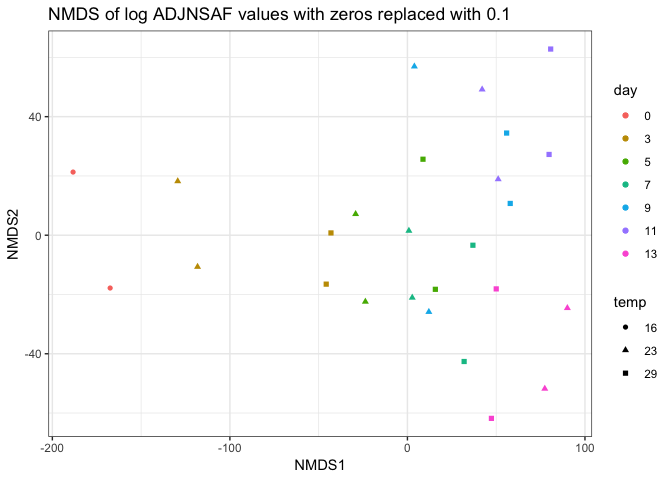

Clustering technical replicates
================
Shelly Trigg
1/11/2019

Load packages

``` r
library(vegan)
```

    ## Warning: package 'vegan' was built under R version 3.4.4

    ## Loading required package: permute

    ## Loading required package: lattice

    ## This is vegan 2.5-3

``` r
library(ggplot2)
```

    ## Warning: package 'ggplot2' was built under R version 3.4.4

``` r
library(dplyr)
```

    ## Warning: package 'dplyr' was built under R version 3.4.4

    ## 
    ## Attaching package: 'dplyr'

    ## The following objects are masked from 'package:stats':
    ## 
    ##     filter, lag

    ## The following objects are masked from 'package:base':
    ## 
    ##     intersect, setdiff, setequal, union

``` r
library(gtools)
```

    ## Warning: package 'gtools' was built under R version 3.4.4

    ## 
    ## Attaching package: 'gtools'

    ## The following object is masked from 'package:permute':
    ## 
    ##     permute

Load Abacus data, parse out ADJNSAF values, and simplify column names to just sample number

``` r
#upload data file
ABACUSdata <- read.csv("~/Documents/GitHub/OysterSeedProject/raw_data/ABACUS_output021417.tsv", sep = "\t", header=TRUE, stringsAsFactors = FALSE)
#select only columns containing ADJNSAF and Protein ID
ABACUSdata <- ABACUSdata[,c(1,grep("ADJNSAF", colnames(ABACUSdata)))]

## change column names in ABACUSdata to just sampleID
colnames(ABACUSdata) <- gsub(pattern = "X20161205_SAMPLE_", "", colnames(ABACUSdata))
colnames(ABACUSdata) <- gsub(pattern = "_ADJNSAF", "", colnames(ABACUSdata))
```

Load meta data file with temperature and day information

``` r
#upload meta data; this was a csv file I create from Rhonda's notebook entry: https://github.com/Ellior2/Ellior2.github.io/blob/master/_posts/2017-3-11-NMDS-analysis.md
meta_data <- read.csv("~/Documents/GitHub/OysterSeedProject/analysis/nmds_R/Rhonda_new_sample_names.csv", header = TRUE, stringsAsFactors = FALSE)
meta_data$silo <- substr(meta_data$Contents,5,5)
meta_data$day <- substr(meta_data$SampleName,5,6)
meta_data$SampleName <- gsub(pattern = "H","",meta_data$SampleName)
meta_data$SampleName <- gsub(pattern = "C","",meta_data$SampleName)
#create a temperature column
meta_data$temp <- "temp"
for(i in 1:nrow(meta_data)){
  if(meta_data$silo[i] == "2"){
    meta_data$temp[i] <- "23"
  }
  if(meta_data$silo[i] == "3"){
    meta_data$temp[i] <- "23"
  }
  if(meta_data$silo[i] == "9"){
    meta_data$temp[i] <- "29"
  }
  if(meta_data$silo[i] == "e"){
    meta_data$temp[i] <- "16"
  }
}
```

Reformat Abacus data for NMDS

``` r
#Transpose- switch rows and columns
tABACUSdata <- t.data.frame(ABACUSdata[,-1])
colnames(tABACUSdata) <- ABACUSdata[,1]
tABACUSdata <- cbind(data.frame(rownames(tABACUSdata)),tABACUSdata)
colnames(tABACUSdata)[1] <- "SampleID"

#add meta data to abacus data
tABACUSdata <- merge(meta_data[,c(1,2,7,8)],tABACUSdata, by = "SampleID")

#Remove Silo 2 and day 15
silo3and9 <- tABACUSdata[which(substr(tABACUSdata$SampleName,1,2) != "S2" & tABACUSdata$day != "15"),]
#make rownames from Sample ID column so that the NMDS knows what's what
rownames(silo3and9) <- silo3and9$SampleID
#order the data frame by day and temperature so coloring the points on the plot is easier
silo3and9 <- silo3and9[order(as.numeric(silo3and9$day),silo3and9$temp),]
```

Determine if any proteins have zero ADJNSAF vals for all samples; this would be because they were in Silo 2, but not in Silo 3 or 9

``` r
no_val_proteins <- silo3and9[,which(apply(silo3and9, 2, var) == 0)]
```

    ## Warning in FUN(newX[, i], ...): NAs introduced by coercion

    ## Warning in FUN(newX[, i], ...): NAs introduced by coercion

``` r
ncol(no_val_proteins)
```

    ## [1] 451

Remove proteins if they have a zero value in all samples

``` r
silo3and9_nozerovar <- silo3and9[,-c(1:4,which(colnames(silo3and9) %in% colnames(no_val_proteins)))]
#check to make sure it worked
ncol(silo3and9)-ncol(silo3and9_nozerovar)
```

    ## [1] 455

For proteins with a zero value in any sample, replace with very small value

``` r
silo3and9_nozerovar[silo3and9_nozerovar == 0.0000] <- 0.1000
```

try PCA

``` r
pca <- prcomp(silo3and9_nozerovar, center = T, scale = T)
pca_meta <- cbind(silo3and9$day, silo3and9$temp, data.frame(paste(silo3and9$day,silo3and9$temp, sep = "_")),pca$x)
colnames(pca_meta)[1:3] <- c("day","temp","SampleName")
ggplot(pca_meta, aes(PC1, PC2)) + geom_point(aes(col = day, shape = temp)) + theme_bw() + ggtitle("PCA of ADJNSAF values where zeros were replaced with 0.1")
```


try PCA on log transformed values

``` r
silo3and9_log <- log(silo3and9_nozerovar,2)
pca_log <- prcomp(silo3and9_log, center = F, scale = F)
pca_log_meta <- cbind(silo3and9$day, silo3and9$temp, data.frame(paste(silo3and9$day,silo3and9$temp, sep = "_")),pca_log$x)
colnames(pca_log_meta)[1:3] <- c("day","temp","SampleName")
ggplot(pca_log_meta, aes(PC1, PC2)) + geom_point(aes(col = day, shape = temp)) + theme_bw() + ggtitle("PCA of log ADJNSAF values with zeros replaced with 0.1")
```


Make MDS dissimilarity matrix

``` r
nmds.silo3and9 <- metaMDS(silo3and9_nozerovar, distance = 'euclidean', k = 2, trymax = 3000, autotransform = FALSE)
```

    ## Run 0 stress 0.1649526 
    ## Run 1 stress 0.1919806 
    ## Run 2 stress 0.240481 
    ## Run 3 stress 0.1627148 
    ## ... New best solution
    ## ... Procrustes: rmse 0.03388586  max resid 0.1322063 
    ## Run 4 stress 0.2013391 
    ## Run 5 stress 0.1741252 
    ## Run 6 stress 0.1631587 
    ## ... Procrustes: rmse 0.01477026  max resid 0.06085529 
    ## Run 7 stress 0.1627157 
    ## ... Procrustes: rmse 0.0003003071  max resid 0.001241101 
    ## ... Similar to previous best
    ## Run 8 stress 0.1627189 
    ## ... Procrustes: rmse 0.001374734  max resid 0.005536949 
    ## ... Similar to previous best
    ## Run 9 stress 0.1741257 
    ## Run 10 stress 0.1627147 
    ## ... New best solution
    ## ... Procrustes: rmse 0.0001965391  max resid 0.0007818316 
    ## ... Similar to previous best
    ## Run 11 stress 0.1763239 
    ## Run 12 stress 0.1950545 
    ## Run 13 stress 0.1832194 
    ## Run 14 stress 0.1807044 
    ## Run 15 stress 0.1866089 
    ## Run 16 stress 0.1865945 
    ## Run 17 stress 0.1741259 
    ## Run 18 stress 0.2402578 
    ## Run 19 stress 0.1741262 
    ## Run 20 stress 0.1832209 
    ## *** Solution reached

``` r
#make data frame of NMDS scores
nmds.silo3and9.scores <- cbind(silo3and9$day, silo3and9$temp,data.frame(scores(nmds.silo3and9)))
colnames(nmds.silo3and9.scores)[1:2] <- c("day","temp")
ggplot(nmds.silo3and9.scores, aes(NMDS1, NMDS2)) + geom_point(aes(col = day, shape = temp)) + theme_bw() + ggtitle("NMDS of ADJNSAF values with zeros replaced with 0.1")
```


Make MDS dissimilarity matrix with log tranformed ADJNSAF values

``` r
nmds.silo3and9_log <- metaMDS(silo3and9_log, distance = 'euclidean', k = 2, trymax = 3000, autotransform = FALSE)
```

    ## 'comm' has negative data: 'autotransform', 'noshare' and 'wascores' set to FALSE

    ## Run 0 stress 0.1123882 
    ## Run 1 stress 0.1259507 
    ## Run 2 stress 0.1271869 
    ## Run 3 stress 0.1271869 
    ## Run 4 stress 0.1155854 
    ## Run 5 stress 0.1124374 
    ## ... Procrustes: rmse 0.004889831  max resid 0.01687039 
    ## Run 6 stress 0.1156682 
    ## Run 7 stress 0.1282847 
    ## Run 8 stress 0.1431649 
    ## Run 9 stress 0.1155853 
    ## Run 10 stress 0.1123888 
    ## ... Procrustes: rmse 0.0004998949  max resid 0.001643022 
    ## ... Similar to previous best
    ## Run 11 stress 0.126326 
    ## Run 12 stress 0.1263269 
    ## Run 13 stress 0.1124365 
    ## ... Procrustes: rmse 0.004788526  max resid 0.01682266 
    ## Run 14 stress 0.1155853 
    ## Run 15 stress 0.115678 
    ## Run 16 stress 0.1318572 
    ## Run 17 stress 0.1123881 
    ## ... New best solution
    ## ... Procrustes: rmse 0.0002371247  max resid 0.0006376293 
    ## ... Similar to previous best
    ## Run 18 stress 0.1324306 
    ## Run 19 stress 0.1229455 
    ## Run 20 stress 0.1328564 
    ## *** Solution reached

``` r
#make data frame of NMDS scores
nmds.silo3and9_log.scores <- cbind(silo3and9$day, silo3and9$temp,data.frame(scores(nmds.silo3and9_log)))
colnames(nmds.silo3and9_log.scores)[1:2] <- c("day","temp")
ggplot(nmds.silo3and9_log.scores, aes(NMDS1, NMDS2)) + geom_point(aes(col = day, shape = temp)) + theme_bw() + ggtitle("NMDS of log ADJNSAF values with zeros replaced with 0.1")
```


Make MDS dissimilarity matrix with log transformed ADJNSAF values and bray curtis distance

``` r
nmds.silo3and9_log_bray <- metaMDS(silo3and9_log, distance = 'bray', k = 2, trymax = 3000, autotransform = FALSE)
```

    ## 'comm' has negative data: 'autotransform', 'noshare' and 'wascores' set to FALSE

    ## Warning in distfun(comm, method = distance, ...): results may be
    ## meaningless because data have negative entries in method "bray"

    ## Run 0 stress 0.2389081 
    ## Run 1 stress 0.2369053 
    ## ... New best solution
    ## ... Procrustes: rmse 0.1276508  max resid 0.268226 
    ## Run 2 stress 0.2376733 
    ## Run 3 stress 0.2378483 
    ## Run 4 stress 0.2321422 
    ## ... New best solution
    ## ... Procrustes: rmse 0.1079628  max resid 0.412324 
    ## Run 5 stress 0.2344695 
    ## Run 6 stress 0.242479 
    ## Run 7 stress 0.236135 
    ## Run 8 stress 0.2386903 
    ## Run 9 stress 0.2302105 
    ## ... New best solution
    ## ... Procrustes: rmse 0.06618057  max resid 0.2407508 
    ## Run 10 stress 0.2340585 
    ## Run 11 stress 0.2327527 
    ## Run 12 stress 0.2408861 
    ## Run 13 stress 0.2386376 
    ## Run 14 stress 0.2364203 
    ## Run 15 stress 0.238947 
    ## Run 16 stress 0.2369078 
    ## Run 17 stress 0.2343237 
    ## Run 18 stress 0.2350835 
    ## Run 19 stress 0.2379239 
    ## Run 20 stress 0.236489 
    ## Run 21 stress 0.2358678 
    ## Run 22 stress 0.2407253 
    ## Run 23 stress 0.2359289 
    ## Run 24 stress 0.23877 
    ## Run 25 stress 0.2363038 
    ## Run 26 stress 0.2394314 
    ## Run 27 stress 0.2334202 
    ## Run 28 stress 0.2329653 
    ## Run 29 stress 0.2363101 
    ## Run 30 stress 0.2386526 
    ## Run 31 stress 0.2344437 
    ## Run 32 stress 0.2408424 
    ## Run 33 stress 0.2422705 
    ## Run 34 stress 0.2383526 
    ## Run 35 stress 0.2327472 
    ## Run 36 stress 0.2390432 
    ## Run 37 stress 0.2364879 
    ## Run 38 stress 0.2383523 
    ## Run 39 stress 0.2377156 
    ## Run 40 stress 0.2326831 
    ## Run 41 stress 0.2360762 
    ## Run 42 stress 0.2388992 
    ## Run 43 stress 0.2373395 
    ## Run 44 stress 0.2424558 
    ## Run 45 stress 0.2398204 
    ## Run 46 stress 0.2396305 
    ## Run 47 stress 0.2365453 
    ## Run 48 stress 0.2316022 
    ## Run 49 stress 0.2382449 
    ## Run 50 stress 0.2390244 
    ## Run 51 stress 0.2401874 
    ## Run 52 stress 0.2317461 
    ## Run 53 stress 0.2364745 
    ## Run 54 stress 0.2379734 
    ## Run 55 stress 0.243997 
    ## Run 56 stress 0.2327256 
    ## Run 57 stress 0.241332 
    ## Run 58 stress 0.2332255 
    ## Run 59 stress 0.2402813 
    ## Run 60 stress 0.2407673 
    ## Run 61 stress 0.2432056 
    ## Run 62 stress 0.2366106 
    ## Run 63 stress 0.2396072 
    ## Run 64 stress 0.2371724 
    ## Run 65 stress 0.2439347 
    ## Run 66 stress 0.2373949 
    ## Run 67 stress 0.2361279 
    ## Run 68 stress 0.2372866 
    ## Run 69 stress 0.2375757 
    ## Run 70 stress 0.2330422 
    ## Run 71 stress 0.234388 
    ## Run 72 stress 0.236542 
    ## Run 73 stress 0.2346767 
    ## Run 74 stress 0.2402884 
    ## Run 75 stress 0.2395569 
    ## Run 76 stress 0.2344378 
    ## Run 77 stress 0.2387275 
    ## Run 78 stress 0.2321389 
    ## Run 79 stress 0.2344283 
    ## Run 80 stress 0.2336445 
    ## Run 81 stress 0.2399087 
    ## Run 82 stress 0.2346434 
    ## Run 83 stress 0.2310107 
    ## Run 84 stress 0.2333617 
    ## Run 85 stress 0.233945 
    ## Run 86 stress 0.2383522 
    ## Run 87 stress 0.2397841 
    ## Run 88 stress 0.2383223 
    ## Run 89 stress 0.2366236 
    ## Run 90 stress 0.234864 
    ## Run 91 stress 0.2344529 
    ## Run 92 stress 0.2366176 
    ## Run 93 stress 0.2421591 
    ## Run 94 stress 0.237864 
    ## Run 95 stress 0.2371018 
    ## Run 96 stress 0.2383109 
    ## Run 97 stress 0.2399893 
    ## Run 98 stress 0.2391452 
    ## Run 99 stress 0.2384882 
    ## Run 100 stress 0.2358253 
    ## Run 101 stress 0.235759 
    ## Run 102 stress 0.239008 
    ## Run 103 stress 0.2324584 
    ## Run 104 stress 0.2382678 
    ## Run 105 stress 0.2387324 
    ## Run 106 stress 0.2336719 
    ## Run 107 stress 0.2440966 
    ## Run 108 stress 0.2371749 
    ## Run 109 stress 0.2364486 
    ## Run 110 stress 0.2381346 
    ## Run 111 stress 0.2370947 
    ## Run 112 stress 0.2361932 
    ## Run 113 stress 0.238937 
    ## Run 114 stress 0.2389044 
    ## Run 115 stress 0.2357408 
    ## Run 116 stress 0.2375662 
    ## Run 117 stress 0.2336469 
    ## Run 118 stress 0.2376639 
    ## Run 119 stress 0.2359604 
    ## Run 120 stress 0.2416706 
    ## Run 121 stress 0.2329165 
    ## Run 122 stress 0.2392693 
    ## Run 123 stress 0.2351874 
    ## Run 124 stress 0.2364949 
    ## Run 125 stress 0.2390768 
    ## Run 126 stress 0.2337977 
    ## Run 127 stress 0.2361239 
    ## Run 128 stress 0.2375846 
    ## Run 129 stress 0.2338426 
    ## Run 130 stress 0.2356373 
    ## Run 131 stress 0.2414234 
    ## Run 132 stress 0.2419458 
    ## Run 133 stress 0.23678 
    ## Run 134 stress 0.2406468 
    ## Run 135 stress 0.2375677 
    ## Run 136 stress 0.2404997 
    ## Run 137 stress 0.2381279 
    ## Run 138 stress 0.2386468 
    ## Run 139 stress 0.23794 
    ## Run 140 stress 0.2332299 
    ## Run 141 stress 0.2325735 
    ## Run 142 stress 0.2398587 
    ## Run 143 stress 0.2388895 
    ## Run 144 stress 0.2353278 
    ## Run 145 stress 0.2366501 
    ## Run 146 stress 0.2389732 
    ## Run 147 stress 0.236395 
    ## Run 148 stress 0.2379376 
    ## Run 149 stress 0.2463849 
    ## Run 150 stress 0.2378767 
    ## Run 151 stress 0.2334116 
    ## Run 152 stress 0.2380464 
    ## Run 153 stress 0.2387833 
    ## Run 154 stress 0.2374176 
    ## Run 155 stress 0.2367396 
    ## Run 156 stress 0.2377827 
    ## Run 157 stress 0.2368633 
    ## Run 158 stress 0.2357656 
    ## Run 159 stress 0.2373241 
    ## Run 160 stress 0.2359285 
    ## Run 161 stress 0.240707 
    ## Run 162 stress 0.2390851 
    ## Run 163 stress 0.2336096 
    ## Run 164 stress 0.3658073 
    ## Run 165 stress 0.2383081 
    ## Run 166 stress 0.2364144 
    ## Run 167 stress 0.2393145 
    ## Run 168 stress 0.2399625 
    ## Run 169 stress 0.2388716 
    ## Run 170 stress 0.2328663 
    ## Run 171 stress 0.2365964 
    ## Run 172 stress 0.2358375 
    ## Run 173 stress 0.2365167 
    ## Run 174 stress 0.2379995 
    ## Run 175 stress 0.2399237 
    ## Run 176 stress 0.2323735 
    ## Run 177 stress 0.2414408 
    ## Run 178 stress 0.2386904 
    ## Run 179 stress 0.2374286 
    ## Run 180 stress 0.235043 
    ## Run 181 stress 0.2351735 
    ## Run 182 stress 0.2366884 
    ## Run 183 stress 0.236612 
    ## Run 184 stress 0.2360963 
    ## Run 185 stress 0.2377047 
    ## Run 186 stress 0.2378617 
    ## Run 187 stress 0.2317461 
    ## Run 188 stress 0.2350398 
    ## Run 189 stress 0.2382731 
    ## Run 190 stress 0.2390491 
    ## Run 191 stress 0.2310506 
    ## Run 192 stress 0.2381717 
    ## Run 193 stress 0.2345393 
    ## Run 194 stress 0.2345891 
    ## Run 195 stress 0.2387875 
    ## Run 196 stress 0.238194 
    ## Run 197 stress 0.2352992 
    ## Run 198 stress 0.2390494 
    ## Run 199 stress 0.2395693 
    ## Run 200 stress 0.2402074 
    ## Run 201 stress 0.2363177 
    ## Run 202 stress 0.2363709 
    ## Run 203 stress 0.2375918 
    ## Run 204 stress 0.2380807 
    ## Run 205 stress 0.2332157 
    ## Run 206 stress 0.2364094 
    ## Run 207 stress 0.2422961 
    ## Run 208 stress 0.2325844 
    ## Run 209 stress 0.2366605 
    ## Run 210 stress 0.2395671 
    ## Run 211 stress 0.2399764 
    ## Run 212 stress 0.2360247 
    ## Run 213 stress 0.2373191 
    ## Run 214 stress 0.2356294 
    ## Run 215 stress 0.2393527 
    ## Run 216 stress 0.2388859 
    ## Run 217 stress 0.2385175 
    ## Run 218 stress 0.2405119 
    ## Run 219 stress 0.2359769 
    ## Run 220 stress 0.2391453 
    ## Run 221 stress 0.2333861 
    ## Run 222 stress 0.2324189 
    ## Run 223 stress 0.236851 
    ## Run 224 stress 0.2373354 
    ## Run 225 stress 0.2330772 
    ## Run 226 stress 0.2384743 
    ## Run 227 stress 0.2360236 
    ## Run 228 stress 0.2330648 
    ## Run 229 stress 0.23678 
    ## Run 230 stress 0.2365209 
    ## Run 231 stress 0.2416591 
    ## Run 232 stress 0.2372847 
    ## Run 233 stress 0.242043 
    ## Run 234 stress 0.2377911 
    ## Run 235 stress 0.2350926 
    ## Run 236 stress 0.2375731 
    ## Run 237 stress 0.2378573 
    ## Run 238 stress 0.2369464 
    ## Run 239 stress 0.2374994 
    ## Run 240 stress 0.2342158 
    ## Run 241 stress 0.2387645 
    ## Run 242 stress 0.2366173 
    ## Run 243 stress 0.2322522 
    ## Run 244 stress 0.2322522 
    ## Run 245 stress 0.2345241 
    ## Run 246 stress 0.2382857 
    ## Run 247 stress 0.2396597 
    ## Run 248 stress 0.2385611 
    ## Run 249 stress 0.23568 
    ## Run 250 stress 0.2314696 
    ## Run 251 stress 0.2380891 
    ## Run 252 stress 0.2360563 
    ## Run 253 stress 0.2347467 
    ## Run 254 stress 0.2364798 
    ## Run 255 stress 0.2428206 
    ## Run 256 stress 0.2419998 
    ## Run 257 stress 0.2366599 
    ## Run 258 stress 0.234004 
    ## Run 259 stress 0.2341298 
    ## Run 260 stress 0.2358894 
    ## Run 261 stress 0.2383131 
    ## Run 262 stress 0.241302 
    ## Run 263 stress 0.2355702 
    ## Run 264 stress 0.2397847 
    ## Run 265 stress 0.2377157 
    ## Run 266 stress 0.2342765 
    ## Run 267 stress 0.2368489 
    ## Run 268 stress 0.2376046 
    ## Run 269 stress 0.2335988 
    ## Run 270 stress 0.2370412 
    ## Run 271 stress 0.2356977 
    ## Run 272 stress 0.2391516 
    ## Run 273 stress 0.235787 
    ## Run 274 stress 0.2316003 
    ## Run 275 stress 0.2389268 
    ## Run 276 stress 0.2375236 
    ## Run 277 stress 0.2347069 
    ## Run 278 stress 0.2310495 
    ## Run 279 stress 0.2364937 
    ## Run 280 stress 0.2384316 
    ## Run 281 stress 0.2423527 
    ## Run 282 stress 0.2397723 
    ## Run 283 stress 0.2319342 
    ## Run 284 stress 0.2369072 
    ## Run 285 stress 0.2384676 
    ## Run 286 stress 0.2334145 
    ## Run 287 stress 0.2382807 
    ## Run 288 stress 0.238374 
    ## Run 289 stress 0.2338759 
    ## Run 290 stress 0.2317076 
    ## Run 291 stress 0.2379403 
    ## Run 292 stress 0.2317083 
    ## Run 293 stress 0.2383393 
    ## Run 294 stress 0.232139 
    ## Run 295 stress 0.2366483 
    ## Run 296 stress 0.2386904 
    ## Run 297 stress 0.232378 
    ## Run 298 stress 0.2397739 
    ## Run 299 stress 0.2337109 
    ## Run 300 stress 0.2374495 
    ## Run 301 stress 0.2376454 
    ## Run 302 stress 0.2365856 
    ## Run 303 stress 0.2368742 
    ## Run 304 stress 0.3707808 
    ## Run 305 stress 0.2413666 
    ## Run 306 stress 0.2401429 
    ## Run 307 stress 0.2366208 
    ## Run 308 stress 0.2350867 
    ## Run 309 stress 0.2341601 
    ## Run 310 stress 0.2367082 
    ## Run 311 stress 0.3659612 
    ## Run 312 stress 0.2377371 
    ## Run 313 stress 0.2376638 
    ## Run 314 stress 0.2396397 
    ## Run 315 stress 0.2314697 
    ## Run 316 stress 0.2357953 
    ## Run 317 stress 0.2351972 
    ## Run 318 stress 0.2350821 
    ## Run 319 stress 0.2362068 
    ## Run 320 stress 0.238739 
    ## Run 321 stress 0.2307117 
    ## Run 322 stress 0.2382762 
    ## Run 323 stress 0.2398528 
    ## Run 324 stress 0.2363439 
    ## Run 325 stress 0.2302105 
    ## ... Procrustes: rmse 6.299121e-05  max resid 0.0001834955 
    ## ... Similar to previous best
    ## *** Solution reached

``` r
#make data frame of NMDS scores
nmds.silo3and9_log_bray.scores <- cbind(silo3and9$day, silo3and9$temp,data.frame(scores(nmds.silo3and9_log_bray)))
colnames(nmds.silo3and9_log_bray.scores)[1:2] <- c("day","temp")
ggplot(nmds.silo3and9_log_bray.scores, aes(NMDS1, NMDS2)) + geom_point(aes(col = day, shape = temp)) + theme_bw() + ggtitle("bray curtis NMDS of log ADJNSAF values with zeros replaced with 0.1")
```



Seems like technical replicates are pretty close according to either PCA, although a couple are questionable (e.g. 23C day 9, 23C day 11)
-----------------------------------------------------------------------------------------------------------------------------------------

The ADJNSAF values for trypsin across samples seem fairly consistent as expected since this was manually added in during protein prep. This suggests that sample scaling should not be necessary.

``` r
mean(silo3and9_nozerovar[,grep("TRYP",colnames(silo3and9_nozerovar))])
```

    ## [1] 24.39327

``` r
sd(silo3and9_nozerovar[,grep("TRYP",colnames(silo3and9_nozerovar))])
```

    ## [1] 3.803557

Looking at percent error in 23C day 9 replicates

``` r
S3D9 <- ABACUSdata[,c("PROTID","28","28A")]
S3D9$percerr <- abs(S3D9$`28` - S3D9$`28A`)/S3D9$`28` * 100
S3D9$SD <- apply(S3D9[,c("28","28A")],1,sd)
S3D9$Diff <- abs(S3D9$`28` - S3D9$`28A`)
```

There are a number of proteins that show up in one technical replicate, sometimes with ADJNSAF values \> 100, but then don't show up in the second technical replicate. This seems suspicious and perhaps these are unreliable proteins

``` r
head(S3D9[order(S3D9$SD, decreasing = TRUE),], n = 20)
```

    ##                                    PROTID       28      28A   percerr
    ## 4759       CHOYP_LOC100890099.1.1|m.11505 798.6587   0.0000 100.00000
    ## 3277             CHOYP_CALM.22.50|m.31010 485.1982   0.0000 100.00000
    ## 5076              CHOYP_TBB4B.1.7|m.12262 297.2170 598.8666 101.49137
    ## 3786               CHOYP_LDLR.6.7|m.57984 469.9926 220.1602  53.15667
    ## 4905              CHOYP_RLA1.5.12|m.15482   0.0000 245.9438       Inf
    ## 4593                CHOYP_MYSP.4.9|m.2302 734.9748 967.9571  31.69936
    ## 4305        CHOYP_LOC101072646.1.1|m.8800 390.5889 168.3118  56.90820
    ## 2978  CHOYP_BRAFLDRAFT_121562.1.1|m.37268 295.8526  80.0234  72.95160
    ## 4761              CHOYP_ACT.23.27|m.58454   0.0000 198.6892       Inf
    ## 2923              CHOYP_RS3A.4.15|m.15367 174.5522   0.0000 100.00000
    ## 81                    CHOYP_H3.1.2|m.3829 186.6147  20.3155  89.11367
    ## 5114              CHOYP_TPM.17.19|m.63919   0.0000 154.3981       Inf
    ## 1728               CHOYP_NPC2.6.7|m.31030 432.4313 295.4860  31.66868
    ## 4395          CHOYP_LOC587133.1.1|m.61281 401.9394 267.2274  33.51550
    ## 4893              CHOYP_RL8.10.10|m.65636   0.0000 134.1296       Inf
    ## 4585                CHOYP_MLE.1.9|m.15462 361.4183 234.5287  35.10879
    ## 3223 CHOYP_BRAFLDRAFT_208436.4.32|m.22689 125.2283   0.0000 100.00000
    ## 732        CHOYP_LOC100375551.1.2|m.27489 174.4442  50.3472  71.13851
    ## 2770              CHOYP_14332.2.2|m.61737 164.3987  41.3566  74.84372
    ## 5063                CHOYP_TBA1.2.9|m.9962   0.0000 118.2623       Inf
    ##             SD     Diff
    ## 4759 564.73698 798.6587
    ## 3277 343.08694 485.1982
    ## 5076 213.29848 301.6496
    ## 3786 176.65818 249.8324
    ## 4905 173.90853 245.9438
    ## 4593 164.74336 232.9823
    ## 4305 157.17364 222.2771
    ## 2978 152.61429 215.8292
    ## 4761 140.49448 198.6892
    ## 2923 123.42704 174.5522
    ## 81   117.59129 166.2992
    ## 5114 109.17594 154.3981
    ## 1728  96.83495 136.9453
    ## 4395  95.25577 134.7120
    ## 4893  94.84395 134.1296
    ## 4585  89.72450 126.8896
    ## 3223  88.54978 125.2283
    ## 732   87.74983 124.0970
    ## 2770  87.00390 123.0421
    ## 5063  83.62407 118.2623

If we look at one of these proteins across all technical replicates, are there other samples that show unreliable detection?

``` r
silo3and9[,c(1:4,grep("CHOYP_RLA1.5.12|m.15482", colnames(silo3and9)))]
```

    ##     SampleID SampleName day temp CHOYP_RLA1.5.12|m.15482
    ## 1          1      pool0   0   16                  0.0000
    ## 1A        1A      pool0   0   16                  0.0000
    ## 4          4       S3D3   3   23                  0.0000
    ## 4A        4A       S3D3   3   23                  0.0000
    ## 8          8       S9D3   3   29                  0.0000
    ## 8A        8A       S9D3   3   29                  0.0000
    ## 12        12       S3D5   5   23                197.1867
    ## 12A      12A       S3D5   5   23                212.0639
    ## 16        16       S9D5   5   29                180.6154
    ## 16A      16A       S9D5   5   29                  0.0000
    ## 20        20       S3D7   7   23                225.7157
    ## 20A      20A       S3D7   7   23                  0.0000
    ## 24        24       S9D7   7   29                238.9554
    ## 24A      24A       S9D7   7   29                272.1093
    ## 28        28       S3D9   9   23                  0.0000
    ## 28A      28A       S3D9   9   23                245.9438
    ## 32        32       S9D9   9   29                218.2319
    ## 32A      32A       S9D9   9   29                  0.0000
    ## 36        36      S3D11  11   23                  0.0000
    ## 36A      36A      S3D11  11   23                  0.0000
    ## 40        40      S9D11  11   29                  0.0000
    ## 40A      40A      S9D11  11   29                  0.0000
    ## 44        44      S3D13  13   23                  0.0000
    ## 44A      44A      S3D13  13   23                  0.0000
    ## 48        48      S9D13  13   29                  0.0000
    ## 48A      48A      S9D13  13   29                  0.0000

In addition to S3D9, this protein is also not reiably detected in technical replicates from S9D5, S3D7, and S9D9.

\*\*Next steps: - Investigate how wide spread a problem this is an determine if certain proteins need to be removed from the dataset due to unreliable detection across technical replicates
