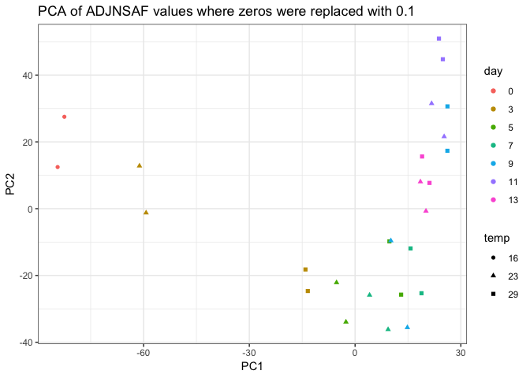
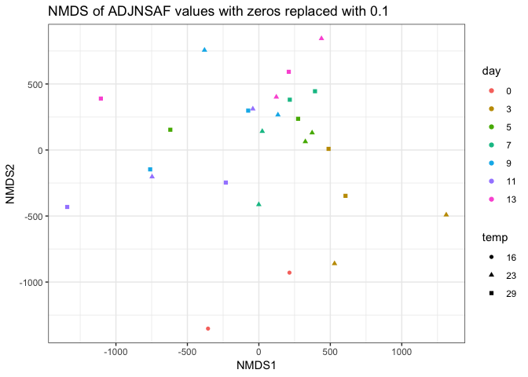

Clustering technical replicates
================
Shelly Trigg
1/11/2019

Load packages

``` r
library(vegan)
```

    ## Warning: package 'vegan' was built under R version 3.4.4

    ## Loading required package: permute

    ## Loading required package: lattice

    ## This is vegan 2.5-3

``` r
library(ggplot2)
```

    ## Warning: package 'ggplot2' was built under R version 3.4.4

``` r
library(dplyr)
```

    ## Warning: package 'dplyr' was built under R version 3.4.4

    ## 
    ## Attaching package: 'dplyr'

    ## The following objects are masked from 'package:stats':
    ## 
    ##     filter, lag

    ## The following objects are masked from 'package:base':
    ## 
    ##     intersect, setdiff, setequal, union

Load Abacus data, parse out ADJNSAF values, and simplify column names to just sample number

``` r
#upload data file
ABACUSdata <- read.csv("~/Documents/GitHub/OysterSeedProject/raw_data/ABACUS_output021417.tsv", sep = "\t", header=TRUE, stringsAsFactors = FALSE)
#select only columns containing ADJNSAF and Protein ID
ABACUSdata <- ABACUSdata[,c(1,grep("ADJNSAF", colnames(ABACUSdata)))]

## change column names in ABACUSdata to just sampleID
colnames(ABACUSdata) <- gsub(pattern = "X20161205_SAMPLE_", "", colnames(ABACUSdata))
colnames(ABACUSdata) <- gsub(pattern = "_ADJNSAF", "", colnames(ABACUSdata))
```

Load meta data file with temperature and day information

``` r
#upload meta data; this was a csv file I create from Rhonda's notebook entry: https://github.com/Ellior2/Ellior2.github.io/blob/master/_posts/2017-3-11-NMDS-analysis.md
meta_data <- read.csv("~/Documents/GitHub/OysterSeedProject/analysis/nmds_R/Rhonda_new_sample_names.csv", header = TRUE, stringsAsFactors = FALSE)
meta_data$silo <- substr(meta_data$Contents,5,5)
meta_data$day <- substr(meta_data$SampleName,5,6)
meta_data$SampleName <- gsub(pattern = "H","",meta_data$SampleName)
meta_data$SampleName <- gsub(pattern = "C","",meta_data$SampleName)
#create a temperature column
meta_data$temp <- "temp"
for(i in 1:nrow(meta_data)){
  if(meta_data$silo[i] == "2"){
    meta_data$temp[i] <- "23"
  }
  if(meta_data$silo[i] == "3"){
    meta_data$temp[i] <- "23"
  }
  if(meta_data$silo[i] == "9"){
    meta_data$temp[i] <- "29"
  }
  if(meta_data$silo[i] == "e"){
    meta_data$temp[i] <- "16"
  }
}
```

Reformat Abacus data for NMDS

``` r
#Transpose- switch rows and columns
tABACUSdata <- t.data.frame(ABACUSdata[,-1])
colnames(tABACUSdata) <- ABACUSdata[,1]
tABACUSdata <- cbind(data.frame(rownames(tABACUSdata)),tABACUSdata)
colnames(tABACUSdata)[1] <- "SampleID"

#add meta data to abacus data
tABACUSdata <- merge(meta_data[,c(1,2,7,8)],tABACUSdata, by = "SampleID")

#Remove Silo 2 and day 15
silo3and9 <- tABACUSdata[which(substr(tABACUSdata$SampleName,1,2) != "S2" & tABACUSdata$day != "15"),]
#make rownames from Sample ID column so that the NMDS knows what's what
rownames(silo3and9) <- silo3and9$SampleID
#order the data frame by day and temperature so coloring the points on the plot is easier
silo3and9 <- silo3and9[order(as.numeric(silo3and9$day),silo3and9$temp),]
```

Determine if any proteins have zero ADJNSAF vals for all samples; this would be because they were in Silo 2, but not in Silo 3 or 9

``` r
no_val_proteins <- silo3and9[,which(apply(silo3and9, 2, var) == 0)]
```

    ## Warning in FUN(newX[, i], ...): NAs introduced by coercion

    ## Warning in FUN(newX[, i], ...): NAs introduced by coercion

``` r
ncol(no_val_proteins)
```

    ## [1] 451

Remove all proteins with zero values

``` r
silo3and9_nozerovar <- silo3and9[,-c(1:4,which(colnames(silo3and9) %in% colnames(no_val_proteins)))]
#check to make sure it worked
ncol(silo3and9)-ncol(silo3and9_nozerovar)
```

    ## [1] 455

replace zeros with very small value

``` r
silo3and9_nozerovar[silo3and9_nozerovar == 0.0000] <- 0.1000
```

try PCA 

try PCA on log transformed values 

Make MDS dissimilarity matrix

``` r
nmds.silo3and9 <- metaMDS(silo3and9_nozerovar, distance = 'euclidean', k = 2, trymax = 3000, autotransform = FALSE)
```

    ## Run 0 stress 0.1649526 
    ## Run 1 stress 0.1741269 
    ## Run 2 stress 0.1725525 
    ## Run 3 stress 0.1760285 
    ## Run 4 stress 0.1753259 
    ## Run 5 stress 0.1649514 
    ## ... New best solution
    ## ... Procrustes: rmse 0.0007436352  max resid 0.003096005 
    ## ... Similar to previous best
    ## Run 6 stress 0.1631586 
    ## ... New best solution
    ## ... Procrustes: rmse 0.03635947  max resid 0.1309649 
    ## Run 7 stress 0.1865944 
    ## Run 8 stress 0.1649518 
    ## Run 9 stress 0.1865914 
    ## Run 10 stress 0.2611265 
    ## Run 11 stress 0.18322 
    ## Run 12 stress 0.1741333 
    ## Run 13 stress 0.1649516 
    ## Run 14 stress 0.1649514 
    ## Run 15 stress 0.1627157 
    ## ... New best solution
    ## ... Procrustes: rmse 0.01495092  max resid 0.06137915 
    ## Run 16 stress 0.172553 
    ## Run 17 stress 0.1627152 
    ## ... New best solution
    ## ... Procrustes: rmse 0.0005067687  max resid 0.001981874 
    ## ... Similar to previous best
    ## Run 18 stress 0.1760287 
    ## Run 19 stress 0.2516087 
    ## Run 20 stress 0.1832189 
    ## *** Solution reached

``` r
#make data frame of NMDS scores
nmds.silo3and9.scores <- cbind(silo3and9$day, silo3and9$temp,data.frame(scores(nmds.silo3and9)))
colnames(nmds.silo3and9.scores)[1:2] <- c("day","temp")
ggplot(nmds.silo3and9.scores, aes(NMDS1, NMDS2)) + geom_point(aes(col = day, shape = temp)) + theme_bw() + ggtitle("NMDS of log ADJNSAF values with zeros replaced with 0.1")
```


Make MDS dissimilarity matrix with log transformed values and bray curtis distance

``` r
nmds.silo3and9_log_bray <- metaMDS(silo3and9_log, distance = 'bray', k = 2, trymax = 3000, autotransform = FALSE)
```

    ## 'comm' has negative data: 'autotransform', 'noshare' and 'wascores' set to FALSE

    ## Warning in distfun(comm, method = distance, ...): results may be
    ## meaningless because data have negative entries in method "bray"

    ## Run 0 stress 0.2389081 
    ## Run 1 stress 0.2332733 
    ## ... New best solution
    ## ... Procrustes: rmse 0.1444526  max resid 0.4403767 
    ## Run 2 stress 0.2338505 
    ## Run 3 stress 0.2387298 
    ## Run 4 stress 0.2401866 
    ## Run 5 stress 0.2330291 
    ## ... New best solution
    ## ... Procrustes: rmse 0.1307549  max resid 0.4463157 
    ## Run 6 stress 0.2335177 
    ## ... Procrustes: rmse 0.0618454  max resid 0.2467103 
    ## Run 7 stress 0.2356567 
    ## Run 8 stress 0.2383822 
    ## Run 9 stress 0.2345525 
    ## Run 10 stress 0.2417656 
    ## Run 11 stress 0.2382868 
    ## Run 12 stress 0.2346831 
    ## Run 13 stress 0.2453078 
    ## Run 14 stress 0.2384488 
    ## Run 15 stress 0.236467 
    ## Run 16 stress 0.2394207 
    ## Run 17 stress 0.2377233 
    ## Run 18 stress 0.2321389 
    ## ... New best solution
    ## ... Procrustes: rmse 0.1322374  max resid 0.442023 
    ## Run 19 stress 0.2311818 
    ## ... New best solution
    ## ... Procrustes: rmse 0.07154503  max resid 0.2189289 
    ## Run 20 stress 0.236726 
    ## Run 21 stress 0.235059 
    ## Run 22 stress 0.2332069 
    ## Run 23 stress 0.236937 
    ## Run 24 stress 0.2374804 
    ## Run 25 stress 0.2391465 
    ## Run 26 stress 0.2374923 
    ## Run 27 stress 0.2379671 
    ## Run 28 stress 0.2383589 
    ## Run 29 stress 0.2722841 
    ## Run 30 stress 0.2397593 
    ## Run 31 stress 0.2393209 
    ## Run 32 stress 0.2387046 
    ## Run 33 stress 0.2404317 
    ## Run 34 stress 0.2322504 
    ## Run 35 stress 0.2330908 
    ## Run 36 stress 0.2376351 
    ## Run 37 stress 0.2433281 
    ## Run 38 stress 0.2370066 
    ## Run 39 stress 0.2380892 
    ## Run 40 stress 0.2414426 
    ## Run 41 stress 0.2343002 
    ## Run 42 stress 0.2378652 
    ## Run 43 stress 0.2352698 
    ## Run 44 stress 0.2333858 
    ## Run 45 stress 0.2420678 
    ## Run 46 stress 0.2343261 
    ## Run 47 stress 0.2370614 
    ## Run 48 stress 0.2343808 
    ## Run 49 stress 0.2351907 
    ## Run 50 stress 0.2371634 
    ## Run 51 stress 0.2349275 
    ## Run 52 stress 0.2375037 
    ## Run 53 stress 0.2358666 
    ## Run 54 stress 0.2370198 
    ## Run 55 stress 0.2367287 
    ## Run 56 stress 0.2371555 
    ## Run 57 stress 0.232823 
    ## Run 58 stress 0.2386861 
    ## Run 59 stress 0.2405822 
    ## Run 60 stress 0.2336612 
    ## Run 61 stress 0.2344462 
    ## Run 62 stress 0.2339139 
    ## Run 63 stress 0.236956 
    ## Run 64 stress 0.2390215 
    ## Run 65 stress 0.2393403 
    ## Run 66 stress 0.231536 
    ## ... Procrustes: rmse 0.03426062  max resid 0.1106969 
    ## Run 67 stress 0.2395755 
    ## Run 68 stress 0.239884 
    ## Run 69 stress 0.2429141 
    ## Run 70 stress 0.2374067 
    ## Run 71 stress 0.2349292 
    ## Run 72 stress 0.2377227 
    ## Run 73 stress 0.237574 
    ## Run 74 stress 0.2397681 
    ## Run 75 stress 0.240295 
    ## Run 76 stress 0.2383898 
    ## Run 77 stress 0.232683 
    ## Run 78 stress 0.238473 
    ## Run 79 stress 0.2367388 
    ## Run 80 stress 0.2392214 
    ## Run 81 stress 0.239111 
    ## Run 82 stress 0.2386197 
    ## Run 83 stress 0.233053 
    ## Run 84 stress 0.238884 
    ## Run 85 stress 0.2360788 
    ## Run 86 stress 0.2330873 
    ## Run 87 stress 0.2375358 
    ## Run 88 stress 0.2388079 
    ## Run 89 stress 0.2393334 
    ## Run 90 stress 0.2342986 
    ## Run 91 stress 0.2321368 
    ## Run 92 stress 0.2418188 
    ## Run 93 stress 0.2395011 
    ## Run 94 stress 0.2400667 
    ## Run 95 stress 0.2369568 
    ## Run 96 stress 0.2368894 
    ## Run 97 stress 0.2333608 
    ## Run 98 stress 0.23583 
    ## Run 99 stress 0.2364572 
    ## Run 100 stress 0.2381483 
    ## Run 101 stress 0.2369429 
    ## Run 102 stress 0.2327362 
    ## Run 103 stress 0.233947 
    ## Run 104 stress 0.2341752 
    ## Run 105 stress 0.2310492 
    ## ... New best solution
    ## ... Procrustes: rmse 0.08441874  max resid 0.3739837 
    ## Run 106 stress 0.2377468 
    ## Run 107 stress 0.2368196 
    ## Run 108 stress 0.2385494 
    ## Run 109 stress 0.2380066 
    ## Run 110 stress 0.23686 
    ## Run 111 stress 0.2336762 
    ## Run 112 stress 0.2392364 
    ## Run 113 stress 0.2335257 
    ## Run 114 stress 0.2322523 
    ## Run 115 stress 0.2384011 
    ## Run 116 stress 0.237575 
    ## Run 117 stress 0.2340513 
    ## Run 118 stress 0.2438557 
    ## Run 119 stress 0.2363657 
    ## Run 120 stress 0.2380187 
    ## Run 121 stress 0.240333 
    ## Run 122 stress 0.2394766 
    ## Run 123 stress 0.2390457 
    ## Run 124 stress 0.2394774 
    ## Run 125 stress 0.2361649 
    ## Run 126 stress 0.2351878 
    ## Run 127 stress 0.2359284 
    ## Run 128 stress 0.2325736 
    ## Run 129 stress 0.2385702 
    ## Run 130 stress 0.2382562 
    ## Run 131 stress 0.2397413 
    ## Run 132 stress 0.2336566 
    ## Run 133 stress 0.2378164 
    ## Run 134 stress 0.2382742 
    ## Run 135 stress 0.2398553 
    ## Run 136 stress 0.2406188 
    ## Run 137 stress 0.2398675 
    ## Run 138 stress 0.2401637 
    ## Run 139 stress 0.242738 
    ## Run 140 stress 0.2363877 
    ## Run 141 stress 0.236063 
    ## Run 142 stress 0.2367595 
    ## Run 143 stress 0.2327475 
    ## Run 144 stress 0.2379168 
    ## Run 145 stress 0.2380069 
    ## Run 146 stress 0.2404315 
    ## Run 147 stress 0.2327676 
    ## Run 148 stress 0.2367678 
    ## Run 149 stress 0.2325729 
    ## Run 150 stress 0.2369511 
    ## Run 151 stress 0.2391057 
    ## Run 152 stress 0.2359163 
    ## Run 153 stress 0.2358467 
    ## Run 154 stress 0.2368166 
    ## Run 155 stress 0.2373787 
    ## Run 156 stress 0.2369442 
    ## Run 157 stress 0.2320097 
    ## Run 158 stress 0.239613 
    ## Run 159 stress 0.2380687 
    ## Run 160 stress 0.2416833 
    ## Run 161 stress 0.2372091 
    ## Run 162 stress 0.2367477 
    ## Run 163 stress 0.2373037 
    ## Run 164 stress 0.2394967 
    ## Run 165 stress 0.2368244 
    ## Run 166 stress 0.2381107 
    ## Run 167 stress 0.2368225 
    ## Run 168 stress 0.232174 
    ## Run 169 stress 0.2313425 
    ## ... Procrustes: rmse 0.01993141  max resid 0.07221034 
    ## Run 170 stress 0.2367703 
    ## Run 171 stress 0.2385848 
    ## Run 172 stress 0.2392603 
    ## Run 173 stress 0.2359304 
    ## Run 174 stress 0.2391117 
    ## Run 175 stress 0.2412713 
    ## Run 176 stress 0.2377376 
    ## Run 177 stress 0.2381882 
    ## Run 178 stress 0.2332493 
    ## Run 179 stress 0.23641 
    ## Run 180 stress 0.2384137 
    ## Run 181 stress 0.237016 
    ## Run 182 stress 0.2392245 
    ## Run 183 stress 0.2392226 
    ## Run 184 stress 0.2360623 
    ## Run 185 stress 0.2423814 
    ## Run 186 stress 0.2392317 
    ## Run 187 stress 0.2412831 
    ## Run 188 stress 0.2372706 
    ## Run 189 stress 0.2374156 
    ## Run 190 stress 0.2384219 
    ## Run 191 stress 0.2371336 
    ## Run 192 stress 0.2362735 
    ## Run 193 stress 0.2364251 
    ## Run 194 stress 0.2386434 
    ## Run 195 stress 0.2354954 
    ## Run 196 stress 0.2376529 
    ## Run 197 stress 0.241365 
    ## Run 198 stress 0.2392624 
    ## Run 199 stress 0.2340389 
    ## Run 200 stress 0.232573 
    ## Run 201 stress 0.2375185 
    ## Run 202 stress 0.2362833 
    ## Run 203 stress 0.237971 
    ## Run 204 stress 0.2364332 
    ## Run 205 stress 0.2394427 
    ## Run 206 stress 0.2383781 
    ## Run 207 stress 0.2392634 
    ## Run 208 stress 0.2396673 
    ## Run 209 stress 0.2381515 
    ## Run 210 stress 0.2376262 
    ## Run 211 stress 0.240055 
    ## Run 212 stress 0.2374822 
    ## Run 213 stress 0.2332735 
    ## Run 214 stress 0.2334165 
    ## Run 215 stress 0.2399489 
    ## Run 216 stress 0.2360114 
    ## Run 217 stress 0.2392769 
    ## Run 218 stress 0.2358069 
    ## Run 219 stress 0.2336539 
    ## Run 220 stress 0.2400278 
    ## Run 221 stress 0.2368484 
    ## Run 222 stress 0.2401382 
    ## Run 223 stress 0.2330269 
    ## Run 224 stress 0.2379885 
    ## Run 225 stress 0.2356816 
    ## Run 226 stress 0.2366136 
    ## Run 227 stress 0.2376894 
    ## Run 228 stress 0.2355702 
    ## Run 229 stress 0.2380172 
    ## Run 230 stress 0.2379805 
    ## Run 231 stress 0.2370797 
    ## Run 232 stress 0.2386321 
    ## Run 233 stress 0.2376914 
    ## Run 234 stress 0.237577 
    ## Run 235 stress 0.2372173 
    ## Run 236 stress 0.2397583 
    ## Run 237 stress 0.2376024 
    ## Run 238 stress 0.2361684 
    ## Run 239 stress 0.2381742 
    ## Run 240 stress 0.2327538 
    ## Run 241 stress 0.2345708 
    ## Run 242 stress 0.2374826 
    ## Run 243 stress 0.2400291 
    ## Run 244 stress 0.2388837 
    ## Run 245 stress 0.2387747 
    ## Run 246 stress 0.2336338 
    ## Run 247 stress 0.2381867 
    ## Run 248 stress 0.2341171 
    ## Run 249 stress 0.2387349 
    ## Run 250 stress 0.2374917 
    ## Run 251 stress 0.2332423 
    ## Run 252 stress 0.2336534 
    ## Run 253 stress 0.2332538 
    ## Run 254 stress 0.2329276 
    ## Run 255 stress 0.2377567 
    ## Run 256 stress 0.2393631 
    ## Run 257 stress 0.2420769 
    ## Run 258 stress 0.3684519 
    ## Run 259 stress 0.2371445 
    ## Run 260 stress 0.2310107 
    ## ... New best solution
    ## ... Procrustes: rmse 0.06270323  max resid 0.2433171 
    ## Run 261 stress 0.2347069 
    ## Run 262 stress 0.2470934 
    ## Run 263 stress 0.233338 
    ## Run 264 stress 0.235829 
    ## Run 265 stress 0.2356973 
    ## Run 266 stress 0.2340128 
    ## Run 267 stress 0.2384624 
    ## Run 268 stress 0.2396612 
    ## Run 269 stress 0.2362774 
    ## Run 270 stress 0.2374432 
    ## Run 271 stress 0.2387699 
    ## Run 272 stress 0.2374622 
    ## Run 273 stress 0.3756653 
    ## Run 274 stress 0.2387636 
    ## Run 275 stress 0.239493 
    ## Run 276 stress 0.2359726 
    ## Run 277 stress 0.2373038 
    ## Run 278 stress 0.2373311 
    ## Run 279 stress 0.2403603 
    ## Run 280 stress 0.237575 
    ## Run 281 stress 0.238428 
    ## Run 282 stress 0.238974 
    ## Run 283 stress 0.235417 
    ## Run 284 stress 0.2335925 
    ## Run 285 stress 0.2364828 
    ## Run 286 stress 0.2331345 
    ## Run 287 stress 0.2384529 
    ## Run 288 stress 0.2399123 
    ## Run 289 stress 0.2392367 
    ## Run 290 stress 0.2385171 
    ## Run 291 stress 0.2420432 
    ## Run 292 stress 0.235936 
    ## Run 293 stress 0.2387679 
    ## Run 294 stress 0.2372892 
    ## Run 295 stress 0.2385269 
    ## Run 296 stress 0.2408502 
    ## Run 297 stress 0.2352634 
    ## Run 298 stress 0.2334646 
    ## Run 299 stress 0.2431587 
    ## Run 300 stress 0.2369672 
    ## Run 301 stress 0.2412158 
    ## Run 302 stress 0.2383589 
    ## Run 303 stress 0.2408298 
    ## Run 304 stress 0.2388425 
    ## Run 305 stress 0.237646 
    ## Run 306 stress 0.2404863 
    ## Run 307 stress 0.234612 
    ## Run 308 stress 0.2350964 
    ## Run 309 stress 0.2333676 
    ## Run 310 stress 0.2408069 
    ## Run 311 stress 0.2382048 
    ## Run 312 stress 0.2328554 
    ## Run 313 stress 0.3658457 
    ## Run 314 stress 0.2354704 
    ## Run 315 stress 0.2382123 
    ## Run 316 stress 0.2358059 
    ## Run 317 stress 0.2337969 
    ## Run 318 stress 0.2374019 
    ## Run 319 stress 0.2326076 
    ## Run 320 stress 0.2320624 
    ## Run 321 stress 0.2341812 
    ## Run 322 stress 0.2376868 
    ## Run 323 stress 0.2423037 
    ## Run 324 stress 0.2344377 
    ## Run 325 stress 0.2392834 
    ## Run 326 stress 0.2326076 
    ## Run 327 stress 0.2393877 
    ## Run 328 stress 0.2316003 
    ## Run 329 stress 0.2399442 
    ## Run 330 stress 0.2379909 
    ## Run 331 stress 0.235027 
    ## Run 332 stress 0.2382922 
    ## Run 333 stress 0.2365839 
    ## Run 334 stress 0.2389933 
    ## Run 335 stress 0.2378769 
    ## Run 336 stress 0.2368719 
    ## Run 337 stress 0.239219 
    ## Run 338 stress 0.2366623 
    ## Run 339 stress 0.2360487 
    ## Run 340 stress 0.2383542 
    ## Run 341 stress 0.2377702 
    ## Run 342 stress 0.237957 
    ## Run 343 stress 0.2334845 
    ## Run 344 stress 0.2419993 
    ## Run 345 stress 0.2328538 
    ## Run 346 stress 0.2365437 
    ## Run 347 stress 0.2403406 
    ## Run 348 stress 0.2398139 
    ## Run 349 stress 0.2366944 
    ## Run 350 stress 0.2390528 
    ## Run 351 stress 0.2389463 
    ## Run 352 stress 0.2369811 
    ## Run 353 stress 0.239868 
    ## Run 354 stress 0.2399564 
    ## Run 355 stress 0.2388036 
    ## Run 356 stress 0.2377485 
    ## Run 357 stress 0.2339734 
    ## Run 358 stress 0.2361105 
    ## Run 359 stress 0.2387292 
    ## Run 360 stress 0.2333428 
    ## Run 361 stress 0.2374712 
    ## Run 362 stress 0.2341173 
    ## Run 363 stress 0.2376978 
    ## Run 364 stress 0.2364364 
    ## Run 365 stress 0.2328226 
    ## Run 366 stress 0.2316028 
    ## Run 367 stress 0.2403644 
    ## Run 368 stress 0.2398806 
    ## Run 369 stress 0.2339271 
    ## Run 370 stress 0.238813 
    ## Run 371 stress 0.2348226 
    ## Run 372 stress 0.241021 
    ## Run 373 stress 0.2396626 
    ## Run 374 stress 0.2387998 
    ## Run 375 stress 0.2376677 
    ## Run 376 stress 0.2362019 
    ## Run 377 stress 0.2371605 
    ## Run 378 stress 0.2347748 
    ## Run 379 stress 0.2336004 
    ## Run 380 stress 0.2360323 
    ## Run 381 stress 0.2329915 
    ## Run 382 stress 0.2364749 
    ## Run 383 stress 0.2383713 
    ## Run 384 stress 0.2364977 
    ## Run 385 stress 0.2361028 
    ## Run 386 stress 0.2357797 
    ## Run 387 stress 0.2372394 
    ## Run 388 stress 0.2337297 
    ## Run 389 stress 0.2354637 
    ## Run 390 stress 0.2412847 
    ## Run 391 stress 0.2372089 
    ## Run 392 stress 0.2414604 
    ## Run 393 stress 0.2320194 
    ## Run 394 stress 0.2343233 
    ## Run 395 stress 0.2339271 
    ## Run 396 stress 0.2360444 
    ## Run 397 stress 0.238889 
    ## Run 398 stress 0.2389749 
    ## Run 399 stress 0.2367271 
    ## Run 400 stress 0.2371682 
    ## Run 401 stress 0.2381523 
    ## Run 402 stress 0.2310107 
    ## ... New best solution
    ## ... Procrustes: rmse 6.88189e-06  max resid 1.824344e-05 
    ## ... Similar to previous best
    ## *** Solution reached

``` r
#make data frame of NMDS scores
nmds.silo3and9_log_bray.scores <- cbind(silo3and9$day, silo3and9$temp,data.frame(scores(nmds.silo3and9_log_bray)))
colnames(nmds.silo3and9_log_bray.scores)[1:2] <- c("day","temp")
ggplot(nmds.silo3and9_log_bray.scores, aes(NMDS1, NMDS2)) + geom_point(aes(col = day, shape = temp)) + theme_bw() + ggtitle("bray curtis NMDS of log ADJNSAF values with zeros replaced with 0.1")
```


