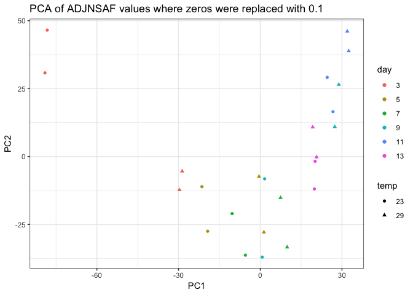
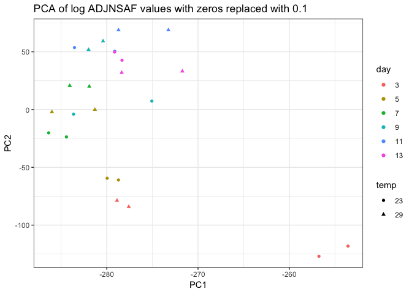
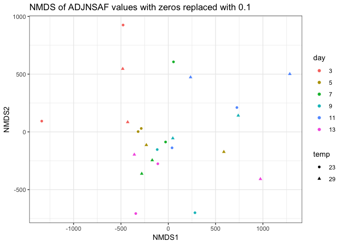
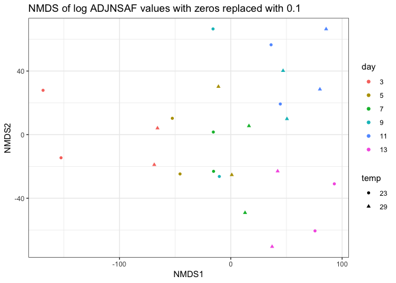
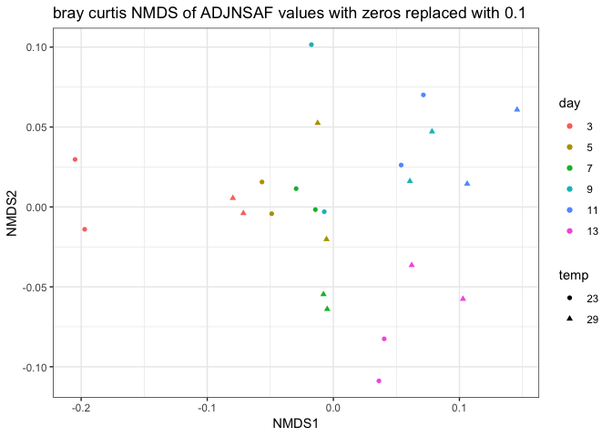

ClusteringTechnicalReplicates\_noDay0
================
Shelly Trigg
4/4/2019

Load packages

``` r
library(vegan)
```

    ## Loading required package: permute

    ## Loading required package: lattice

    ## This is vegan 2.5-4

``` r
library(ggplot2)
library(dplyr)
```

    ## 
    ## Attaching package: 'dplyr'

    ## The following objects are masked from 'package:stats':
    ## 
    ##     filter, lag

    ## The following objects are masked from 'package:base':
    ## 
    ##     intersect, setdiff, setequal, union

``` r
library(gtools)
```

    ## 
    ## Attaching package: 'gtools'

    ## The following object is masked from 'package:permute':
    ## 
    ##     permute

Load NSAF data

``` r
silo3and9 <- read.csv("~/Documents/GitHub/OysterSeedProject/analysis/nmds_R/silo3and9_nozerovals.csv", stringsAsFactors = FALSE)

silo3and9 <- silo3and9[which(silo3and9$silo3and9.day !=0),]
colnames(silo3and9)[1:3] <- c("SampleID","day", "temp")

no_val_proteins <- silo3and9[,which(apply(silo3and9, 2, var) == 0)]
```

    ## Warning in FUN(newX[, i], ...): NAs introduced by coercion

``` r
ncol(no_val_proteins)
```

    ## [1] 132

Remove proteins if they have a zero value in all samples

``` r
silo3and9_nozerovar <- silo3and9[,-c(which(colnames(silo3and9) %in% colnames(no_val_proteins)))]
```

try PCA

``` r
#first convert day and temp data to factors for plotting
silo3and9_nozerovar$day <- factor(silo3and9_nozerovar$day, levels = unique(silo3and9_nozerovar$day))
silo3and9_nozerovar$temp <- factor(silo3and9_nozerovar$temp, levels = unique(silo3and9_nozerovar$temp))

#run PCA
pca <- prcomp(silo3and9_nozerovar[,-c(1:3)], center = T, scale = T)
pca_meta <- cbind(silo3and9_nozerovar$day, silo3and9_nozerovar$temp, data.frame(paste(silo3and9_nozerovar$day,silo3and9_nozerovar$temp, sep = "_")),pca$x)
colnames(pca_meta)[1:3] <- c("day","temp","SampleName")
ggplot(pca_meta, aes(PC1, PC2)) + geom_point(aes(col = day, shape = temp)) + theme_bw() + ggtitle("PCA of ADJNSAF values where zeros were replaced with 0.1")
```



try PCA on log transformed values

``` r
silo3and9_log <- log(silo3and9_nozerovar[,-c(1:3)],2)
pca_log <- prcomp(silo3and9_log, center = F, scale = F)
pca_log_meta <- cbind(silo3and9_nozerovar$day, silo3and9_nozerovar$temp, data.frame(paste(silo3and9_nozerovar$day,silo3and9_nozerovar$temp, sep = "_")),pca_log$x)
colnames(pca_log_meta)[1:3] <- c("day","temp","SampleName")
ggplot(pca_log_meta, aes(PC1, PC2)) + geom_point(aes(col = day, shape = temp)) + theme_bw() + ggtitle("PCA of log ADJNSAF values with zeros replaced with 0.1")
```



Make MDS dissimilarity matrix

``` r
nmds.silo3and9 <- metaMDS(silo3and9_nozerovar[,-c(1:3)], distance = 'euclidean', k = 2, trymax = 3000, autotransform = FALSE)
```

    ## Run 0 stress 0.1384715 
    ## Run 1 stress 0.1716268 
    ## Run 2 stress 0.1748817 
    ## Run 3 stress 0.1868165 
    ## Run 4 stress 0.1628551 
    ## Run 5 stress 0.1389291 
    ## ... Procrustes: rmse 0.0167428  max resid 0.07172914 
    ## Run 6 stress 0.1384716 
    ## ... Procrustes: rmse 0.0001122529  max resid 0.0002831851 
    ## ... Similar to previous best
    ## Run 7 stress 0.1903529 
    ## Run 8 stress 0.1394582 
    ## Run 9 stress 0.1557418 
    ## Run 10 stress 0.1389293 
    ## ... Procrustes: rmse 0.01655344  max resid 0.07071545 
    ## Run 11 stress 0.1573176 
    ## Run 12 stress 0.1389289 
    ## ... Procrustes: rmse 0.01661497  max resid 0.07104277 
    ## Run 13 stress 0.1628558 
    ## Run 14 stress 0.1794599 
    ## Run 15 stress 0.1389289 
    ## ... Procrustes: rmse 0.01660723  max resid 0.07099767 
    ## Run 16 stress 0.1384716 
    ## ... Procrustes: rmse 0.000113913  max resid 0.0004586909 
    ## ... Similar to previous best
    ## Run 17 stress 0.1687594 
    ## Run 18 stress 0.1573356 
    ## Run 19 stress 0.1384721 
    ## ... Procrustes: rmse 0.0005710659  max resid 0.002287931 
    ## ... Similar to previous best
    ## Run 20 stress 0.2643408 
    ## *** Solution reached

``` r
#make data frame of NMDS scores
nmds.silo3and9.scores <- cbind(silo3and9_nozerovar$day, silo3and9_nozerovar$temp,data.frame(scores(nmds.silo3and9)))
colnames(nmds.silo3and9.scores)[1:2] <- c("day","temp")
ggplot(nmds.silo3and9.scores, aes(NMDS1, NMDS2)) + geom_point(aes(col = day, shape = temp)) + theme_bw() + ggtitle("NMDS of ADJNSAF values with zeros replaced with 0.1")
```



Make MDS dissimilarity matrix with log tranformed ADJNSAF values

``` r
nmds.silo3and9_log <- metaMDS(silo3and9_log, distance = 'euclidean', k = 2, trymax = 3000, autotransform = FALSE)
```

    ## 'comm' has negative data: 'autotransform', 'noshare' and 'wascores' set to FALSE

    ## Run 0 stress 0.1307187 
    ## Run 1 stress 0.1531376 
    ## Run 2 stress 0.130717 
    ## ... New best solution
    ## ... Procrustes: rmse 0.001950832  max resid 0.008636007 
    ## ... Similar to previous best
    ## Run 3 stress 0.1366228 
    ## Run 4 stress 0.1542293 
    ## Run 5 stress 0.1557988 
    ## Run 6 stress 0.1492399 
    ## Run 7 stress 0.1534112 
    ## Run 8 stress 0.1508691 
    ## Run 9 stress 0.1533431 
    ## Run 10 stress 0.1542253 
    ## Run 11 stress 0.1307158 
    ## ... New best solution
    ## ... Procrustes: rmse 0.0003684836  max resid 0.001581403 
    ## ... Similar to previous best
    ## Run 12 stress 0.1589361 
    ## Run 13 stress 0.1589357 
    ## Run 14 stress 0.1439875 
    ## Run 15 stress 0.1307167 
    ## ... Procrustes: rmse 0.000315757  max resid 0.001369753 
    ## ... Similar to previous best
    ## Run 16 stress 0.1307157 
    ## ... New best solution
    ## ... Procrustes: rmse 4.122178e-05  max resid 9.623786e-05 
    ## ... Similar to previous best
    ## Run 17 stress 0.1307165 
    ## ... Procrustes: rmse 0.0002668044  max resid 0.001160836 
    ## ... Similar to previous best
    ## Run 18 stress 0.1307152 
    ## ... New best solution
    ## ... Procrustes: rmse 0.0003344462  max resid 0.00147726 
    ## ... Similar to previous best
    ## Run 19 stress 0.1643093 
    ## Run 20 stress 0.1589348 
    ## *** Solution reached

``` r
#make data frame of NMDS scores
nmds.silo3and9_log.scores <- cbind(silo3and9_nozerovar$day, silo3and9_nozerovar$temp,data.frame(scores(nmds.silo3and9_log)))
colnames(nmds.silo3and9_log.scores)[1:2] <- c("day","temp")
ggplot(nmds.silo3and9_log.scores, aes(NMDS1, NMDS2)) + geom_point(aes(col = day, shape = temp)) + theme_bw() + ggtitle("NMDS of log ADJNSAF values with zeros replaced with 0.1")
```



Make MDS dissimilarity matrix with log transformed (ADJNSAF values) and bray curtis distance

``` r
nmds.silo3and9_log_bray <- metaMDS(silo3and9_nozerovar[,-c(1:3)], distance = 'bray', k = 2, trymax = 3000, autotransform = FALSE)
```

    ## Run 0 stress 0.1326693 
    ## Run 1 stress 0.1546861 
    ## Run 2 stress 0.1393307 
    ## Run 3 stress 0.1326692 
    ## ... New best solution
    ## ... Procrustes: rmse 0.0001725769  max resid 0.0005305028 
    ## ... Similar to previous best
    ## Run 4 stress 0.1326692 
    ## ... New best solution
    ## ... Procrustes: rmse 4.779325e-05  max resid 0.0001407824 
    ## ... Similar to previous best
    ## Run 5 stress 0.1673336 
    ## Run 6 stress 0.1497493 
    ## Run 7 stress 0.176685 
    ## Run 8 stress 0.1656692 
    ## Run 9 stress 0.1551628 
    ## Run 10 stress 0.1593501 
    ## Run 11 stress 0.1450819 
    ## Run 12 stress 0.1580664 
    ## Run 13 stress 0.1442572 
    ## Run 14 stress 0.1706295 
    ## Run 15 stress 0.1627002 
    ## Run 16 stress 0.1326693 
    ## ... Procrustes: rmse 3.579848e-05  max resid 0.0001356162 
    ## ... Similar to previous best
    ## Run 17 stress 0.1620035 
    ## Run 18 stress 0.1545368 
    ## Run 19 stress 0.1326692 
    ## ... New best solution
    ## ... Procrustes: rmse 1.120345e-05  max resid 3.195542e-05 
    ## ... Similar to previous best
    ## Run 20 stress 0.1545374 
    ## *** Solution reached

``` r
#make data frame of NMDS scores
nmds.silo3and9_log_bray.scores <- cbind(silo3and9_nozerovar$day, silo3and9_nozerovar$temp,data.frame(scores(nmds.silo3and9_log_bray)))
colnames(nmds.silo3and9_log_bray.scores)[1:2] <- c("day","temp")
ggplot(nmds.silo3and9_log_bray.scores, aes(NMDS1, NMDS2)) + geom_point(aes(col = day, shape = temp)) + theme_bw() + ggtitle("bray curtis NMDS of ADJNSAF values with zeros replaced with 0.1")
```


