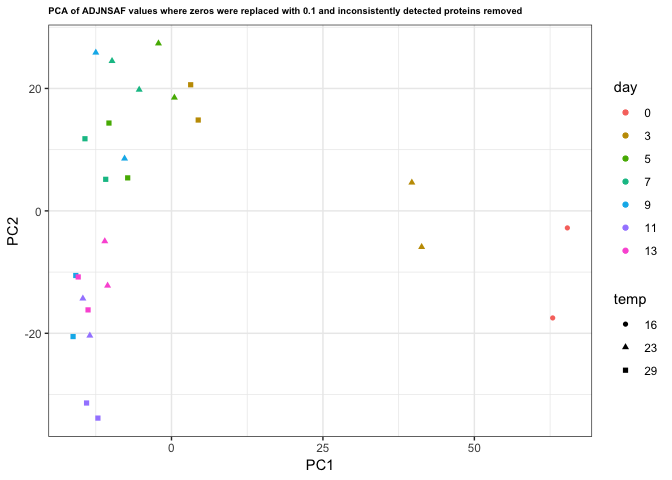
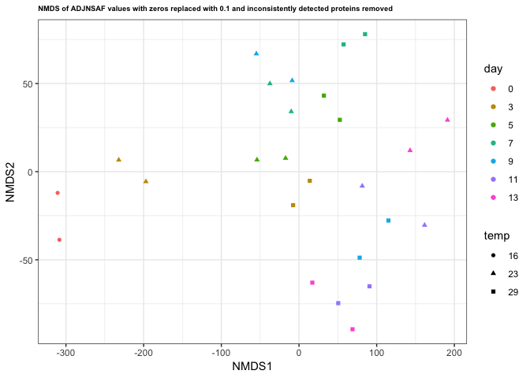
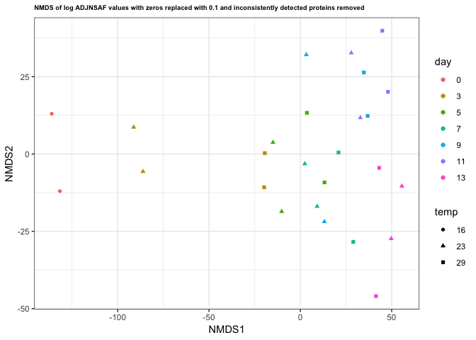

Identifying and removing inconsistently detected proteins
================
Shelly Trigg
1/15/2019

Load packages

``` r
library(vegan)
```

    ## Warning: package 'vegan' was built under R version 3.4.4

    ## Loading required package: permute

    ## Loading required package: lattice

    ## This is vegan 2.5-3

``` r
library(ggplot2)
```

    ## Warning: package 'ggplot2' was built under R version 3.4.4

``` r
library(dplyr)
```

    ## Warning: package 'dplyr' was built under R version 3.4.4

    ## 
    ## Attaching package: 'dplyr'

    ## The following objects are masked from 'package:stats':
    ## 
    ##     filter, lag

    ## The following objects are masked from 'package:base':
    ## 
    ##     intersect, setdiff, setequal, union

``` r
library(gtools)
```

    ## Warning: package 'gtools' was built under R version 3.4.4

    ## 
    ## Attaching package: 'gtools'

    ## The following object is masked from 'package:permute':
    ## 
    ##     permute

``` r
library(MLmetrics)
```

    ## 
    ## Attaching package: 'MLmetrics'

    ## The following object is masked from 'package:base':
    ## 
    ##     Recall

Read in data

``` r
silo3and9_nozerovar <- read.csv("~/Documents/GitHub/OysterSeedProject/analysis/nmds_R/silo3and9_nozerovals.csv", stringsAsFactors = FALSE)
silo3and9_meta <- silo3and9_nozerovar[,1:3]
colnames(silo3and9_meta) <- c("Sample.ID", "day", "temp")
str(silo3and9_meta)
```

    ## 'data.frame':    26 obs. of  3 variables:
    ##  $ Sample.ID: chr  "1" "1A" "4" "4A" ...
    ##  $ day      : int  0 0 3 3 3 3 5 5 5 5 ...
    ##  $ temp     : int  16 16 23 23 29 29 23 23 29 29 ...

``` r
silo3and9_meta$day <- factor(silo3and9_meta$day, levels = unique(silo3and9_meta$day))
silo3and9_meta$temp <- factor(silo3and9_meta$temp, levels = unique(silo3and9_meta$temp))
str(silo3and9_meta)
```

    ## 'data.frame':    26 obs. of  3 variables:
    ##  $ Sample.ID: chr  "1" "1A" "4" "4A" ...
    ##  $ day      : Factor w/ 7 levels "0","3","5","7",..: 1 1 2 2 2 2 3 3 3 3 ...
    ##  $ temp     : Factor w/ 3 levels "16","23","29": 1 1 2 2 3 3 2 2 3 3 ...

``` r
silo3and9_nozerovar <- silo3and9_nozerovar[,-c(1:3)]
rownames(silo3and9_nozerovar) <- silo3and9_meta$Sample.ID
```

Check if any pair of replicates have protein NSAF values that show \> 20% error AND an SD \> 5; those are the potentially unrealiable proteins

``` r
#create an empty data frame
df <- data.frame()
#loop through the data and calculate the standard deviation between replicates for each protein
#this calculates the SD for 
for (i in seq(1,nrow(silo3and9_nozerovar),2)){
  #this calculates the SD for each odd number row and the row following it
  df_row <- apply(silo3and9_nozerovar[c(i,i+1),],2,sd)
  #this sequencially combines rows of data together after the SD is generated
  df <- rbind(df, df_row)
}
#add column names to SD data
colnames(df) <- colnames(silo3and9_nozerovar)
rownames(df) <- rownames(silo3and9_nozerovar[-grep("A",rownames(silo3and9_nozerovar)),])

#create a new SD data frame to parse out proteins with SD > 5
df_SD5 <- df
#convert SD values > 5 to NA
df_SD5[df_SD5 > 5] <- NA
#transpose the data frame so that proteins are column names and sample number is row names
df_SD5 <- t.data.frame(df_SD5)
#parse out rows (proteins) with SD > 5 in any sample
df_SD5 <- df_SD5[rowSums(is.na(df_SD5)) > 0,]

#create an empty data frame
df_err <- data.frame()
#loop through data and calculate percent error between replicates for each protein
#this goes through each odd numbered row(i), and looks at each protein (j) in each odd row then computes the percent error by comparing it to the protein (j) in the odd row + 1 (i + 1). The computed percent error is filled into the empty data frame using the same coordinates as its origin. 
for (i in seq(1,nrow(silo3and9_nozerovar),2)){
  for(j in 1:ncol(silo3and9_nozerovar)){
    true <- silo3and9_nozerovar[i,j]
    pred <- silo3and9_nozerovar[i+1, j]
    df_err[i,j] <- abs(pred-true)/true *100
  }  
}    

#remove empty rows in data frame
df_err <- df_err[c(seq(1,nrow(silo3and9_nozerovar),2)),]  
#add column names (protein names) back
colnames(df_err) <- colnames(silo3and9_nozerovar)
#add row names (sample names) back
rownames(df_err) <- rownames(silo3and9_nozerovar[-grep("A",rownames(silo3and9_nozerovar)),])

#create a new data frame to subset from
df_err_20 <- df_err
#convert values > than 20% error in data frame to NAs
df_err_20[df_err_20 > 20] <- NA
#transform data frame so rows are protein names and columns are sample names
df_err_20 <- t.data.frame(df_err_20)
#extract proteins that contain NA values (https://stackoverflow.com/questions/7980622/subset-of-rows-containing-na-missing-values-in-a-chosen-column-of-a-data-frame)
df_err_20  <- df_err_20[rowSums(is.na(df_err_20)) > 0,]

#create a list of proteins with any replicate SD > 5 or %error > 20
df_err20_SD5 <- rownames(df_err_20[which(rownames(df_err_20) %in% rownames(df_SD5)),])

#try removing these and seeing if PCA improves
silo3and9_nozerovar_err20_SD5 <- silo3and9_nozerovar[,-c(which(colnames(silo3and9_nozerovar) %in% df_err20_SD5))]
#chech it worked
ncol(silo3and9_nozerovar) - ncol(silo3and9_nozerovar_err20_SD5)
```

    ## [1] 3396

``` r
length(df_err20_SD5)
```

    ## [1] 3396

Plot PCA with inconsistent proteins removed

``` r
pca_cut <- prcomp(silo3and9_nozerovar_err20_SD5, center = T, scale = T)
pca_cut_meta <- cbind(silo3and9_meta$day, silo3and9_meta$temp,data.frame(pca_cut$x))
colnames(pca_cut_meta)[1:2] <- c("day","temp")
ggplot(pca_cut_meta, aes(PC1, PC2)) + geom_point(aes(col = day, shape = temp)) + theme_bw() + ggtitle("PCA of ADJNSAF values where zeros were replaced with 0.1 and inconsistently detected proteins removed") + theme(plot.title = element_text(size = 7, face = "bold"))
```



``` r
nmds.silo3and9.err20SD5 <- metaMDS(silo3and9_nozerovar_err20_SD5, distance = 'euclidean', k = 2, trymax = 3000, autotransform = FALSE)
```

    ## Run 0 stress 0.09649335 
    ## Run 1 stress 0.1110536 
    ## Run 2 stress 0.09561105 
    ## ... New best solution
    ## ... Procrustes: rmse 0.02766707  max resid 0.08006392 
    ## Run 3 stress 0.09561106 
    ## ... Procrustes: rmse 1.532362e-05  max resid 5.068584e-05 
    ## ... Similar to previous best
    ## Run 4 stress 0.09561122 
    ## ... Procrustes: rmse 0.0001768953  max resid 0.0004736883 
    ## ... Similar to previous best
    ## Run 5 stress 0.111037 
    ## Run 6 stress 0.1110888 
    ## Run 7 stress 0.09649329 
    ## Run 8 stress 0.1156924 
    ## Run 9 stress 0.1157292 
    ## Run 10 stress 0.096377 
    ## Run 11 stress 0.09649492 
    ## Run 12 stress 0.09564827 
    ## ... Procrustes: rmse 0.01074503  max resid 0.04279624 
    ## Run 13 stress 0.09649308 
    ## Run 14 stress 0.1100264 
    ## Run 15 stress 0.09564893 
    ## ... Procrustes: rmse 0.01087511  max resid 0.04399558 
    ## Run 16 stress 0.09561103 
    ## ... New best solution
    ## ... Procrustes: rmse 0.0001383638  max resid 0.0004179078 
    ## ... Similar to previous best
    ## Run 17 stress 0.09561109 
    ## ... Procrustes: rmse 7.046002e-05  max resid 0.0002139234 
    ## ... Similar to previous best
    ## Run 18 stress 0.09564822 
    ## ... Procrustes: rmse 0.01077064  max resid 0.04291223 
    ## Run 19 stress 0.09637834 
    ## Run 20 stress 0.09561101 
    ## ... New best solution
    ## ... Procrustes: rmse 8.849991e-05  max resid 0.0001886452 
    ## ... Similar to previous best
    ## *** Solution reached

``` r
#make data frame of NMDS scores
nmds.silo3and9.err20SD5.scores <- cbind(silo3and9_meta$day, silo3and9_meta$temp,data.frame(scores(nmds.silo3and9.err20SD5)))
colnames(nmds.silo3and9.err20SD5.scores)[1:2] <- c("day","temp")
ggplot(nmds.silo3and9.err20SD5.scores, aes(NMDS1, NMDS2)) + geom_point(aes(col = day, shape = temp)) + theme_bw() + ggtitle("NMDS of ADJNSAF values with zeros replaced with 0.1 and inconsistently detected proteins removed") + theme(plot.title = element_text(size = 7, face = "bold"))
```



``` r
#make data frame of NMDS scores
silo3and9_nozerovar_err20_SD5_log <- log(silo3and9_nozerovar_err20_SD5,2)

nmds.silo3and9_nozerovar_err20_SD5_log <- metaMDS(silo3and9_nozerovar_err20_SD5_log, distance = 'euclidean', k = 2, trymax = 3000, autotransform = FALSE)
```

    ## 'comm' has negative data: 'autotransform', 'noshare' and 'wascores' set to FALSE

    ## Run 0 stress 0.1151003 
    ## Run 1 stress 0.1151004 
    ## ... Procrustes: rmse 0.0005012301  max resid 0.001158548 
    ## ... Similar to previous best
    ## Run 2 stress 0.1289759 
    ## Run 3 stress 0.1304337 
    ## Run 4 stress 0.1157219 
    ## Run 5 stress 0.125709 
    ## Run 6 stress 0.1320721 
    ## Run 7 stress 0.1407451 
    ## Run 8 stress 0.1254476 
    ## Run 9 stress 0.1289896 
    ## Run 10 stress 0.1151004 
    ## ... Procrustes: rmse 0.0005272173  max resid 0.001230939 
    ## ... Similar to previous best
    ## Run 11 stress 0.1352 
    ## Run 12 stress 0.125448 
    ## Run 13 stress 0.1197585 
    ## Run 14 stress 0.1151001 
    ## ... New best solution
    ## ... Procrustes: rmse 0.0001044487  max resid 0.0002401767 
    ## ... Similar to previous best
    ## Run 15 stress 0.1248021 
    ## Run 16 stress 0.1289979 
    ## Run 17 stress 0.1279578 
    ## Run 18 stress 0.1151 
    ## ... New best solution
    ## ... Procrustes: rmse 0.0001730041  max resid 0.00034712 
    ## ... Similar to previous best
    ## Run 19 stress 0.1300717 
    ## Run 20 stress 0.1248013 
    ## *** Solution reached

``` r
nmds.silo3and9_nozerovar_err20_SD5_log.scores <- cbind(silo3and9_meta$day, silo3and9_meta$temp,data.frame(scores(nmds.silo3and9_nozerovar_err20_SD5_log)))
colnames(nmds.silo3and9_nozerovar_err20_SD5_log.scores)[1:2] <- c("day","temp")
ggplot(nmds.silo3and9_nozerovar_err20_SD5_log.scores, aes(NMDS1, NMDS2)) + geom_point(aes(col = day, shape = temp)) + theme_bw() + ggtitle("NMDS of log ADJNSAF values with zeros replaced with 0.1 and inconsistently detected proteins removed") + theme(plot.title = element_text(size = 7, face = "bold"))
```



Average NSAF values

``` r
df_avg <- data.frame()
#loop through the data and calculate the mean between replicates for each protein
for (i in seq(1,nrow(silo3and9_nozerovar_err20_SD5),2)){
  #this calculates the SD for each odd number row and the row following it
  df_avg_row <- apply(silo3and9_nozerovar_err20_SD5[c(i,i+1),],2,mean)
  #this sequencially combines rows of data together after the SD is generated
  df_avg <- rbind(df_avg, df_avg_row)
}
#add column names to SD data
colnames(df_avg) <- colnames(silo3and9_nozerovar_err20_SD5)
df_avg$Sample.ID <- rownames(silo3and9_nozerovar_err20_SD5[-grep("A",rownames(silo3and9_nozerovar_err20_SD5)),])
```

export filtered protein data set
